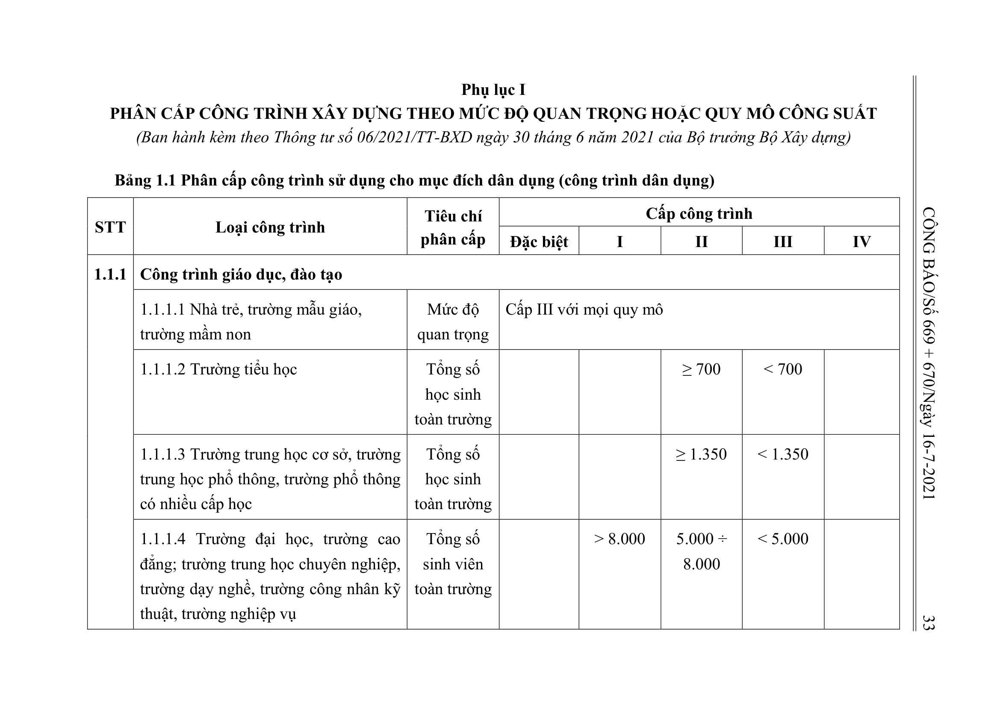
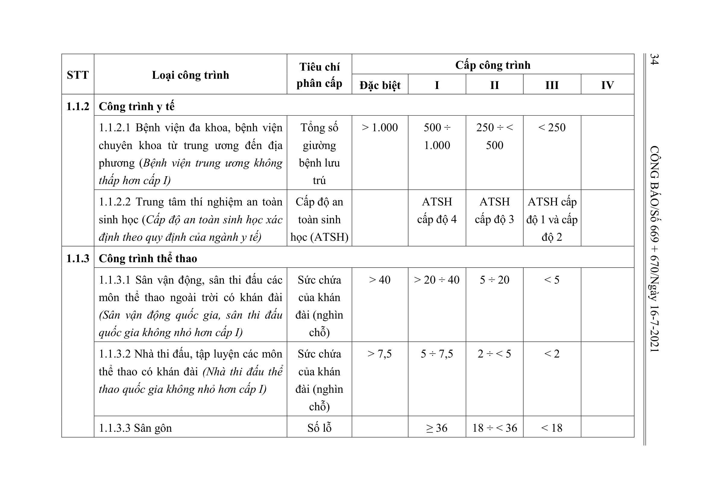

> **Trích dẫn:** Bảng 1.1: nhóm 1.1.1 Công trình giáo dục, đào tạo, Phụ lục I Thông tư số 06/2021/TT-BXD

## Bảng 1.1: nhóm 1.1.1 Công trình giáo dục, đào tạo

| STT | Loại công trình | Tiêu chí phân cấp | Đặc biệt | I | II | III | IV |
| --- | --- | --- | --- | --- | --- | --- | --- |
| 1.1.1 | Công trình giáo dục, đào tạo |  |  |  |  |  |  |
|  | 1.1.1.1 Nhà trẻ, trường mẫu giáo, trường mầm non | Mức độ quan trọng | Cấp III với mọi quy mô |  |  |  |  |
|  | 1.1.1.2 Trường tiểu học | Tổng số học sinh toàn trường |  |  | ≥ 700 | < 700 |  |
|  | 1.1.1.3 Trường trung học cơ sở, trường trung học phổ thông, trường phổ thông có nhiều cấp học | Tổng số học sinh toàn trường |  |  | ≥ 1.350 | < 1.350 |  |
|  | 1.1.1.4 Trường đại học, trường cao đẳng; trường trung học chuyên nghiệp, trường dạy nghề, trường công nhân kỹ thuật, trường nghiệp vụ | Tổng số sinh viên toàn trường |  | > 8.000 | 5.000 ÷ 8.000 | < 5.000 |  |
