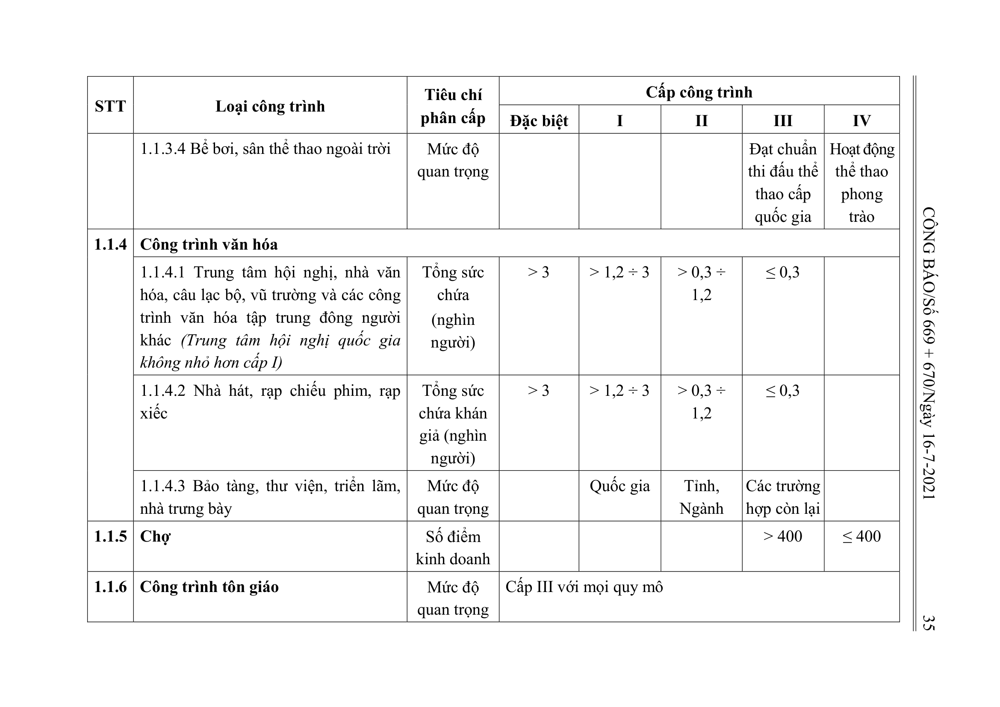

> **Trích dẫn:** Bảng 1.1: nhóm 1.1.3 Công trình thể thao, Phụ lục I Thông tư số 06/2021/TT-BXD

## Bảng 1.1: nhóm 1.1.3 Công trình thể thao

| STT | Loại công trình | Tiêu chí phân cấp | Đặc biệt | I | II | III | IV |
| --- | --- | --- | --- | --- | --- | --- | --- |
| 1.1.3 | Công trình thể thao |  |  |  |  |  |  |
|  | 1.1.3.1 Sân vận động, sân thi đấu các môn thể thao ngoài trời có khán đài (Sân vận động quốc gia, sân thi đấu quốc gia không nhỏ hơn cấp I) | Sức chứa của khán đài (nghìn chỗ) | > 40 | > 20 ÷ 40 | 5 ÷ 20 | < 5 |  |
|  | 1.1.3.2 Nhà thi đấu, tập luyện các môn thể thao có khán đài (Nhà thi đấu thể thao quốc gia không nhỏ hơn cấp I) | Sức chứa của khán đài (nghìn chỗ) | > 7,5 | 5 ÷ 7,5 | 2 ÷ < 5 | < 2 |  |
|  | 1.1.3.3 Sân gôn | Số lỗ |  | ≥ 36 | 18 ÷ < 36 | < 18 |  |
|  | 1.1.3.4 Bể bơi, sân thể thao ngoài trời | Mức độ quan trọng |  |  |  | Đạt chuẩn thi đấu thể thao cấp quốc gia | Hoạt động thể thao phong trào |
