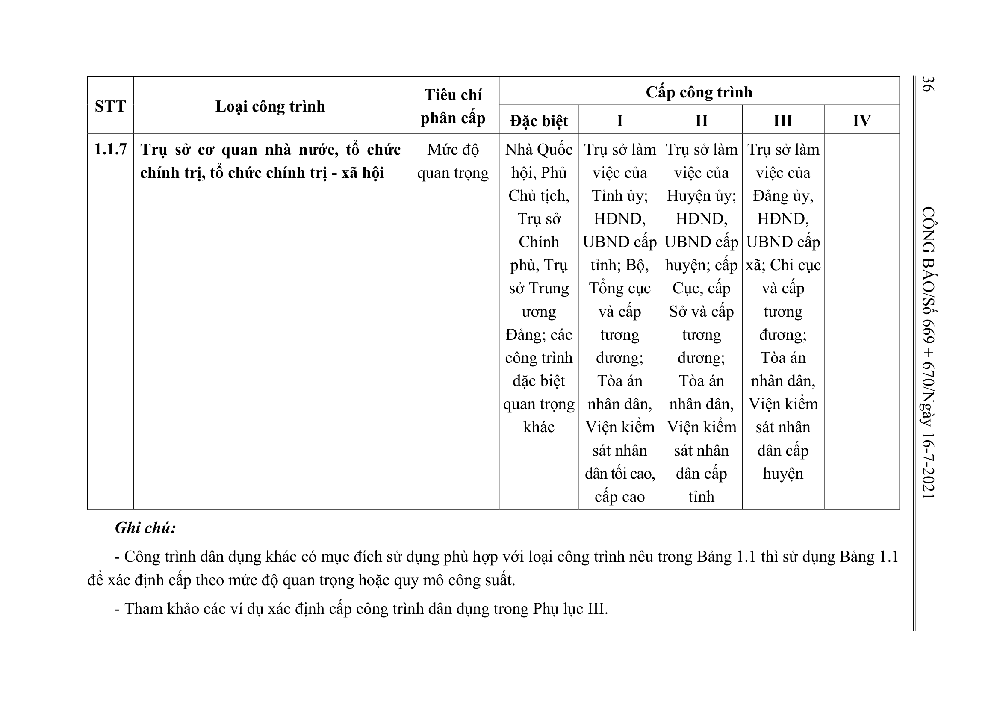

> **Trích dẫn:** Bảng 1.1: nhóm 1.1.7 Trụ sở cơ quan nhà nước, tổ chức chính trị, tổ chức chính trị - xã hội, Phụ lục I Thông tư số 06/2021/TT-BXD

## Bảng 1.1: nhóm 1.1.7 Trụ sở cơ quan nhà nước, tổ chức chính trị, tổ chức chính trị - xã hội

| STT | Loại công trình | Tiêu chí phân cấp | Đặc biệt | I | II | III | IV |
| --- | --- | --- | --- | --- | --- | --- | --- |
| 1.1.7 | Trụ sở cơ quan nhà nước, tổ chức chính trị, tổ chức chính trị - xã hội | Mức độ quan trọng | Nhà Quốc hội, Phủ Chủ tịch, Trụ sở Chính phủ, Trụ sở Trung ương Đảng; các công trình đặc biệt quan trọng khác | Trụ sở làm việc của Tỉnh ủy; HĐND, UBND cấp tỉnh; Bộ, Tổng cục và cấp tương đương; Tòa án nhân dân, Viện kiểm sát nhân dân tối cao, cấp cao | Trụ sở làm việc của Huyện ủy; HĐND, UBND cấp huyện; cấp Cục, cấp Sở và cấp tương đương; Tòa án nhân dân, Viện kiểm sát nhân dân cấp tỉnh | Trụ sở làm việc của Đảng ủy, HĐND, UBND cấp xã; Chi cục và cấp tương đương; Tòa án nhân dân, Viện kiểm sát nhân dân cấp huyện |  |

**Ghi chú:**

- Công trình dân dụng khác có mục đích sử dụng phù hợp với loại công trình nêu trong Bảng 1.1 thì sử dụng Bảng 1.1 để xác định cấp theo mức độ quan trọng hoặc quy mô công suất.
- Tham khảo các ví dụ xác định cấp công trình dân dụng trong Phụ lục III.
