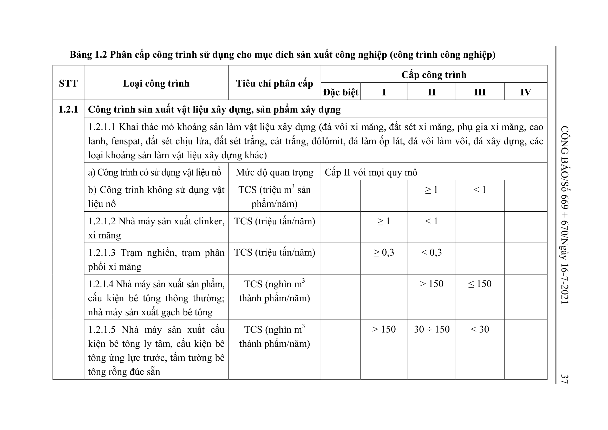
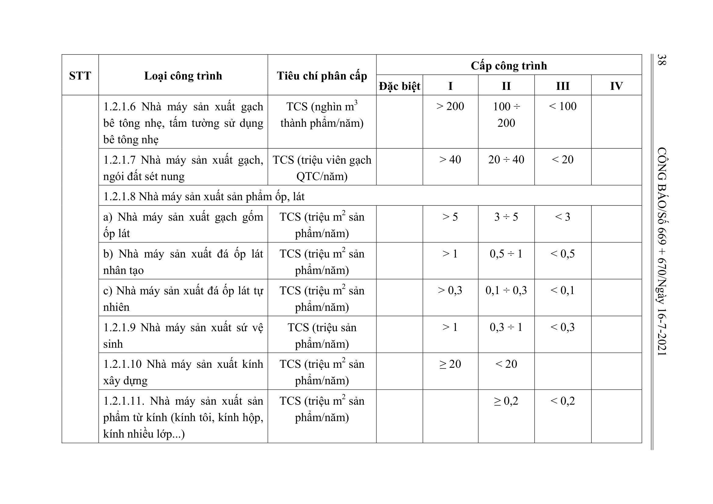
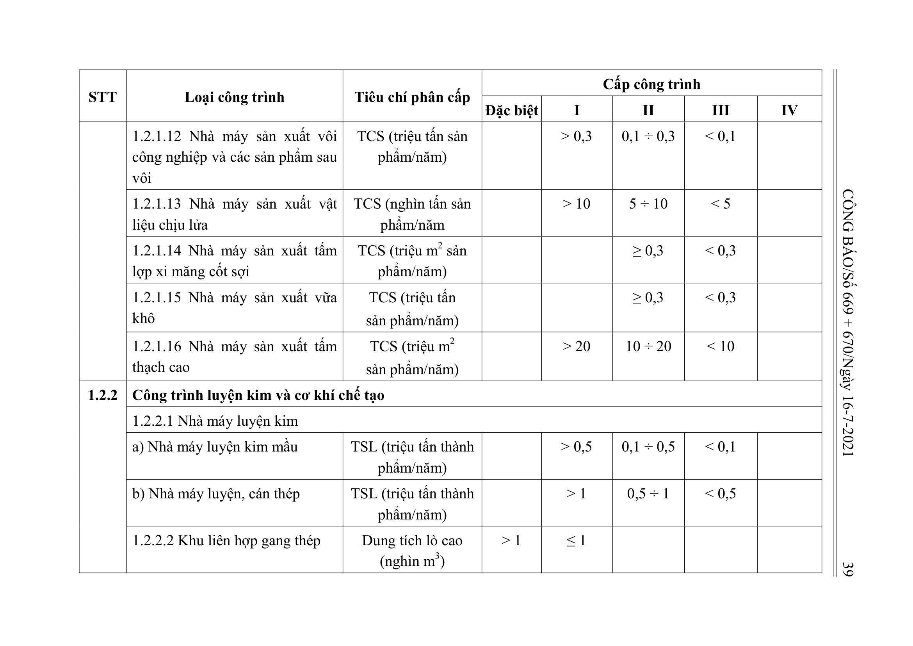

> **Trích dẫn:** Bảng 1.2: nhóm 1.2.1 Công trình sản xuất vật liệu xây dựng, sản phẩm xây dựng, Phụ lục I Thông tư số 06/2021/TT-BXD

## Bảng 1.2: nhóm 1.2.1 Công trình sản xuất vật liệu xây dựng, sản phẩm xây dựng

| STT | Loại công trình | Tiêu chí phân cấp | Đặc biệt | I | II | III | IV |
| --- | --- | --- | --- | --- | --- | --- | --- |
| 1.2.1 | Công trình sản xuất vật liệu xây dựng, sản phẩm xây dựng |  |  |  |  |  |  |
|  | 1.2.1.1 Khai thác mỏ khoáng sản làm vật liệu xây dựng (đá vôi xi măng, đất sét xi măng, phụ gia xi măng, cao lanh, fenspat, đất sét chịu lửa, đất sét trắng, cát trắng, đôlômit, đá làm ốp lát, đá vôi làm vôi, đá xây dựng, các loại khoáng sản làm vật liệu xây dựng khác) |  |  |  |  |  |  |
|  | a) Công trình có sử dụng vật liệu nổ | Mức độ quan trọng | Cấp II với mọi quy mô |  |  |  |  |
|  | b) Công trình không sử dụng vật liệu nổ | TCS (triệu m3 sản phẩm/năm) |  |  | ≥ 1 | < 1 |  |
|  | 1.2.1.2 Nhà máy sản xuất clinker, xi măng | TCS (triệu tấn/năm) |  | ≥ 1 | < 1 |  |  |
|  | 1.2.1.3 Trạm nghiền, trạm phân phối xi măng | TCS (triệu tấn/năm) |  | ≥ 0,3 | < 0,3 |  |  |
|  | 1.2.1.4 Nhà máy sản xuất sản phẩm, cấu kiện bê tông thông thường; nhà máy sản xuất gạch bê tông | TCS (nghìn m3 thành phẩm/năm) |  |  | > 150 | ≤ 150 |  |
|  | 1.2.1.5 Nhà máy sản xuất cấu kiện bê tông ly tâm, cấu kiện bê tông ứng lực trước, tấm tường bê tông rỗng đúc sẵn | TCS (nghìn m3 thành phẩm/năm) |  | > 150 | 30 ÷ 150 | < 30 |  |
|  | 1.2.1.6 Nhà máy sản xuất gạch bê tông nhẹ, tấm tường sử dụng bê tông nhẹ | TCS (nghìn m3 thành phẩm/năm) |  | > 200 | 100 ÷ 200 | < 100 |  |
|  | 1.2.1.7 Nhà máy sản xuất gạch, ngói đất sét nung | TCS (triệu viên gạch QTC/năm) |  | > 40 | 20 ÷ 40 | < 20 |  |
|  | 1.2.1.8 Nhà máy sản xuất sản phẩm ốp, lát |  |  |  |  |  |  |
|  | a) Nhà máy sản xuất gạch gốm ốp lát | TCS (triệu m2 sản phẩm/năm) |  | > 5 | 3 ÷ 5 | < 3 |  |
|  | b) Nhà máy sản xuất đá ốp lát nhân tạo | TCS (triệu m2 sản phẩm/năm) |  | > 1 | 0,5 ÷ 1 | < 0,5 |  |
|  | c) Nhà máy sản xuất đá ốp lát tự nhiên | TCS (triệu m2 sản phẩm/năm) |  | > 0,3 | 0,1 ÷ 0,3 | < 0,1 |  |
|  | 1.2.1.9 Nhà máy sản xuất sứ vệ sinh | TCS (triệu sản phẩm/năm) |  | > 1 | 0,3 ÷ 1 | < 0,3 |  |
|  | 1.2.1.10 Nhà máy sản xuất kính xây dựng | TCS (triệu m2 sản phẩm/năm) |  | ≥ 20 | < 20 |  |  |
|  | 1.2.1.11. Nhà máy sản xuất sản phẩm từ kính (kính tôi, kính hộp, kính nhiều lớp...) | TCS (triệu m2 sản phẩm/năm) |  |  | ≥ 0,2 | < 0,2 |  |
|  | 1.2.1.12 Nhà máy sản xuất vôi công nghiệp và các sản phẩm sau vôi | TCS (triệu tấn sản phẩm/năm) |  | > 0,3 | 0,1 ÷ 0,3 | < 0,1 |  |
|  | 1.2.1.13 Nhà máy sản xuất vật liệu chịu lửa | TCS (nghìn tấn sản phẩm/năm |  | > 10 | 5 ÷ 10 | < 5 |  |
|  | 1.2.1.14 Nhà máy sản xuất tấm lợp xi măng cốt sợi | TCS (triệu m2 sản phẩm/năm) |  |  | ≥ 0,3 | < 0,3 |  |
|  | 1.2.1.15 Nhà máy sản xuất vữa khô | TCS (triệu tấn sản phẩm/năm) |  |  | ≥ 0,3 | < 0,3 |  |
|  | 1.2.1.16 Nhà máy sản xuất tấm thạch cao | TCS (triệu m2 sản phẩm/năm) |  | > 20 | 10 ÷ 20 | < 10 |  |
