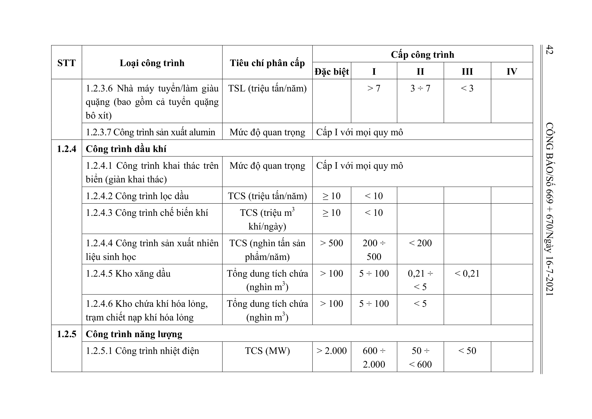

> **Trích dẫn:** Bảng 1.2: nhóm 1.2.4 Công trình dầu khí, Phụ lục I Thông tư số 06/2021/TT-BXD

## Bảng 1.2: nhóm 1.2.4 Công trình dầu khí

| STT | Loại công trình | Tiêu chí phân cấp | Đặc biệt | I | II | III | IV |
| --- | --- | --- | --- | --- | --- | --- | --- |
| 1.2.4 | Công trình dầu khí |  |  |  |  |  |  |
|  | 1.2.4.1 Công trình khai thác trên biển (giàn khai thác) | Mức độ quan trọng | Cấp I với mọi quy mô |  |  |  |  |
|  | 1.2.4.2 Công trình lọc dầu | TCS (triệu tấn/năm) | ≥ 10 | < 10 |  |  |  |
|  | 1.2.4.3 Công trình chế biến khí | TCS (triệu m3 khí/ngày) | ≥ 10 | < 10 |  |  |  |
|  | 1.2.4.4 Công trình sản xuất nhiên liệu sinh học | TCS (nghìn tấn sản phẩm/năm) | > 500 | 200 ÷ 500 | < 200 |  |  |
|  | 1.2.4.5 Kho xăng dầu | Tổng dung tích chứa (nghìn m3) | > 100 | 5 ÷ 100 | 0,21 ÷ < 5 | < 0,21 |  |
|  | 1.2.4.6 Kho chứa khí hóa lỏng, trạm chiết nạp khí hóa lỏng | Tổng dung tích chứa (nghìn m3) | > 100 | 5 ÷ 100 | < 5 |  |  |
