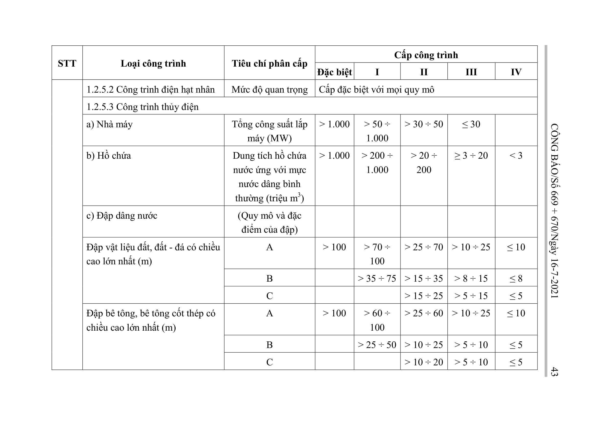
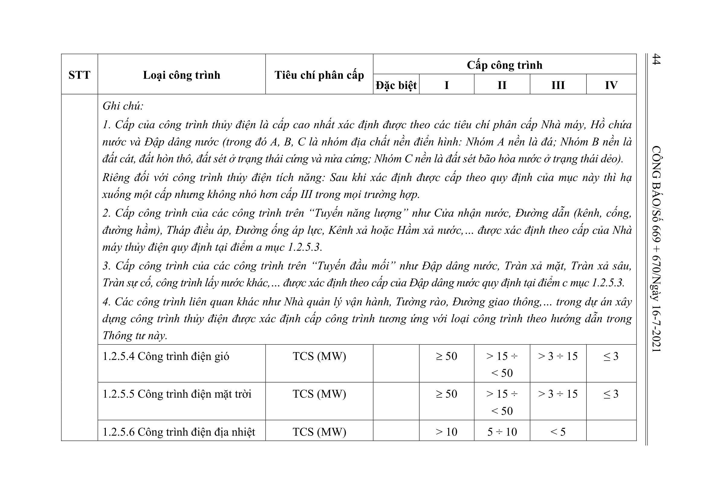

> **Trích dẫn:** Bảng 1.2: nhóm 1.2.5 Công trình năng lượng, Phụ lục I Thông tư số 06/2021/TT-BXD

## Bảng 1.2: nhóm 1.2.5 Công trình năng lượng

| STT | Loại công trình | Tiêu chí phân cấp | Đặc biệt | I | II | III | IV |
| --- | --- | --- | --- | --- | --- | --- | --- |
| 1.2.5 | Công trình năng lượng |  |  |  |  |  |  |
|  | 1.2.5.1 Công trình nhiệt điện | TCS (MW) | > 2.000 | 600 ÷ 2.000 | 50 ÷ < 600 | < 50 |  |
|  | 1.2.5.2 Công trình điện hạt nhân | Mức độ quan trọng | Cấp đặc biệt với mọi quy mô |  |  |  |  |
|  | 1.2.5.3 Công trình thủy điện |  |  |  |  |  |  |
|  | a) Nhà máy | Tổng công suất lắp máy (MW) | > 1.000 | > 50 ÷ 1.000 | > 30 ÷ 50 | ≤ 30 |  |
|  | b) Hồ chứa | Dung tích hồ chứa nước ứng với mực nước dâng bình thường (triệu m3) | > 1.000 | > 200 ÷ 1.000 | > 20 ÷ 200 | ≥ 3 ÷ 20 | < 3 |
|  | c) Đập dâng nước | (Quy mô và đặc điểm của đập) |  |  |  |  |  |
|  | Đập vật liệu đất, đất - đá có chiều cao lớn nhất (m) | A | > 100 | > 70 ÷ 100 | > 25 ÷ 70 | > 10 ÷ 25 | ≤ 10 |
|  |  | B |  | > 35 ÷ 75 | > 15 ÷ 35 | > 8 ÷ 15 | ≤ 8 |
|  |  | C |  |  | > 15 ÷ 25 | > 5 ÷ 15 | ≤ 5 |
|  | Đập bê tông, bê tông cốt thép có chiều cao lớn nhất (m) | A | > 100 | > 60 ÷ 100 | > 25 ÷ 60 | > 10 ÷ 25 | ≤ 10 |
|  |  | B |  | > 25 ÷ 50 | > 10 ÷ 25 | > 5 ÷ 10 | ≤ 5 |
|  |  | C |  |  | > 10 ÷ 20 | > 5 ÷ 10 | ≤ 5 |
|  | Ghi chú: 1. Cấp của công trình thủy điện là cấp cao nhất xác định được theo các tiêu chí phân cấp Nhà máy, Hồ chứa nước và Đập dâng nước (trong đó A, B, C là nhóm địa chất nền điển hình: Nhóm A nền là đá; Nhóm B nền là đất cát, đất hòn thô, đất sét ở trạng thái cứng và nửa cứng; Nhóm C nền là đất sét bão hòa nước ở trạng thái dẻo). Riêng đối với công trình thủy điện tích năng: Sau khi xác định được cấp theo quy định của mục này thì hạ xuống một cấp nhưng không nhỏ hơn cấp III trong mọi trường hợp. 2. Cấp công trình của các công trình trên “Tuyến năng lượng” như Cửa nhận nước, Đường dẫn (kênh, cống, đường hầm), Tháp điều áp, Đường ống áp lực, Kênh xả hoặc Hầm xả nước,… được xác định theo cấp của Nhà máy thủy điện quy định tại điểm a mục 1.2.5.3. 3. Cấp công trình của các công trình trên “Tuyến đầu mối” như Đập dâng nước, Tràn xả mặt, Tràn xả sâu, Tràn sự cố, công trình lấy nước khác,… được xác định theo cấp của Đập dâng nước quy định tại điểm c mục 1.2.5.3. 4. Các công trình liên quan khác như Nhà quản lý vận hành, Tường rào, Đường giao thông,… trong dự án xây dựng công trình thủy điện được xác định cấp công trình tương ứng với loại công trình theo hướng dẫn trong Thông tư này. |  |  |  |  |  |  |
|  | 1.2.5.4 Công trình điện gió | TCS (MW) |  | ≥ 50 | > 15 ÷ < 50 | > 3 ÷ 15 | ≤ 3 |
|  | 1.2.5.5 Công trình điện mặt trời | TCS (MW) |  | ≥ 50 | > 15 ÷ < 50 | > 3 ÷ 15 | ≤ 3 |
|  | 1.2.5.6 Công trình điện địa nhiệt | TCS (MW) |  | > 10 | 5 ÷ 10 | < 5 |  |
|  | 1.2.5.7 Công trình điện thủy triều | TCS (MW) |  | > 50 | 30 ÷ 50 | < 30 |  |
|  | 1.2.5.8 Công trình điện rác | TCS (MW) | > 70 | > 15 ÷ 70 | 5 ÷ 15 | < 5 |  |
|  | 1.2.5.9 Công trình điện sinh khối | TCS (MW) |  | > 30 | 10 ÷ 30 | < 10 |  |
|  | 1.2.5.10 Công trình điện khí biogas | TCS (MW) |  | > 15 | 5 ÷ 15 | < 5 |  |
|  | 1.2.5.11 Đường dây và trạm biến áp | Điện áp (kV) | ≥ 500 | 220 | 110 | > 35 ÷ < 110 | ≤ 35 |
|  | 1.2.5.12 Cửa hàng/Trạm bán lẻ xăng, dầu, khí hóa lỏng; trạm cấp/sạc điện, pin điện. | Mức độ quan trọng | Cấp III với mọi quy mô |  |  |  |  |
