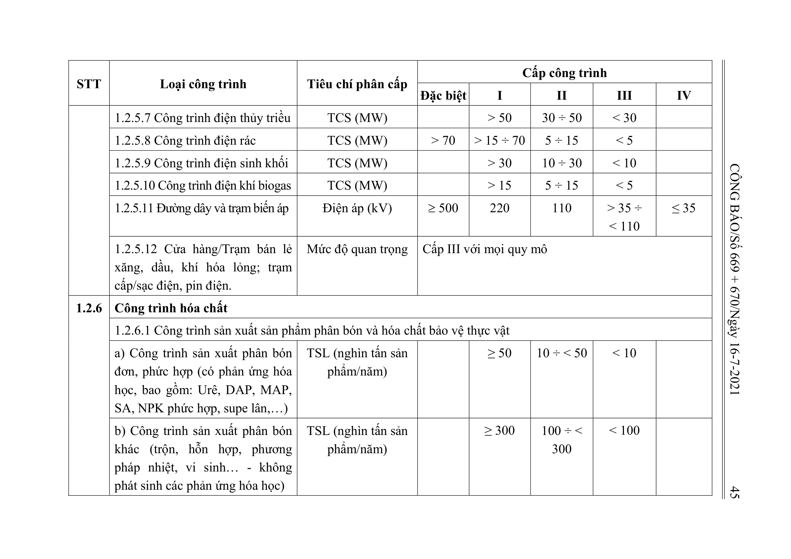
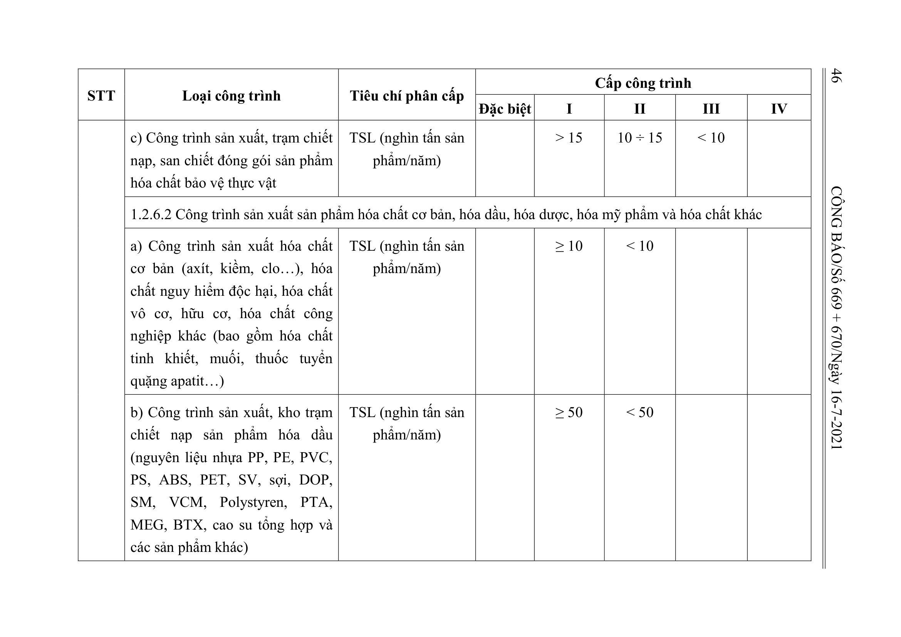
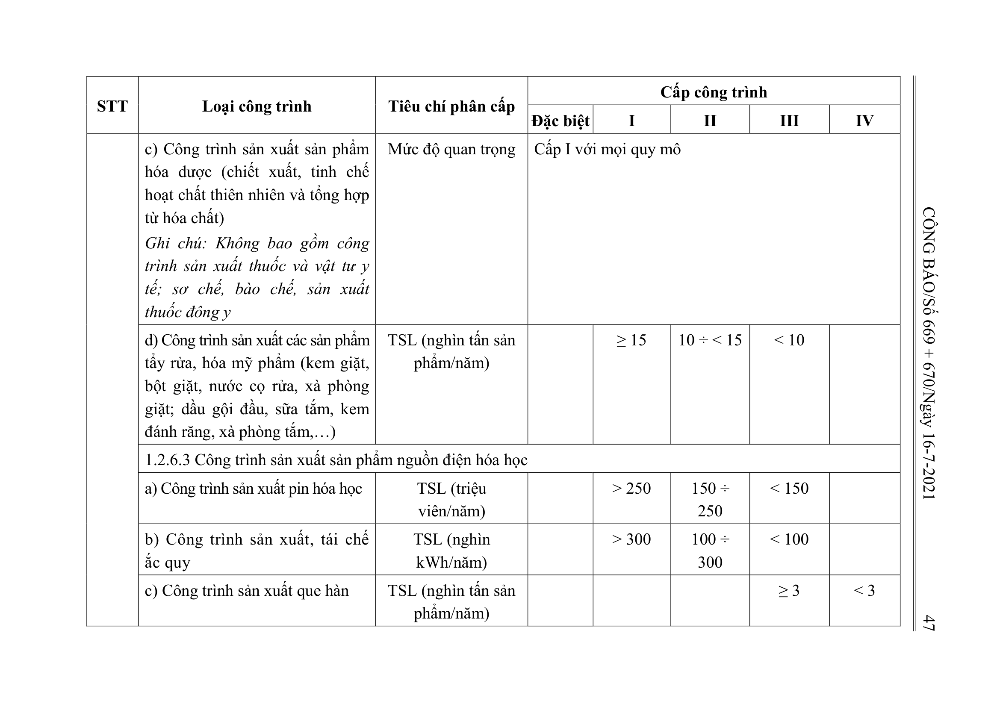
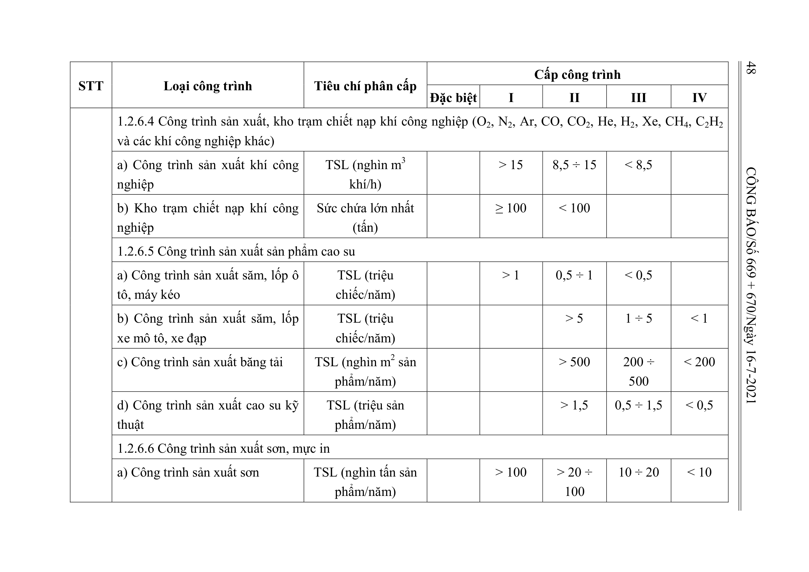
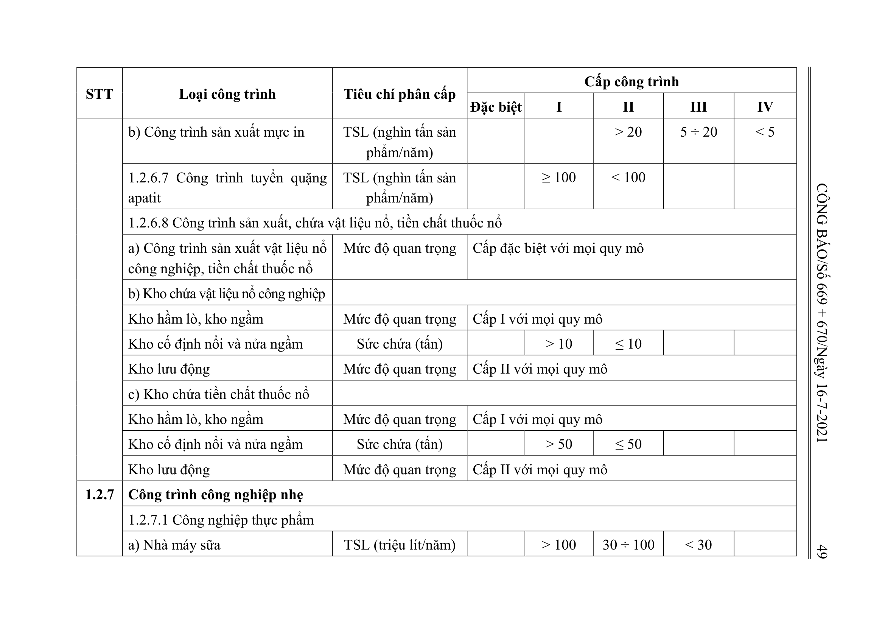

> **Trích dẫn:** Bảng 1.2: nhóm 1.2.6 Công trình hóa chất, Phụ lục I Thông tư số 06/2021/TT-BXD

## Bảng 1.2: nhóm 1.2.6 Công trình hóa chất

| STT | Loại công trình | Tiêu chí phân cấp | Đặc biệt | I | II | III | IV |
| --- | --- | --- | --- | --- | --- | --- | --- |
| 1.2.6 | Công trình hóa chất |  |  |  |  |  |  |
|  | 1.2.6.1 Công trình sản xuất sản phẩm phân bón và hóa chất bảo vệ thực vật |  |  |  |  |  |  |
|  | a) Công trình sản xuất phân bón đơn, phức hợp (có phản ứng hóa học, bao gồm: Urê, DAP, MAP, SA, NPK phức hợp, supe lân,…) | TSL (nghìn tấn sản phẩm/năm) |  | ≥ 50 | 10 ÷ < 50 | < 10 |  |
|  | b) Công trình sản xuất phân bón khác (trộn, hỗn hợp, phương pháp nhiệt, vi sinh… - không phát sinh các phản ứng hóa học) | TSL (nghìn tấn sản phẩm/năm) |  | ≥ 300 | 100 ÷ < 300 | < 100 |  |
|  | c) Công trình sản xuất, trạm chiết nạp, san chiết đóng gói sản phẩm hóa chất bảo vệ thực vật | TSL (nghìn tấn sản phẩm/năm) |  | > 15 | 10 ÷ 15 | < 10 |  |
|  | 1.2.6.2 Công trình sản xuất sản phẩm hóa chất cơ bản, hóa dầu, hóa dược, hóa mỹ phẩm và hóa chất khác |  |  |  |  |  |  |
|  | a) Công trình sản xuất hóa chất cơ bản (axít, kiềm, clo…), hóa chất nguy hiểm độc hại, hóa chất vô cơ, hữu cơ, hóa chất công nghiệp khác (bao gồm hóa chất tinh khiết, muối, thuốc tuyển quặng apatit…) | TSL (nghìn tấn sản phẩm/năm) |  | ≥ 10 | < 10 |  |  |
|  | b) Công trình sản xuất, kho trạm chiết nạp sản phẩm hóa dầu (nguyên liệu nhựa PP, PE, PVC, PS, ABS, PET, SV, sợi, DOP, SM, VCM, Polystyren, PTA, MEG, BTX, cao su tổng hợp và các sản phẩm khác) | TSL (nghìn tấn sản phẩm/năm) |  | ≥ 50 | < 50 |  |  |
|  | c) Công trình sản xuất sản phẩm hóa dược (chiết xuất, tinh chế hoạt chất thiên nhiên và tổng hợp từ hóa chất) Ghi chú: Không bao gồm công trình sản xuất thuốc và vật tư y tế; sơ chế, bào chế, sản xuất thuốc đông y | Mức độ quan trọng | Cấp I với mọi quy mô |  |  |  |  |
|  | d) Công trình sản xuất các sản phẩm tẩy rửa, hóa mỹ phẩm (kem giặt, bột giặt, nước cọ rửa, xà phòng giặt; dầu gội đầu, sữa tắm, kem đánh răng, xà phòng tắm,…) | TSL (nghìn tấn sản phẩm/năm) |  | ≥ 15 | 10 ÷ < 15 | < 10 |  |
|  | 1.2.6.3 Công trình sản xuất sản phẩm nguồn điện hóa học |  |  |  |  |  |  |
|  | a) Công trình sản xuất pin hóa học | TSL (triệu viên/năm) |  | > 250 | 150 ÷ 250 | < 150 |  |
|  | b) Công trình sản xuất, tái chế ắc quy | TSL (nghìn kWh/năm) |  | > 300 | 100 ÷ 300 | < 100 |  |
|  | c) Công trình sản xuất que hàn | TSL (nghìn tấn sản phẩm/năm) |  |  |  | ≥ 3 | < 3 |
|  | 1.2.6.4 Công trình sản xuất, kho trạm chiết nạp khí công nghiệp (O , N , Ar, CO, CO , He, H , Xe, CH , C H 2 2 2 2 4 2 2 và các khí công nghiệp khác) |  |  |  |  |  |  |
|  | a) Công trình sản xuất khí công nghiệp | TSL (nghìn m3 khí/h) |  | > 15 | 8,5 ÷ 15 | < 8,5 |  |
|  | b) Kho trạm chiết nạp khí công nghiệp | Sức chứa lớn nhất (tấn) |  | ≥ 100 | < 100 |  |  |
|  | 1.2.6.5 Công trình sản xuất sản phẩm cao su |  |  |  |  |  |  |
|  | a) Công trình sản xuất săm, lốp ô tô, máy kéo | TSL (triệu chiếc/năm) |  | > 1 | 0,5 ÷ 1 | < 0,5 |  |
|  | b) Công trình sản xuất săm, lốp xe mô tô, xe đạp | TSL (triệu chiếc/năm) |  |  | > 5 | 1 ÷ 5 | < 1 |
|  | c) Công trình sản xuất băng tải | TSL (nghìn m2 sản phẩm/năm) |  |  | > 500 | 200 ÷ 500 | < 200 |
|  | d) Công trình sản xuất cao su kỹ thuật | TSL (triệu sản phẩm/năm) |  |  | > 1,5 | 0,5 ÷ 1,5 | < 0,5 |
|  | 1.2.6.6 Công trình sản xuất sơn, mực in |  |  |  |  |  |  |
|  | a) Công trình sản xuất sơn | TSL (nghìn tấn sản phẩm/năm) |  | > 100 | > 20 ÷ 100 | 10 ÷ 20 | < 10 |
|  | b) Công trình sản xuất mực in | TSL (nghìn tấn sản phẩm/năm) |  |  | > 20 | 5 ÷ 20 | < 5 |
|  | 1.2.6.7 Công trình tuyển quặng apatit | TSL (nghìn tấn sản phẩm/năm) |  | ≥ 100 | < 100 |  |  |
|  | 1.2.6.8 Công trình sản xuất, chứa vật liệu nổ, tiền chất thuốc nổ |  |  |  |  |  |  |
|  | a) Công trình sản xuất vật liệu nổ công nghiệp, tiền chất thuốc nổ | Mức độ quan trọng | Cấp đặc biệt với mọi quy mô |  |  |  |  |
|  | b) Kho chứa vật liệu nổ công nghiệp |  |  |  |  |  |  |
|  | Kho hầm lò, kho ngầm | Mức độ quan trọng | Cấp I với mọi quy mô |  |  |  |  |
|  | Kho cố định nổi và nửa ngầm | Sức chứa (tấn) |  | > 10 | ≤ 10 |  |  |
|  | Kho lưu động | Mức độ quan trọng | Cấp II với mọi quy mô |  |  |  |  |
|  | c) Kho chứa tiền chất thuốc nổ |  |  |  |  |  |  |
|  | Kho hầm lò, kho ngầm | Mức độ quan trọng | Cấp I với mọi quy mô |  |  |  |  |
|  | Kho cố định nổi và nửa ngầm | Sức chứa (tấn) |  | > 50 | ≤ 50 |  |  |
|  | Kho lưu động | Mức độ quan trọng | Cấp II với mọi quy mô |  |  |  |  |
