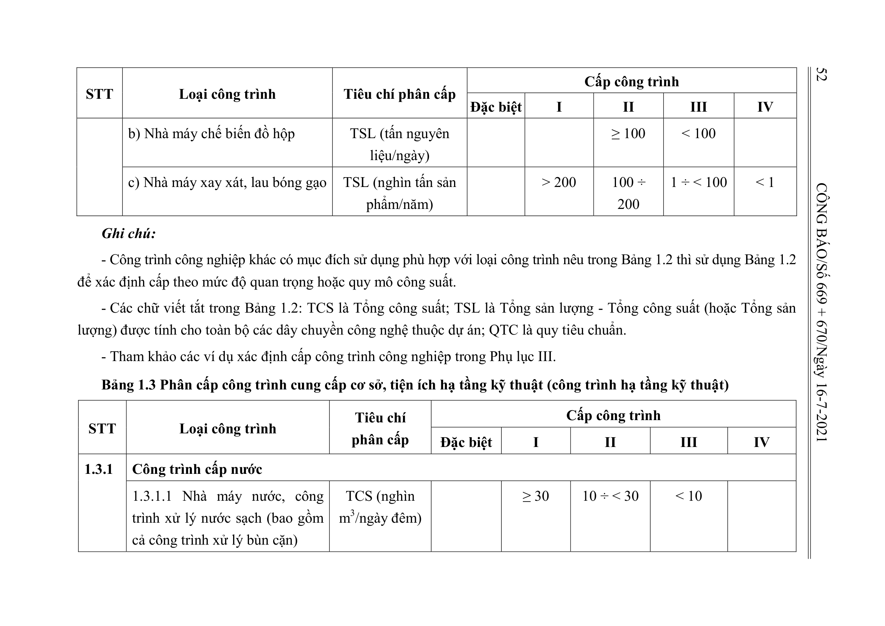
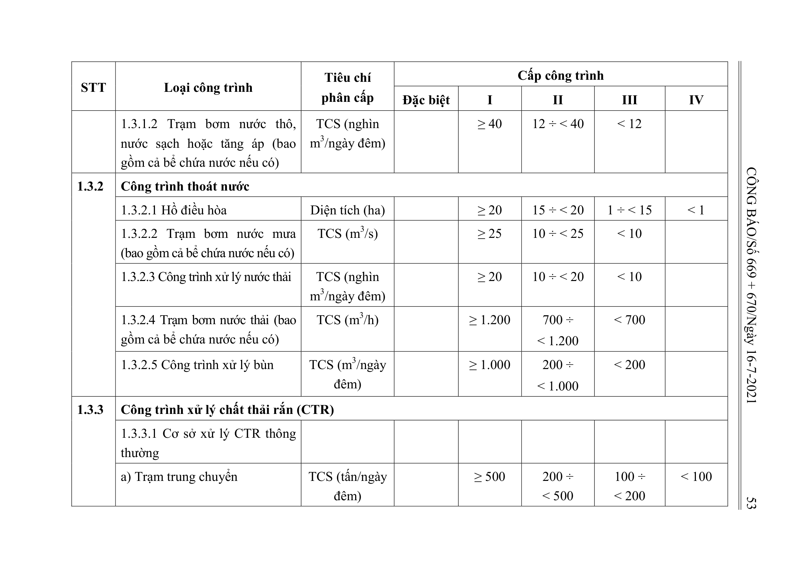

> **Trích dẫn:** Bảng 1.3: nhóm 1.3.1 Công trình cấp nước, Phụ lục I Thông tư số 06/2021/TT-BXD

## Bảng 1.3: nhóm 1.3.1 Công trình cấp nước

| STT | Loại công trình | Tiêu chí phân cấp | Đặc biệt | I | II | III | IV |
| --- | --- | --- | --- | --- | --- | --- | --- |
| 1.3.1 | Công trình cấp nước |  |  |  |  |  |  |
|  | 1.3.1.1 Nhà máy nước, công trình xử lý nước sạch (bao gồm cả công trình xử lý bùn cặn) | TCS (nghìn m3/ngày đêm) |  | ≥ 30 | 10 ÷ < 30 | < 10 |  |
|  | 1.3.1.2 Trạm bơm nước thô, nước sạch hoặc tăng áp (bao gồm cả bể chứa nước nếu có) | TCS (nghìn m3/ngày đêm) |  | ≥ 40 | 12 ÷ < 40 | < 12 |  |
