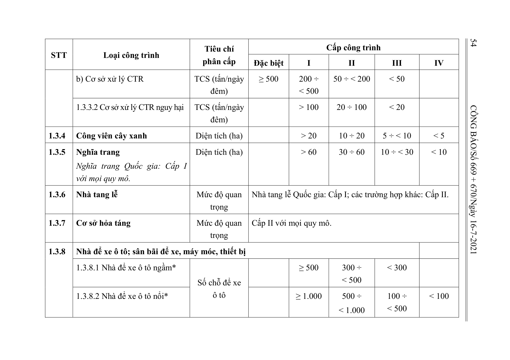

> **Trích dẫn:** Bảng 1.3: nhóm 1.3.3 Công trình xử lý chất thải rắn (CTR), Phụ lục I Thông tư số 06/2021/TT-BXD

## Bảng 1.3: nhóm 1.3.3 Công trình xử lý chất thải rắn (CTR)

| STT | Loại công trình | Tiêu chí phân cấp | Đặc biệt | I | II | III | IV |
| --- | --- | --- | --- | --- | --- | --- | --- |
| 1.3.3 | Công trình xử lý chất thải rắn (CTR) |  |  |  |  |  |  |
|  | 1.3.3.1 Cơ sở xử lý CTR thông thường |  |  |  |  |  |  |
|  | a) Trạm trung chuyển | TCS (tấn/ngày đêm) |  | ≥ 500 | 200 ÷ < 500 | 100 ÷ < 200 | < 100 |
|  | b) Cơ sở xử lý CTR | TCS (tấn/ngày đêm) | ≥ 500 | 200 ÷ < 500 | 50 ÷ < 200 | < 50 |  |
|  | 1.3.3.2 Cơ sở xử lý CTR nguy hại | TCS (tấn/ngày đêm) |  | > 100 | 20 ÷ 100 | < 20 |  |
