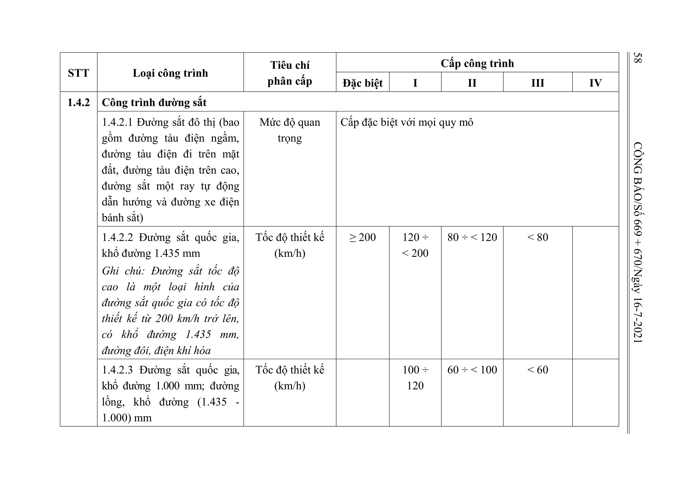
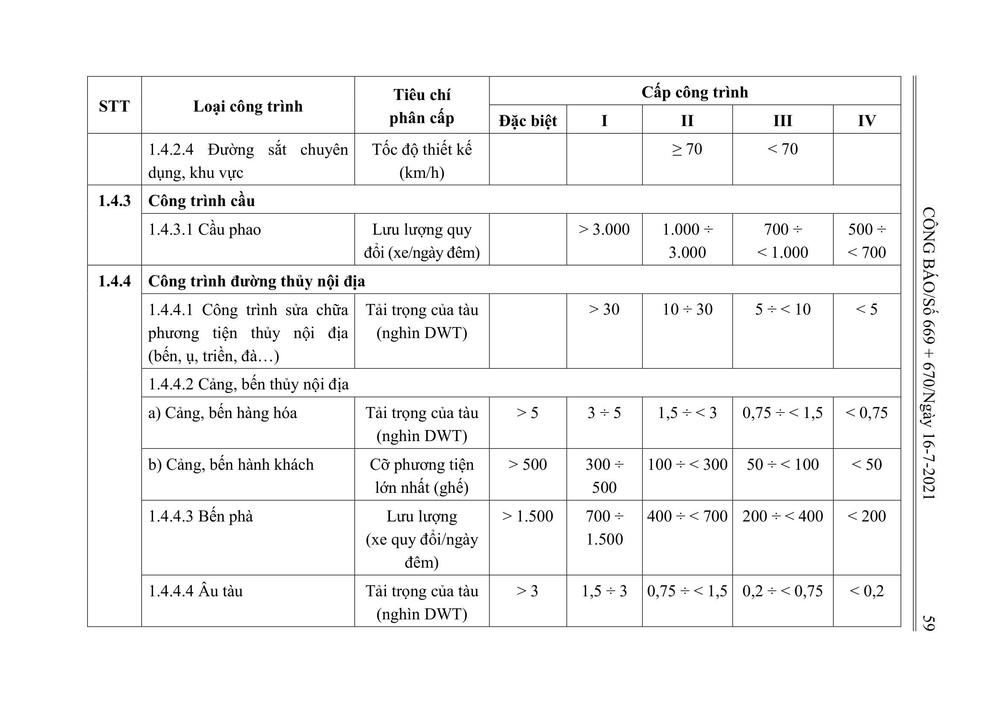

> **Trích dẫn:** Bảng 1.4: nhóm 1.4.2 Công trình đường sắt, Phụ lục I Thông tư số 06/2021/TT-BXD

## Bảng 1.4: nhóm 1.4.2 Công trình đường sắt

| STT | Loại công trình | Tiêu chí phân cấp | Đặc biệt | I | II | III | IV |
| --- | --- | --- | --- | --- | --- | --- | --- |
| 1.4.2 | Công trình đường sắt |  |  |  |  |  |  |
|  | 1.4.2.1 Đường sắt đô thị (bao gồm đường tàu điện ngầm, đường tàu điện đi trên mặt đất, đường tàu điện trên cao, đường sắt một ray tự động dẫn hướng và đường xe điện bánh sắt) | Mức độ quan trọng | Cấp đặc biệt với mọi quy mô |  |  |  |  |
|  | 1.4.2.2 Đường sắt quốc gia, khổ đường 1.435 mm Ghi chú: Đường sắt tốc độ cao là một loại hình của đường sắt quốc gia có tốc độ thiết kế từ 200 km/h trở lên, có khổ đường 1.435 mm, đường đôi, điện khí hóa | Tốc độ thiết kế (km/h) | ≥ 200 | 120 ÷ < 200 | 80 ÷ < 120 | < 80 |  |
|  | 1.4.2.3 Đường sắt quốc gia, khổ đường 1.000 mm; đường lồng, khổ đường (1.435 - 1.000) mm | Tốc độ thiết kế (km/h) |  | 100 ÷ 120 | 60 ÷ < 100 | < 60 |  |
|  | 1.4.2.4 Đường sắt chuyên dụng, khu vực | Tốc độ thiết kế (km/h) |  |  | ≥ 70 | < 70 |  |
