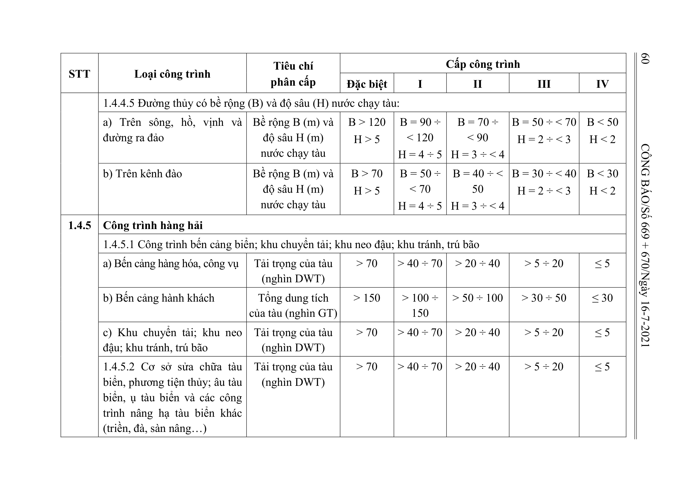

> **Trích dẫn:** Bảng 1.4: nhóm 1.4.4 Công trình đường thủy nội địa, Phụ lục I Thông tư số 06/2021/TT-BXD

## Bảng 1.4: nhóm 1.4.4 Công trình đường thủy nội địa

| STT | Loại công trình | Tiêu chí phân cấp | Đặc biệt | I | II | III | IV |
| --- | --- | --- | --- | --- | --- | --- | --- |
| 1.4.4 | Công trình đường thủy nội địa |  |  |  |  |  |  |
|  | 1.4.4.1 Công trình sửa chữa phương tiện thủy nội địa (bến, ụ, triền, đà…) | Tải trọng của tàu (nghìn DWT) |  | > 30 | 10 ÷ 30 | 5 ÷ < 10 | < 5 |
|  | 1.4.4.2 Cảng, bến thủy nội địa |  |  |  |  |  |  |
|  | a) Cảng, bến hàng hóa | Tải trọng của tàu (nghìn DWT) | > 5 | 3 ÷ 5 | 1,5 ÷ < 3 | 0,75 ÷ < 1,5 | < 0,75 |
|  | b) Cảng, bến hành khách | Cỡ phương tiện lớn nhất (ghế) | > 500 | 300 ÷ 500 | 100 ÷ < 300 | 50 ÷ < 100 | < 50 |
|  | 1.4.4.3 Bến phà | Lưu lượng (xe quy đổi/ngày đêm) | > 1.500 | 700 ÷ 1.500 | 400 ÷ < 700 | 200 ÷ < 400 | < 200 |
|  | 1.4.4.4 Âu tàu | Tải trọng của tàu (nghìn DWT) | > 3 | 1,5 ÷ 3 | 0,75 ÷ < 1,5 | 0,2 ÷ < 0,75 | < 0,2 |
|  | 1.4.4.5 Đường thủy có bề rộng (B) và độ sâu (H) nước chạy tàu: |  |  |  |  |  |  |
|  | a) Trên sông, hồ, vịnh và đường ra đảo | Bề rộng B (m) và độ sâu H (m) nước chạy tàu | B > 120 H > 5 | B = 90 ÷ < 120 H = 4 ÷ 5 | B = 70 ÷ < 90 H = 3 ÷ < 4 | B = 50 ÷ < 70 H = 2 ÷ < 3 | B < 50 H < 2 |
|  | b) Trên kênh đào | Bề rộng B (m) và độ sâu H (m) nước chạy tàu | B > 70 H > 5 | B = 50 ÷ < 70 H = 4 ÷ 5 | B = 40 ÷ < 50 H = 3 ÷ < 4 | B = 30 ÷ < 40 H = 2 ÷ < 3 | B < 30 H < 2 |
