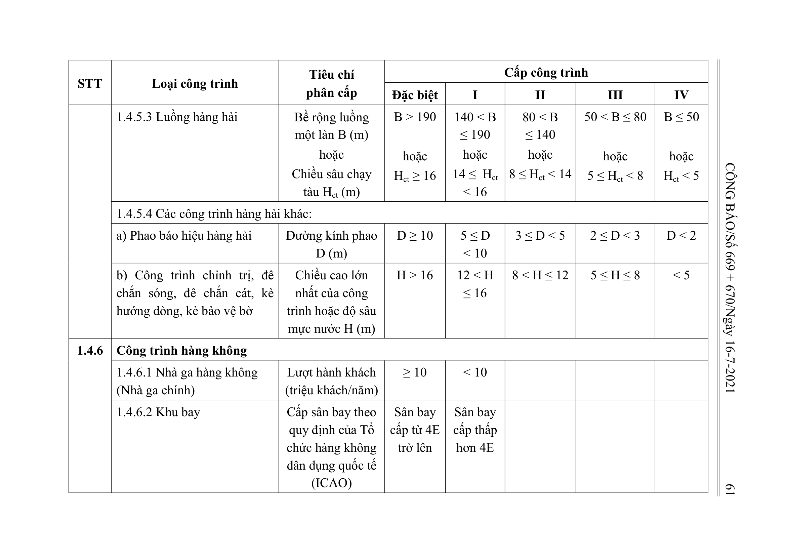

> **Trích dẫn:** Bảng 1.4: nhóm 1.4.6 Công trình hàng không, Phụ lục I Thông tư số 06/2021/TT-BXD

## Bảng 1.4: nhóm 1.4.6 Công trình hàng không

| STT | Loại công trình | Tiêu chí phân cấp | Đặc biệt | I | II | III | IV |
| --- | --- | --- | --- | --- | --- | --- | --- |
| 1.4.6 | Công trình hàng không |  |  |  |  |  |  |
|  | 1.4.6.1 Nhà ga hàng không (Nhà ga chính) | Lượt hành khách (triệu khách/năm) | ≥ 10 | < 10 |  |  |  |
|  | 1.4.6.2 Khu bay | Cấp sân bay theo quy định của Tổ chức hàng không dân dụng quốc tế (ICAO) | Sân bay cấp từ 4E trở lên | Sân bay cấp thấp hơn 4E |  |  |  |

**Ghi chú:**

- Công trình giao thông khác có mục đích sử dụng phù hợp với loại công trình nêu trong Bảng 1.4 thì sử dụng Bảng 1.4 để xác định cấp theo mức độ quan trọng hoặc quy mô công suất.
- Tham khảo các ví dụ xác định cấp công trình giao thông trong Phụ lục III.
