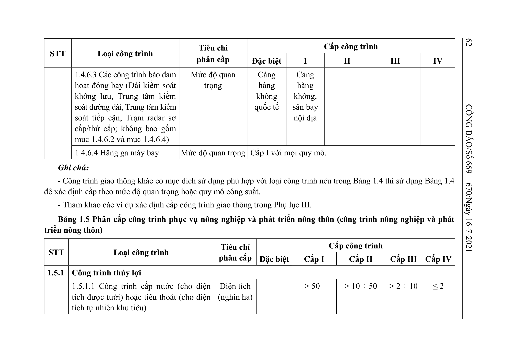

> **Trích dẫn:** Bảng 1.5: nhóm 1.5.1 Công trình thủy lợi, Phụ lục I Thông tư số 06/2021/TT-BXD

## Bảng 1.5: nhóm 1.5.1 Công trình thủy lợi

| STT | Loại công trình | Tiêu chí phân cấp | Đặc biệt | I | II | III | IV |
| --- | --- | --- | --- | --- | --- | --- | --- |
| 1.5.1 | Công trình thủy lợi |  |  |  |  |  |  |
|  | 1.5.1.1 Công trình cấp nước (cho diện tích được tưới) hoặc tiêu thoát (cho diện tích tự nhiên khu tiêu) | Diện tích (nghìn ha) |  | > 50 | > 10 ÷ 50 | > 2 ÷ 10 | ≤ 2 |
|  |  |  | Đặc biệt | Cấp I | Cấp II | Cấp III | Cấp IV |
|  | 1.5.1.2 Hồ chứa nước ứng với mực nước dâng bình thường | Dung tích (triệu m3) | > 1.000 | > 200 ÷ 1.000 | > 20 ÷ 200 | ≥ 3 ÷ 20 | < 3 |
|  | 1.5.1.3 Công trình cấp nguồn nước chưa xử lý cho các ngành sử dụng nước khác | Lưu lượng (m3/s) | > 20 | > 10 ÷ 20 | > 2 ÷ 10 | ≤ 2 |  |
