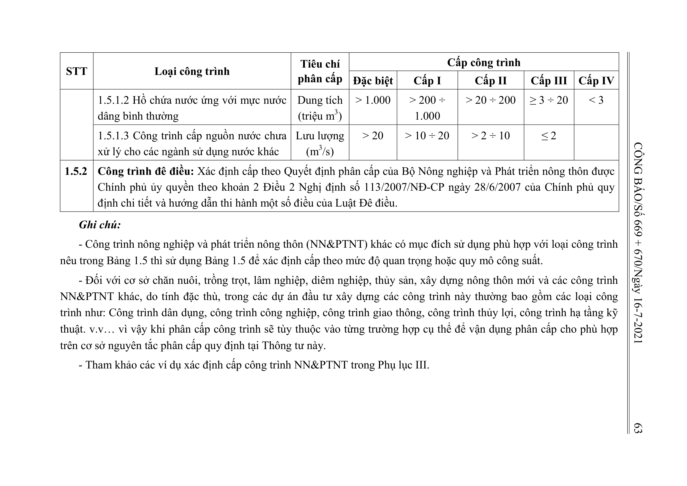

> **Trích dẫn:** Bảng 1.5: nhóm 1.5.2 Công trình đê điều: Xác định cấp theo Quyết định phân cấp của Bộ Nông nghiệp và Phát triển nông thôn được Chính phủ ủy quyền t, Phụ lục I Thông tư số 06/2021/TT-BXD

## Bảng 1.5: nhóm 1.5.2 Công trình đê điều: Xác định cấp theo Quyết định phân cấp của Bộ Nông nghiệp và Phát triển nông thôn được Chính phủ ủy quyền t

| STT | Loại công trình | Tiêu chí phân cấp | Đặc biệt | I | II | III | IV |
| --- | --- | --- | --- | --- | --- | --- | --- |
| 1.5.2 | Công trình đê điều: Xác định cấp theo Quyết định phân cấp của Bộ Nông nghiệp và Phát triển nông thôn được Chính phủ ủy quyền theo khoản 2 Điều 2 Nghị định số 113/2007/NĐ-CP ngày 28/6/2007 của Chính phủ quy định chi tiết và hướng dẫn thi hành một số điều của Luật Đê điều. |  |  |  |  |  |  |

**Ghi chú:**

- Công trình nông nghiệp và phát triển nông thôn (NN&PTNT) khác có mục đích sử dụng phù hợp với loại công trình nêu trong Bảng 1.5 thì sử dụng Bảng 1.5 để xác định cấp theo mức độ quan trọng hoặc quy mô công suất.
- Đối với cơ sở chăn nuôi, trồng trọt, lâm nghiệp, diêm nghiệp, thủy sản, xây dựng nông thôn mới và các công trình NN&PTNT khác, do tính đặc thù, trong các dự án đầu tư xây dựng các công trình này thường bao gồm các loại công trình như: Công trình dân dụng, công trình công nghiệp, công trình giao thông, công trình thủy lợi, công trình hạ tầng kỹ thuật. v.v… vì vậy khi phân cấp công trình sẽ tùy thuộc vào từng trường hợp cụ thể để vận dụng phân cấp cho phù hợp trên cơ sở nguyên tắc phân cấp quy định tại Thông tư này.
- Tham khảo các ví dụ xác định cấp công trình NN&PTNT trong Phụ lục III.
