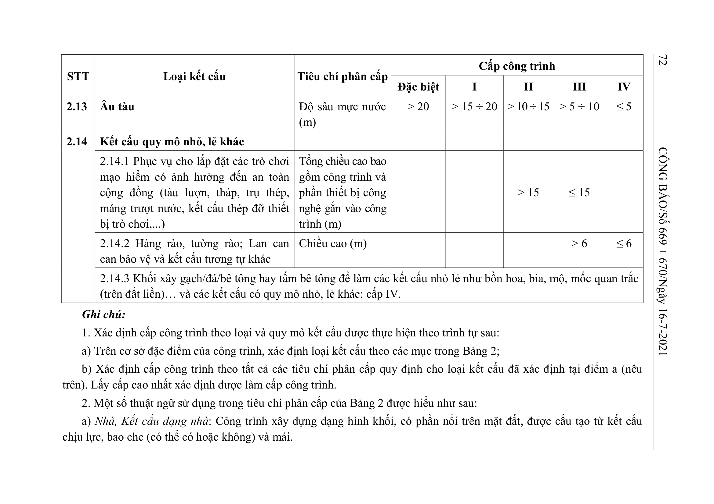

> **Trích dẫn:** Bảng 2: nhóm 2.14 Kết cấu quy mô nhỏ, lẻ khác, Phụ lục II Thông tư số 06/2021/TT-BXD

## Bảng 2: nhóm 2.14 Kết cấu quy mô nhỏ, lẻ khác

| STT | Loại kết cấu | Tiêu chí phân cấp | Đặc biệt | I | II | III | IV |
| --- | --- | --- | --- | --- | --- | --- | --- |
| 2.14 | Kết cấu quy mô nhỏ, lẻ khác |  |  |  |  |  |  |
|  | 2.14.1 Phục vụ cho lắp đặt các trò chơi mạo hiểm có ảnh hưởng đến an toàn cộng đồng (tàu lượn, tháp, trụ thép, máng trượt nước, kết cấu thép đỡ thiết bị trò chơi,...) | Tổng chiều cao bao gồm công trình và phần thiết bị công nghệ gắn vào công trình (m) |  |  | > 15 | ≤ 15 |  |
|  | 2.14.2 Hàng rào, tường rào; Lan can can bảo vệ và kết cấu tương tự khác | Chiều cao (m) |  |  |  | > 6 | ≤ 6 |
|  | 2.14.3 Khối xây gạch/đá/bê tông hay tấm bê tông để làm các kết cấu nhỏ lẻ như bồn hoa, bia, mộ, mốc quan trắc (trên đất liền)… và các kết cấu có quy mô nhỏ, lẻ khác: cấp IV. |  |  |  |  |  |  |

b) Cao độ mặt đất hoặc cao độ mặt đất đặt công trình: Cao độ lấy theo quy hoạch được duyệt (tại những khu vực chưa có quy hoạch, lấy theo cao độ thiết kế hoặc cao độ mặt đất hiện trạng với công trình hiện hữu).
c) Tầng trên mặt đất: Tầng mà cao độ mặt sàn của nó cao hơn hoặc bằng cao độ mặt đất đặt công trình.
d) Tầng hầm (hoặc tầng ngầm): Tầng mà hơn một nửa chiều cao của nó nằm dưới cao độ mặt đất đặt công trình.
đ) Tầng nửa/bán hầm (hoặc tầng nửa/bán ngầm): Tầng mà một nửa chiều cao của nó nằm trên hoặc bằng cao độ mặt đất đặt công trình.
e) Tầng lửng: Tầng trung gian giữa các tầng mà sàn của nó (sàn lửng) nằm giữa sàn của hai tầng có công năng sử dụng chính hoặc nằm giữa mái công trình và sàn tầng có công năng sử dụng chính ngay bên dưới; tầng lửng có diện tích sàn nhỏ hơn diện tích sàn xây dựng tầng có công năng sử dụng chính ngay bên dưới.
g) Tầng áp mái: Tầng nằm bên trong không gian của mái dốc mà toàn bộ hoặc một phần mặt đứng của nó được tạo bởi bề mặt mái nghiêng hoặc mái gấp, trong đó tường đứng (nếu có) không cao quá mặt sàn 1,5 m.
h) Tầng tum hoặc tầng mái tum: Tầng trên cùng của tòa nhà sử dụng cho các mục đích bao che lồng cầu thang, giếng thang máy, các thiết bị công trình (nếu có) và phục vụ mục đích lên sàn mái và cứu nạn cứu hộ.
i) Tầng kỹ thuật: Tầng sử dụng để bố trí các thiết bị kỹ thuật của tòa nhà (có thể kết hợp bố trí gian lánh nạn trong tầng kỹ thuật).
k) Độ sâu ngầm: Chiều sâu tính từ cốt mặt đất đặt công trình tới mặt trên của sàn tầng hầm sâu nhất.
l) Nhịp kết cấu lớn nhất của nhà/công trình: Khoảng cách lớn nhất giữa tim của các trụ (cột, tường) liền kề, được dùng để đỡ kết cấu nằm ngang (dầm, sàn không dầm, giàn mái, giàn cầu, cáp treo…). Riêng đối với kết cấu công xôn, lấy giá trị nhịp bằng 50% giá trị quy định trong Bảng 2.
m) Tổng diện tích sàn của nhà/công trình: Tổng diện tích sàn của tất cả các tầng, bao gồm cả các tầng hầm, tầng nửa hầm, tầng lửng, tầng kỹ thuật, tầng áp mái và tầng tum. Diện tích sàn của một tầng là diện tích sàn xây dựng của tầng đó, gồm cả tường bao (hoặc phần tường chung thuộc về nhà) và diện tích mặt bằng của lôgia, ban công, cầu thang, giếng thang máy, hộp kỹ thuật, ống khói.

3. Cách xác định Chiều cao của công trình/kết cấu:
a) Đối với công trình/kết cấu thuộc mục 2.1: Chiều cao được tính từ cao độ mặt đất đặt công trình tới điểm cao nhất của công trình (kể cả tầng tum hoặc mái dốc). Đối với công trình/kết cấu đặt trên mặt đất có các cao độ mặt đất khác nhau thì chiều cao tính từ cao độ mặt đất thấp nhất. Nếu trên đỉnh công trình có các thiết bị kỹ thuật như cột ăng ten, cột thu sét, thiết bị sử dụng năng lượng mặt trời, bể nước kim loại,… thì chiều cao của các thiết bị này không tính vào chiều cao công trình.
b) Đối với kết cấu thuộc mục 2.2: Chiều cao của kết cấu được tính từ cao độ mặt đất tới điểm cao nhất của công trình. Đối với công trình có cao độ mặt đất khác nhau thì chiều cao tính từ cao độ mặt đất thấp nhất. Chiều cao của kết cấu trong một số trường hợp riêng được quy định như sau: + Đối với kết cấu trụ/tháp/cột đỡ các thiết bị thuộc mục 2.2.1: Chiều cao của kết cấu được tính bằng tổng chiều cao của trụ/tháp/cột đỡ thiết bị và thiết bị đặt trên trụ/tháp/cột đỡ; + Đối với các kết cấu được lắp đặt trên các công trình hiện hữu thuộc mục 2.2.2: Chiều cao của kết cấu được tính từ chân tới đỉnh của kết cấu được lắp đặt (ví dụ: cột BTS chiều dài 12m, đặt trên nóc nhà 3 tầng hiện hữu, chiều cao kết cấu của cột BTS này được tính là 12m).
c) Đối với kết cấu thuộc mục 2.3:
- Chiều cao trụ đỡ: Khoảng cách từ mặt trên của bệ đỡ (móng đỡ) trụ đến đỉnh trụ;
- Độ cao so với mặt đất, mặt nước: Khoảng cách từ cáp treo tới mặt đất hoặc mặt nước (mực nước trung bình năm) bên dưới;
d) Đối với kết cấu chứa thuộc mục 2.4: Chiều cao kết cấu chứa xác định tương tự với mục 2.1
đ) Đối với kết cấu thuộc mục 2.5: Chiều cao trụ cầu là khoảng cách từ mặt trên bệ đỡ trụ (móng đỡ) đến đỉnh trụ;
e) Đối với kết cấu tường chắn, kè thuộc mục 2.7:
- Chiều cao tường: Tính từ mặt nền đất phía thấp hơn đến đỉnh tường chắn;
- Chiều cao kè: Tính bằng tổng của phần kết cấu bên dưới và bên trên mặt nước.

g) Đối với kết cấu đập thuộc mục 2.8:
- Kết cấu đập thuộc mục 2.8.1: Chiều cao đập tính từ mặt nền thấp nhất sau khi dọn móng (không kể phần chiều cao chân khay) đến đỉnh đập;
- Kết cấu đập thuộc mục 2.8.2: Chiều cao đập tính từ đáy chân khay thấp nhất đến đỉnh đập.
h) Đối với kết cấu thuộc mục 2.14.2: Chiều cao tính từ mặt đất tới đỉnh công trình/kết cấu.
4. Cách xác định Số tầng cao của công trình thuộc mục 2.1: Số tầng cao của công trình: Tổng của tất cả các tầng trên mặt đất và tầng nửa/bán hầm nhưng không bao gồm tầng áp mái. Một số trường hợp riêng sau đây, tầng tum và các tầng lửng không tính vào Số tầng cao:
- Tầng tum không tính vào số tầng cao của công trình khi sàn mái tum có diện tích không vượt quá 30% diện tích của sàn mái.
- Tầng lửng không tính vào số tầng cao của công trình trong các trường hợp sau: + Nhà ở riêng lẻ, nhà ở riêng lẻ kết hợp các mục đích dân dụng khác: Tầng lửng có diện tích sàn không vượt quá 65% diện tích sàn xây dựng của tầng có công năng sử dụng chính ngay bên dưới và chỉ cho phép có một tầng lửng không tính vào số tầng cao của nhà. + Nhà chung cư, nhà chung cư hỗn hợp: Duy nhất 01 tầng lửng không tính vào số tầng cao của công trình khi tầng lửng chỉ bố trí sử dụng làm khu kỹ thuật (ví dụ: sàn kỹ thuật đáy bể bơi, sàn đặt máy phát điện, hoặc các thiết bị công trình khác), có diện tích sàn xây dựng không vượt quá 10% diện tích sàn xây dựng của tầng ngay bên dưới và không vượt quá 300m2. + Các công trình khác: Tầng lửng chỉ bố trí sử dụng làm khu kỹ thuật, có diện tích sàn không vượt quá 10% diện tích sàn xây dựng của tầng có công năng sử dụng chính ngay bên dưới.
5. Đối với Kênh thoát nước hở (công trình hạ tầng kỹ thuật): Xác định cấp công trình theo kết cấu gia cố của bờ kênh hoặc mái kênh (chọn loại phù hợp với mục 2.7 hoặc mục 2.9 trong Bảng 2).
6. Tham khảo các ví dụ xác định cấp công trình theo loại và quy mô kết cấu trong Phụ lục III.
