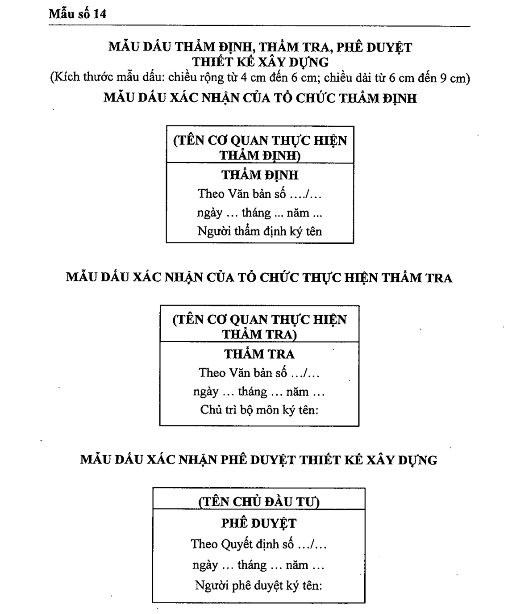

> **Trích dẫn:** Mẫu số 14 — MẪU DẤU THẨM ĐỊNH, THẨM TRA, PHÊ DUYỆT THIẾT KẾ XÂY DỰNG, Phụ lục I Nghị định số 217/2026/NĐ-CP

## Mẫu số 14 — MẪU DẤU THẨM ĐỊNH, THẨM TRA, PHÊ DUYỆT THIẾT KẾ XÂY DỰNG

**MẪU DẤU THẨM ĐỊNH, THẨM TRA, PHÊ DUYỆT THIẾT KẾ XÂY DỰNG**

(Kích thước mẫu dấu: chiều rộng từ 4 cm đến 6 cm; chiều dài từ 6 cm đến 9 cm)

**MẪU DẤU XÁC NHẬN CỦA TỔ CHỨC THẨM ĐỊNH**

| (TÊN CƠ QUAN THỰC HIỆN THẨM ĐỊNH) |
|---|
| **THẨM ĐỊNH** Theo Văn bản số .../... ngày ... tháng ... năm ... Người thẩm định ký tên |

**MẪU DẤU XÁC NHẬN CỦA TỔ CHỨC THỰC HIỆN THẨM TRA**

| (TÊN CƠ QUAN THỰC HIỆN THẨM TRA) |
|---|
| **THẨM TRA** Theo Văn bản số .../... ngày ... tháng ... năm ... Chủ trì bộ môn ký tên: |

**MẪU DẤU XÁC NHẬN PHÊ DUYỆT THIẾT KẾ XÂY DỰNG**

| (TÊN CHỦ ĐẦU TƯ) |
|---|
| **PHÊ DUYỆT** Theo Quyết định số .../... ngày ... tháng ... năm ... Người phê duyệt ký tên: |

---
