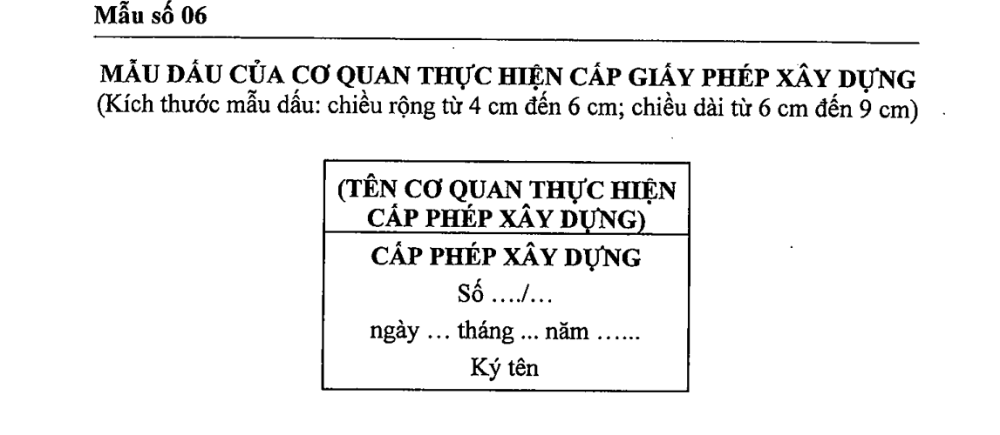

> **Trích dẫn:** Mẫu số 06 — MẪU DẤU CỦA CƠ QUAN THỰC HIỆN CẤP GIẤY PHÉP XÂY DỰNG, Phụ lục II Nghị định số 217/2026/NĐ-CP

## Mẫu số 06 — MẪU DẤU CỦA CƠ QUAN THỰC HIỆN CẤP GIẤY PHÉP XÂY DỰNG

**MẪU DẤU CỦA CƠ QUAN THỰC HIỆN CẤP GIẤY PHÉP XÂY DỰNG**

(Kích thước mẫu dấu: chiều rộng từ 4 cm đến 6 cm; chiều dài từ 6 cm đến 9 cm)

| (TÊN CƠ QUAN THỰC HIỆN CẤP PHÉP XÂY DỰNG) |
|---|
| **CẤP PHÉP XÂY DỰNG** Số .../... ngày ... tháng ... năm ... Ký tên |
