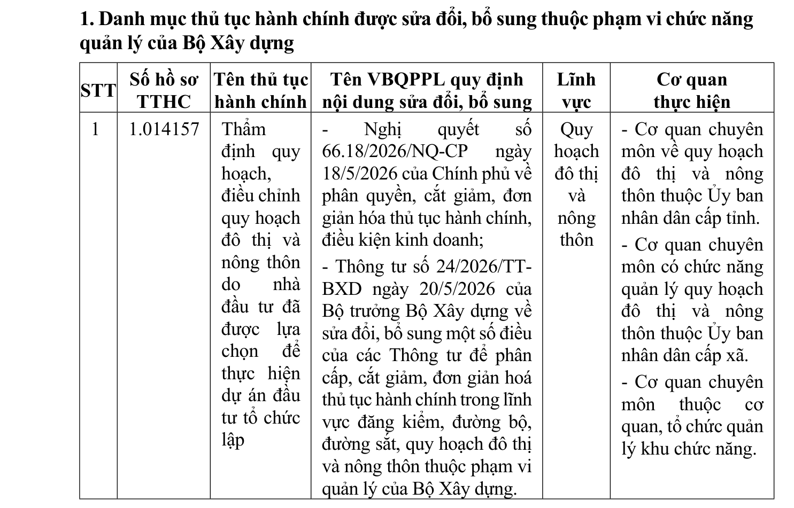

> **Trích dẫn:** Phần I.1 Thủ tục hành chính được sửa đổi, bổ sung Quyết định số 975/QĐ-BXD

| STT | Số hồ sơ TTHC | Tên thủ tục hành chính | Tên văn bản quy phạm pháp luật quy định nội dung sửa đổi, bổ sung | Lĩnh vực | Cơ quan thực hiện |
|---|---|---|---|---|---|
| 1 | 1.014157 | Thẩm định quy hoạch, điều chỉnh quy hoạch đô thị và nông thôn do nhà đầu tư đã được lựa chọn để thực hiện dự án đầu tư tổ chức lập | - Nghị quyết số 66.18/2026/NQ-CP ngày 18/5/2026 của Chính phủ về phân quyền, cắt giảm, đơn giản hóa thủ tục hành chính, điều kiện kinh doanh; - Thông tư số 24/2026/TT-BXD ngày 20/5/2026 của Bộ trưởng Bộ Xây dựng về sửa đổi, bổ sung một số điều của các Thông tư để phân cấp, cắt giảm, đơn giản hoá thủ tục hành chính trong lĩnh vực đăng kiểm, đường bộ, đường sắt, quy hoạch đô thị và nông thôn thuộc phạm vi quản lý của Bộ Xây dựng. | Quy hoạch đô thị và nông thôn | - Cơ quan chuyên môn về quy hoạch đô thị và nông thôn thuộc Ủy ban nhân dân cấp tỉnh. - Cơ quan chuyên môn có chức năng quản lý quy hoạch đô thị và nông thôn thuộc Ủy ban nhân dân cấp xã. - Cơ quan chuyên môn thuộc cơ quan, tổ chức quản lý khu chức năng. |
