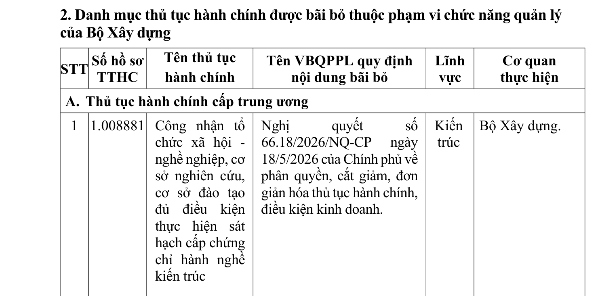
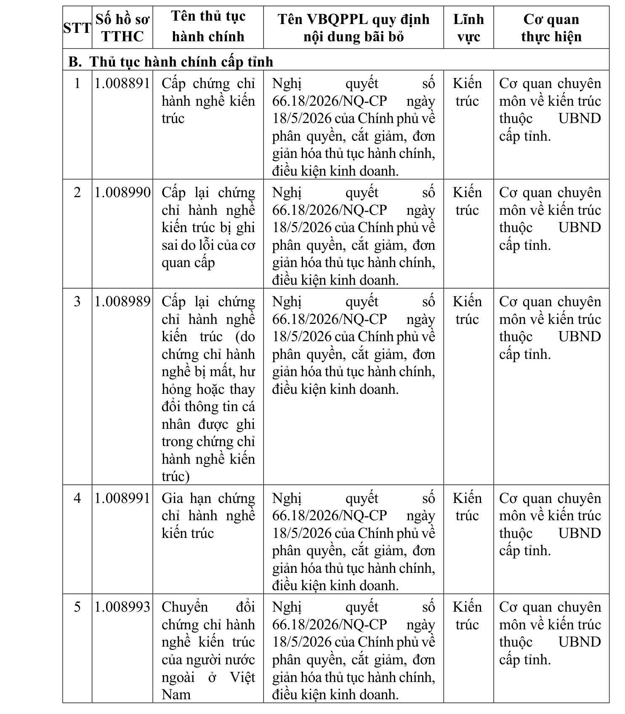

> **Trích dẫn:** Phần I.2 Thủ tục hành chính được bãi bỏ Quyết định số 975/QĐ-BXD

**A. Thủ tục hành chính cấp trung ương**

| STT | Số hồ sơ TTHC | Tên thủ tục hành chính | Tên văn bản quy phạm pháp luật quy định nội dung bãi bỏ | Lĩnh vực | Cơ quan thực hiện |
|---|---|---|---|---|---|
| 1 | 1.008881 | Công nhận tổ chức xã hội - nghề nghiệp, cơ sở nghiên cứu, cơ sở đào tạo đủ điều kiện thực hiện sát hạch cấp chứng chỉ hành nghề kiến trúc | Nghị quyết số 66.18/2026/NQ-CP ngày 18/5/2026 của Chính phủ về phân quyền, cắt giảm, đơn giản hóa thủ tục hành chính, điều kiện kinh doanh. | Kiến trúc | Bộ Xây dựng. |

**B. Thủ tục hành chính cấp tỉnh**

| STT | Số hồ sơ TTHC | Tên thủ tục hành chính | Tên văn bản quy phạm pháp luật quy định nội dung bãi bỏ | Lĩnh vực | Cơ quan thực hiện |
|---|---|---|---|---|---|
| 1 | 1.008891 | Cấp chứng chỉ hành nghề kiến trúc | Nghị quyết số 66.18/2026/NQ-CP ngày 18/5/2026 của Chính phủ về phân quyền, cắt giảm, đơn giản hóa thủ tục hành chính, điều kiện kinh doanh. | Kiến trúc | Cơ quan chuyên môn về kiến trúc thuộc UBND cấp tỉnh. |
| 2 | 1.008990 | Cấp lại chứng chỉ hành nghề kiến trúc bị ghi sai do lỗi của cơ quan cấp | Nghị quyết số 66.18/2026/NQ-CP ngày 18/5/2026 của Chính phủ về phân quyền, cắt giảm, đơn giản hóa thủ tục hành chính, điều kiện kinh doanh. | Kiến trúc | Cơ quan chuyên môn về kiến trúc thuộc UBND cấp tỉnh. |
| 3 | 1.008989 | Cấp lại chứng chỉ hành nghề kiến trúc (do chứng chỉ hành nghề bị mất, hư hỏng hoặc thay đổi thông tin cá nhân được ghi trong chứng chỉ hành nghề kiến trúc) | Nghị quyết số 66.18/2026/NQ-CP ngày 18/5/2026 của Chính phủ về phân quyền, cắt giảm, đơn giản hóa thủ tục hành chính, điều kiện kinh doanh. | Kiến trúc | Cơ quan chuyên môn về kiến trúc thuộc UBND cấp tỉnh. |
| 4 | 1.008991 | Gia hạn chứng chỉ hành nghề kiến trúc | Nghị quyết số 66.18/2026/NQ-CP ngày 18/5/2026 của Chính phủ về phân quyền, cắt giảm, đơn giản hóa thủ tục hành chính, điều kiện kinh doanh. | Kiến trúc | Cơ quan chuyên môn về kiến trúc thuộc UBND cấp tỉnh. |
| 5 | 1.008993 | Chuyển đổi chứng chỉ hành nghề kiến trúc của người nước ngoài ở Việt Nam | Nghị quyết số 66.18/2026/NQ-CP ngày 18/5/2026 của Chính phủ về phân quyền, cắt giảm, đơn giản hóa thủ tục hành chính, điều kiện kinh doanh. | Kiến trúc | Cơ quan chuyên môn về kiến trúc thuộc UBND cấp tỉnh. |

> **GHI CHÚ CỦA KHO — ĐỌC KỸ.** Phần II của Quyết định này chỉ có **một** thủ
> tục hành chính duy nhất được mô tả chi tiết: thẩm định quy hoạch, điều chỉnh
> quy hoạch đô thị và nông thôn do nhà đầu tư tổ chức lập (mã 1.014157). Sáu thủ
> tục hành chính lĩnh vực kiến trúc nêu tại Phần I.2 **bị bãi bỏ nên không còn
> nội dung**. Quyết định này **không nói gì** về số phận của các chứng chỉ hành
> nghề kiến trúc đã được cấp trước ngày 01/7/2026, cũng **không nói gì** về tiêu
> chuẩn năng lực thay thế. Muốn biết hai điều đó phải có Nghị quyết số
> 66.18/2026/NQ-CP.
