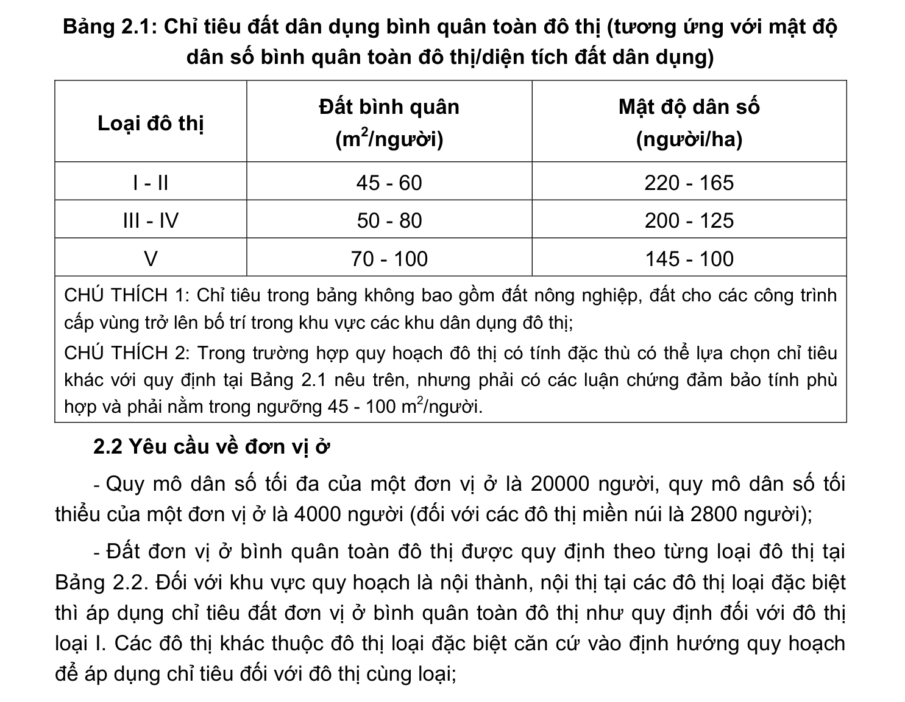

> **Trích dẫn:** mục 2.1 QCVN 01:2021/BXD

# 2.1 Yêu cầu về đất dân dụng

Chỉ tiêu đất dân dụng bình quân tối thiểu và tối đa toàn đô thị được quy định theo từng loại đô thị và nằm trong các chỉ tiêu tại Bảng 2.1. Đối với khu vực quy hoạch là nội thành, nội thị tại các đô thị loại đặc biệt thì áp dụng chỉ tiêu đất dân dụng bình quân toàn đô thị như quy định đối với đô thị loại I. Các đô thị khác thuộc đô thị loại đặc biệt căn cứ vào định hướng quy hoạch để áp dụng chỉ tiêu đối với đô thị cùng loại.

**Bảng 2.1: Chỉ tiêu đất dân dụng bình quân toàn đô thị (tương ứng với mật độ dân số bình quân toàn đô thị/diện tích đất dân dụng)**

Loại đô thị Đất bình quân (m2/người) Mật độ dân số (người/ha) I - II 45 - 60 220 - 165 III - IV 50 - 80 200 - 125 V 70 - 100 145 - 100

CHÚ THÍCH 1: Chỉ tiêu trong bảng không bao gồm đất nông nghiệp, đất cho các công trình cấp vùng trở lên bố trí trong khu vực các khu dân dụng đô thị;

CHÚ THÍCH 2: Trong trường hợp quy hoạch đô thị có tính đặc thù có thể lựa chọn chỉ tiêu khác với quy định tại Bảng 2.1 nêu trên, nhưng phải có các luận chứng đảm bảo tính phù hợp và phải nằm trong ngưỡng 45 - 100 m2/người.
