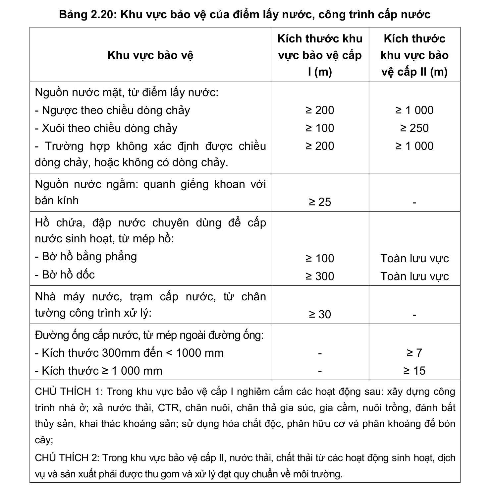

> **Trích dẫn:** mục 2.10.1 QCVN 01:2021/BXD

# 2.10.1 Khu vực bảo vệ của điểm lấy nước, công trình cấp nước

- Hành lang bảo vệ nguồn nước phải tuân thủ quy định của pháp luật về tài nguyên nước;

- Khu vực bảo vệ của điểm lấy nước, công trình cấp nước đô thị quy định tại Bảng 2.20.

**Bảng 2.20: Khu vực bảo vệ của điểm lấy nước, công trình cấp nước**

Khu vực bảo vệ Kích thước khu vực bảo vệ cấp I (m) Kích thước khu vực bảo vệ cấp II (m) Nguồn nước mặt, từ điểm lấy nước:

- Ngược theo chiều dòng chảy

- Xuôi theo chiều dòng chảy

- Trường hợp không xác định được chiều dòng chảy, hoặc không có dòng chảy. ≥ 200 ≥ 100 ≥ 200 ≥ 1 000 ≥ 250 ≥ 1 000 Nguồn nước ngầm: quanh giếng khoan với bán kính ≥ 25 - Hồ chứa, đập nước chuyên dùng để cấp nước sinh hoạt, từ mép hồ:

- Bờ hồ bằng phẳng

- Bờ hồ dốc ≥ 100 ≥ 300 Toàn lưu vực Toàn lưu vực Nhà máy nước, trạm cấp nước, từ chân tường công trình xử lý: ≥ 30 - Đường ống cấp nước, từ mép ngoài đường ống:

- Kích thước 300mm đến < 1000 mm

- Kích thước ≥ 1 000 mm - - ≥ 7 ≥ 15

CHÚ THÍCH 1: Trong khu vực bảo vệ cấp I nghiêm cấm các hoạt động sau: xây dựng công trình nhà ở; xả nước thải, CTR, chăn nuôi, chăn thả gia súc, gia cầm, nuôi trồng, đánh bắt thủy sản, khai thác khoáng sản; sử dụng hóa chất độc, phân hữu cơ và phân khoáng để bón cây;

CHÚ THÍCH 2: Trong khu vực bảo vệ cấp II, nước thải, chất thải từ các hoạt động sinh hoạt, dịch vụ và sản xuất phải được thu gom và xử lý đạt quy chuẩn về môi trường.
