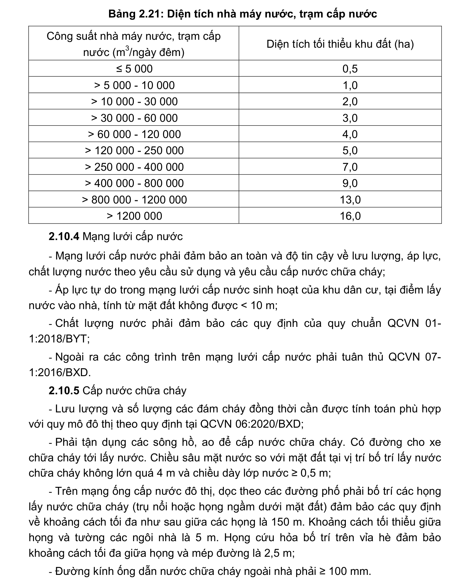

> **Trích dẫn:** mục 2.10.3 QCVN 01:2021/BXD

# 2.10.3 Nguồn nước và công trình cấp nước

- Sản lượng nước có thể khai thác của nguồn nước (trừ vùng hải đảo và vùng núi cao) phải gấp tối thiểu 10 lần nhu cầu sử dụng nước. Tỷ lệ đảm bảo lưu lượng tháng hoặc ngày của nguồn nước tối thiểu phải đạt: 95% đối với đối với khu dân cư trên 50 000 người (hoặc tương đương); 90% đối với khu dân cư từ 5 000 đến 50 000 người (hoặc tương đương) và 85% đối với khu dân cư dưới 5 000 người (hoặc tương đương);

- Lựa chọn nguồn nước phải: đảm bảo yêu cầu về trữ lượng, lưu lượng và chất lượng nước; đảm bảo tiết kiệm tài nguyên nước, đáp ứng yêu cầu tối thiểu về tiện nghi đối với việc sử dụng nước;

- Diện tích xây dựng nhà máy nước, trạm cấp nước quy hoạch mới được xác định trên cơ sở công suất, công nghệ xử lý hoặc tính toán theo tiêu chuẩn được lựa chọn áp dụng hoặc xác định theo thông số tại Bảng 2.21.

**Bảng 2.21: Diện tích nhà máy nước, trạm cấp nước**

Công suất nhà máy nước, trạm cấp nước (m3/ngày đêm) Diện tích tối thiểu khu đất (ha) ≤ 5 000 0,5 > 5 000 - 10 000 1,0 > 10 000 - 30 000 2,0 > 30 000 - 60 000 3,0 > 60 000 - 120 000 4,0 > 120 000 - 250 000 5,0 > 250 000 - 400 000 7,0 > 400 000 - 800 000 9,0 > 800 000 - 1200 000 13,0 > 1200 000 16,0
