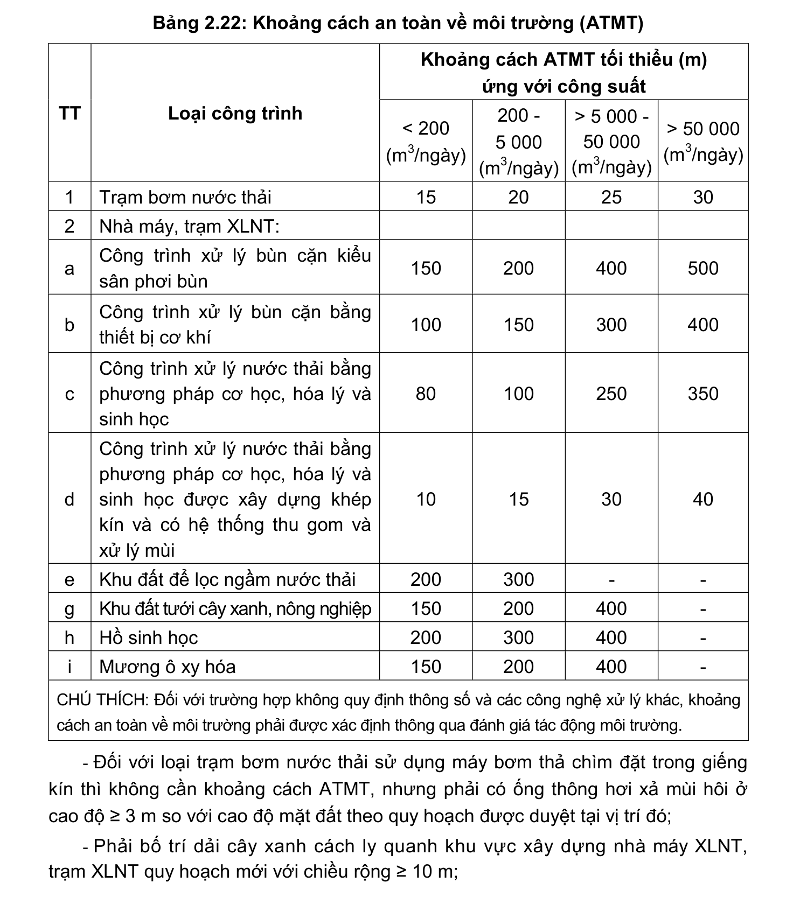

> **Trích dẫn:** mục 2.11.4 QCVN 01:2021/BXD

# 2.11.4 Quy định khoảng cách an toàn về môi trường (ATMT)

- Khoảng cách ATMT của trạm bơm nước thải, nhà máy XLNT, trạm XLNT quy hoạch mới được quy định trong Bảng 2.22;

**Bảng 2.22: Khoảng cách an toàn về môi trường (ATMT)**

Khoảng cách ATMT tối thiểu (m) ứng với công suất TT Loại công trình < 200 (m3/ngày) 200 - 5 000 (m3/ngày) > 5 000 - 50 000 (m3/ngày) > 50 000 (m3/ngày) Trạm bơm nước thải Nhà máy, trạm XLNT: a Công trình xử lý bùn cặn kiểu sân phơi bùn b Công trình xử lý bùn cặn bằng thiết bị cơ khí c Công trình xử lý nước thải bằng phương pháp cơ học, hóa lý và sinh học d Công trình xử lý nước thải bằng phương pháp cơ học, hóa lý và sinh học được xây dựng khép kín và có hệ thống thu gom và xử lý mùi e Khu đất để lọc ngầm nước thải - - g Khu đất tưới cây xanh, nông nghiệp - h Hồ sinh học - i Mương ô xy hóa -

CHÚ THÍCH: Đối với trường hợp không quy định thông số và các công nghệ xử lý khác, khoảng cách an toàn về môi trường phải được xác định thông qua đánh giá tác động môi trường.

- Đối với loại trạm bơm nước thải sử dụng máy bơm thả chìm đặt trong giếng kín thì không cần khoảng cách ATMT, nhưng phải có ống thông hơi xả mùi hôi ở cao độ ≥ 3 m so với cao độ mặt đất theo quy hoạch được duyệt tại vị trí đó;

- Phải bố trí dải cây xanh cách ly quanh khu vực xây dựng nhà máy XLNT, trạm XLNT quy hoạch mới với chiều rộng ≥ 10 m;

- Trong phạm vi khoảng cách an toàn về môi trường chỉ được quy hoạch đường giao thông, bãi đỗ xe, công trình cấp điện, trạm trung chuyển CTR và các công trình khác của trạm bơm nước thải, trạm XLNT, không bố trí các công trình dân dụng khác;

- Các trạm bơm nước thải, trạm XLNT, nhà máy XLNT hiện hữu không đảm bảo các quy định về khoảng cách ATMT phải thực hiện đánh giá tác động môi trường để bổ sung các giải pháp đảm bảo vệ sinh môi trường xung quanh theo quy định.
