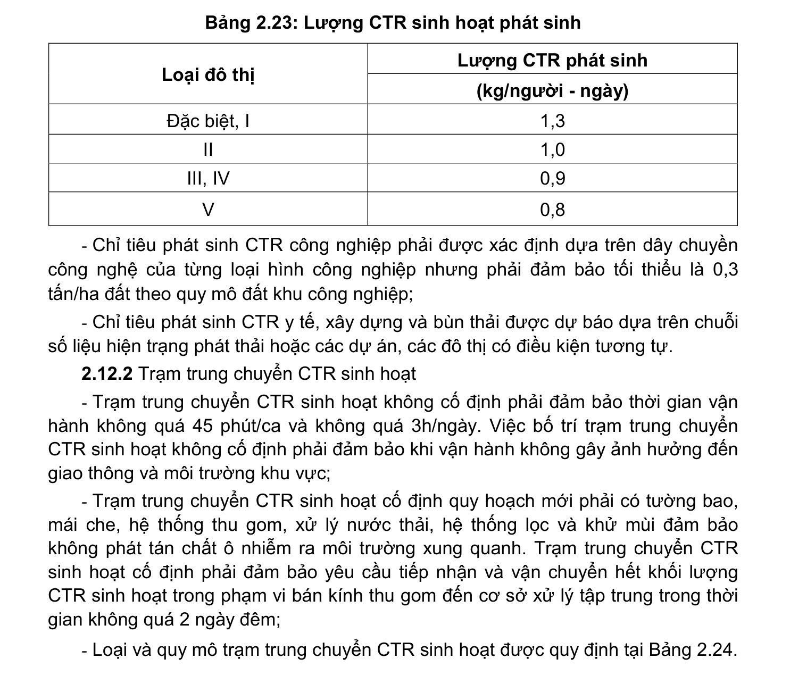

> **Trích dẫn:** mục 2.12.1 QCVN 01:2021/BXD

# 2.12.1 Khối lượng CTR phát sinh

Khối lượng CTR sinh hoạt phát sinh được dự báo dựa trên chuỗi số liệu hiện trạng và mức độ tiện nghi của khu đô thị, điểm dân cư. Trường hợp sử dụng tiêu chuẩn thì phải đảm bảo không vượt quá các chỉ tiêu trong Bảng 2.23;

**Bảng 2.23: Lượng CTR sinh hoạt phát sinh**

Lượng CTR phát sinh Loại đô thị (kg/người - ngày) Đặc biệt, I 1,3 II 1,0 III, IV 0,9 V 0,8

- Chỉ tiêu phát sinh CTR công nghiệp phải được xác định dựa trên dây chuyền công nghệ của từng loại hình công nghiệp nhưng phải đảm bảo tối thiểu là 0,3 tấn/ha đất theo quy mô đất khu công nghiệp;

- Chỉ tiêu phát sinh CTR y tế, xây dựng và bùn thải được dự báo dựa trên chuỗi số liệu hiện trạng phát thải hoặc các dự án, các đô thị có điều kiện tương tự.
