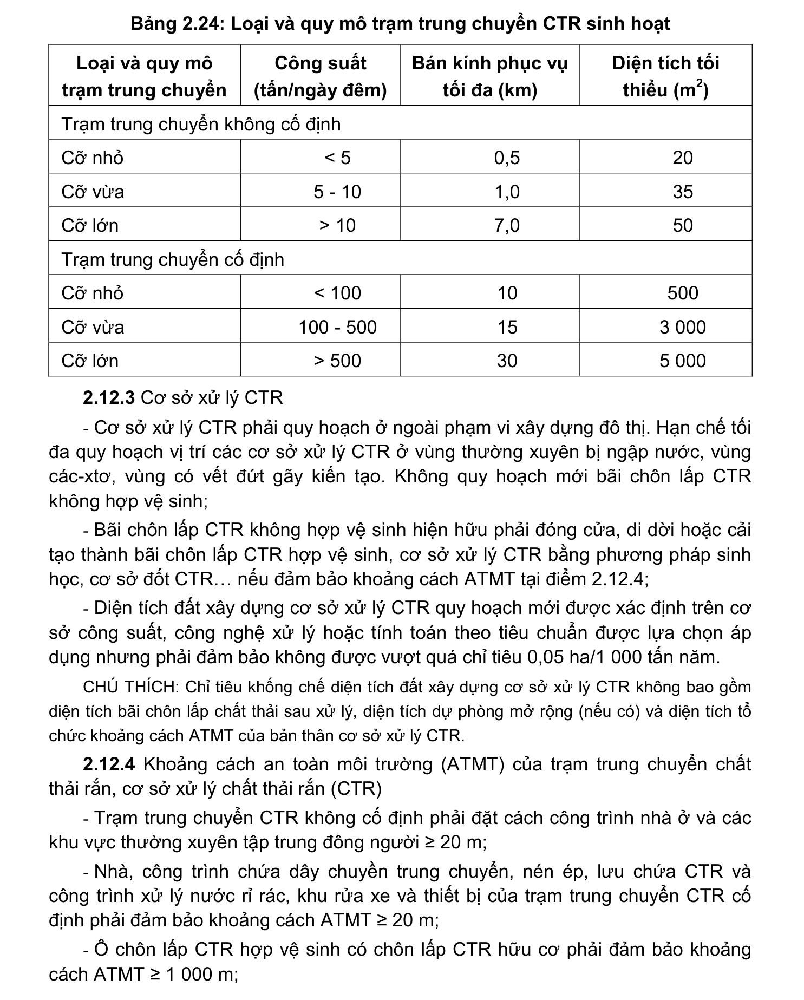

> **Trích dẫn:** mục 2.12.2 QCVN 01:2021/BXD

# 2.12.2 Trạm trung chuyển CTR sinh hoạt

- Trạm trung chuyển CTR sinh hoạt không cố định phải đảm bảo thời gian vận hành không quá 45 phút/ca và không quá 3h/ngày. Việc bố trí trạm trung chuyển CTR sinh hoạt không cố định phải đảm bảo khi vận hành không gây ảnh hưởng đến giao thông và môi trường khu vực;

- Trạm trung chuyển CTR sinh hoạt cố định quy hoạch mới phải có tường bao, mái che, hệ thống thu gom, xử lý nước thải, hệ thống lọc và khử mùi đảm bảo không phát tán chất ô nhiễm ra môi trường xung quanh. Trạm trung chuyển CTR sinh hoạt cố định phải đảm bảo yêu cầu tiếp nhận và vận chuyển hết khối lượng CTR sinh hoạt trong phạm vi bán kính thu gom đến cơ sở xử lý tập trung trong thời gian không quá 2 ngày đêm;

- Loại và quy mô trạm trung chuyển CTR sinh hoạt được quy định tại Bảng 2.24.

**Bảng 2.24: Loại và quy mô trạm trung chuyển CTR sinh hoạt**

Loại và quy mô trạm trung chuyển Công suất (tấn/ngày đêm) Bán kính phục vụ tối đa (km) Diện tích tối thiểu (m2) Trạm trung chuyển không cố định Cỡ nhỏ < 5 0,5 Cỡ vừa 5 - 10 1,0 Cỡ lớn > 10 7,0 Trạm trung chuyển cố định Cỡ nhỏ < 100 Cỡ vừa 100 - 500 3 000 Cỡ lớn > 500 5 000
