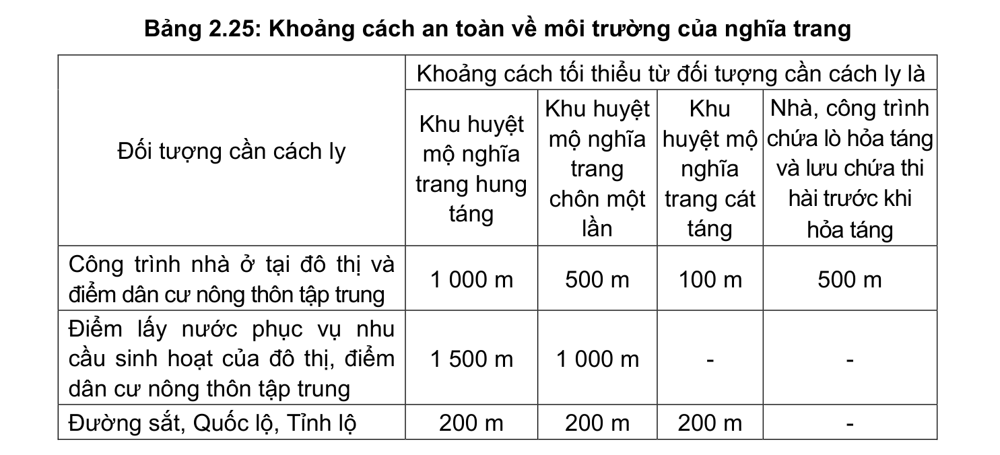
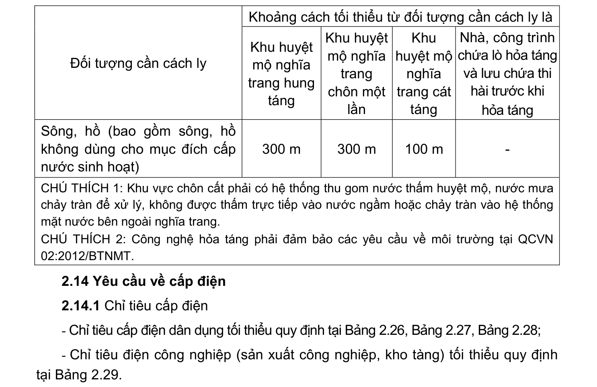

> **Trích dẫn:** mục 2.13.2 QCVN 01:2021/BXD

# 2.13.2 Nghĩa trang, cơ sở hỏa táng

- Nhu cầu đất nghĩa trang (không bao gồm nghĩa trang liệt sỹ), quy mô cơ sở hỏa táng được dự báo dựa trên tỷ lệ tử vong và các hình thức mai táng. Quy mô diện tích các nghĩa trang tập trung phải đảm bảo chỉ tiêu tối thiểu là 0,04 ha/1 000 dân;

- Quy hoạch địa điểm nghĩa trang và cơ sở hỏa táng xây dựng mới không được ảnh hưởng tiêu cực đến các hoạt động của các khu chức năng khác và các hoạt động giao thông. Quy hoạch nghĩa trang phải tính đến các phong tục, tập quán về mai táng ở địa phương nhưng vẫn phải đảm bảo các yêu cầu về môi trường và sử dụng đất đai hiệu quả, tiết kiệm;

- Quy hoạch nghĩa trang phải xác định được các nghĩa trang hiện hữu cần di dời, đóng cửa hoặc cải tạo và quỹ đất cho việc di dời. Các nghĩa trang và cơ sở hỏa táng hiện hữu không đảm bảo các quy định về khoảng cách ATMT phải thực hiện đánh giá tác động môi trường để bổ sung các giải pháp đảm bảo vệ sinh môi trường xung quanh theo quy định;

- Khoảng cách ATMT nghĩa trang, cơ sở hỏa táng quy hoạch mới phải đảm bảo các quy định trong Bảng 2.25. Đồng thời phải tuân thủ quy định về khu vực bảo vệ đối với điểm lấy nước, công trình cấp nước tại điểm 2.10.1;

- Trường hợp đặc biệt, khi cơ sở hỏa táng đặt ở đầu hướng gió chính của đô thị hoặc khi nghĩa trang đặt ở đầu nguồn nước thì khoảng cách ATMT của các công trình trong cơ sở hỏa táng, nghĩa trang phải tăng lên tối thiểu 1,5 lần;

- Phải bố trí dải cây xanh cách ly quanh khu vực xây dựng nghĩa trạng, cơ sở hỏa táng quy hoạch mới với chiều rộng ≥ 10 m;

- Trong vùng ATMT của các công trình thuộc nghĩa trang, cơ sở hỏa táng chỉ được tổ chức các hoạt động canh tác nông, lâm nghiệp, quy hoạch các công trình giao thông, thủy lợi, cung cấp, truyền tải điện, xăng dầu, khí đốt, hệ thống thoát nước, XLNT và các công trình khác thuộc nghĩa trang, cơ sở hỏa táng, không được bố trí các công trình dân dụng khác;

- Ngoài ra nghĩa trang và cơ sở hỏa táng phải tuân thủ QCVN 07-10:2016/BXD.

**Bảng 2.25: Khoảng cách an toàn về môi trường của nghĩa trang**

Khoảng cách tối thiểu từ đối tượng cần cách ly là Đối tượng cần cách ly Khu huyệt mộ nghĩa trang hung táng Khu huyệt mộ nghĩa trang chôn một lần Khu huyệt mộ nghĩa trang cát táng Nhà, công trình chứa lò hỏa táng và lưu chứa thi hài trước khi hỏa táng Công trình nhà ở tại đô thị và điểm dân cư nông thôn tập trung 1 000 m 500 m 100 m 500 m Điểm lấy nước phục vụ nhu cầu sinh hoạt của đô thị, điểm dân cư nông thôn tập trung 1 500 m 1 000 m - - Đường sắt, Quốc lộ, Tỉnh lộ 200 m 200 m 200 m - Khoảng cách tối thiểu từ đối tượng cần cách ly là Đối tượng cần cách ly Khu huyệt mộ nghĩa trang hung táng Khu huyệt mộ nghĩa trang chôn một lần Khu huyệt mộ nghĩa trang cát táng Nhà, công trình chứa lò hỏa táng và lưu chứa thi hài trước khi hỏa táng Sông, hồ (bao gồm sông, hồ không dùng cho mục đích cấp nước sinh hoạt) 300 m 300 m 100 m -

CHÚ THÍCH 1: Khu vực chôn cất phải có hệ thống thu gom nước thấm huyệt mộ, nước mưa chảy tràn để xử lý, không được thấm trực tiếp vào nước ngầm hoặc chảy tràn vào hệ thống mặt nước bên ngoài nghĩa trang.

CHÚ THÍCH 2: Công nghệ hỏa táng phải đảm bảo các yêu cầu về môi trường tại QCVN 02:2012/BTNMT.
