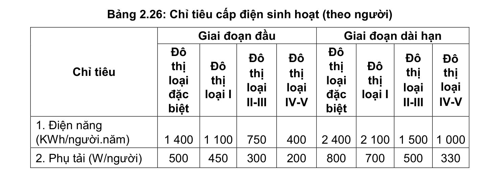
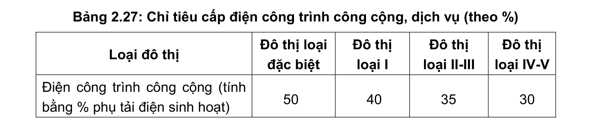
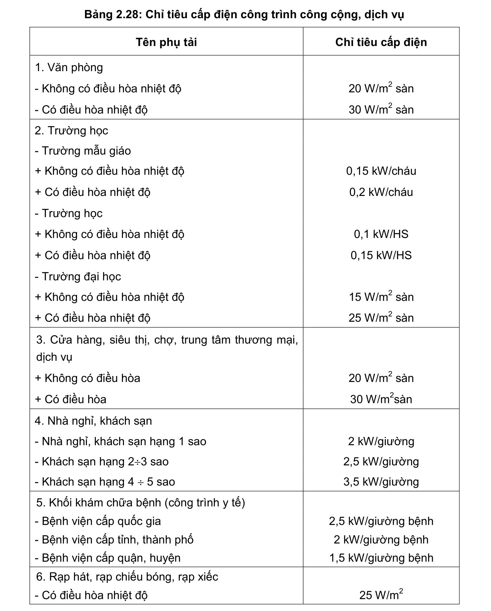
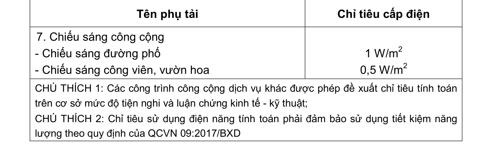
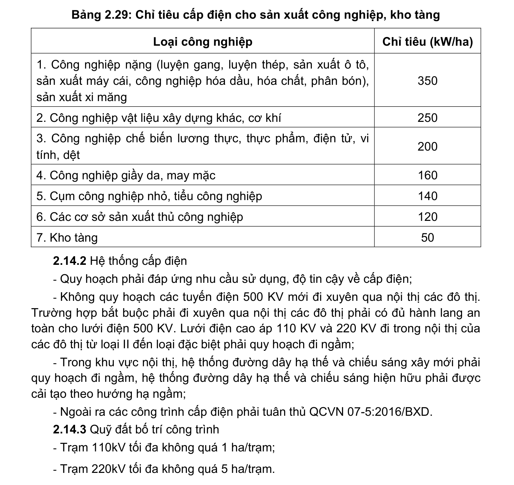

> **Trích dẫn:** mục 2.14.1 QCVN 01:2021/BXD

# 2.14.1 Chỉ tiêu cấp điện

- Chỉ tiêu cấp điện dân dụng tối thiểu quy định tại Bảng 2.26, Bảng 2.27, Bảng 2.28;

- Chỉ tiêu điện công nghiệp (sản xuất công nghiệp, kho tàng) tối thiểu quy định tại Bảng 2.29.

**Bảng 2.26: Chỉ tiêu cấp điện sinh hoạt (theo người)**

Giai đoạn đầu Giai đoạn dài hạn Chỉ tiêu Đô thị loại đặc biệt Đô thị loại I Đô thị loại II-III Đô thị loại IV-V Đô thị loại đặc biệt Đô thị loại I Đô thị loại II-III Đô thị loại IV-V

1. Điện năng (KWh/người.năm) 1 400 1 100 2 400 2 100 1 500 1 000

2. Phụ tải (W/người)

**Bảng 2.27: Chỉ tiêu cấp điện công trình công cộng, dịch vụ (theo %)**

Loại đô thị Đô thị loại đặc biệt Đô thị loại I Đô thị loại II-III Đô thị loại IV-V Điện công trình công cộng (tính bằng % phụ tải điện sinh hoạt)

**Bảng 2.28: Chỉ tiêu cấp điện công trình công cộng, dịch vụ**

Tên phụ tải Chỉ tiêu cấp điện

1. Văn phòng

- Không có điều hòa nhiệt độ 20 W/m2 sàn

- Có điều hòa nhiệt độ 30 W/m2 sàn

2. Trường học

- Trường mẫu giáo + Không có điều hòa nhiệt độ 0,15 kW/cháu + Có điều hòa nhiệt độ 0,2 kW/cháu

- Trường học + Không có điều hòa nhiệt độ 0,1 kW/HS + Có điều hòa nhiệt độ 0,15 kW/HS

- Trường đại học + Không có điều hòa nhiệt độ 15 W/m2 sàn + Có điều hòa nhiệt độ 25 W/m2 sàn

3. Cửa hàng, siêu thị, chợ, trung tâm thương mại, dịch vụ + Không có điều hòa 20 W/m2 sàn + Có điều hòa 30 W/m2sàn

4. Nhà nghỉ, khách sạn

- Nhà nghỉ, khách sạn hạng 1 sao 2 kW/giường

- Khách sạn hạng 2÷3 sao 2,5 kW/giường

- Khách sạn hạng 4 ÷ 5 sao 3,5 kW/giường

5. Khối khám chữa bệnh (công trình y tế)

- Bệnh viện cấp quốc gia 2,5 kW/giường bệnh

- Bệnh viện cấp tỉnh, thành phố 2 kW/giường bệnh

- Bệnh viện cấp quận, huyện 1,5 kW/giường bệnh

6. Rạp hát, rạp chiếu bóng, rạp xiếc

- Có điều hòa nhiệt độ 25 W/m2 Tên phụ tải Chỉ tiêu cấp điện

7. Chiếu sáng công cộng

- Chiếu sáng đường phố

- Chiếu sáng công viên, vườn hoa 1 W/m2 0,5 W/m2

CHÚ THÍCH 1: Các công trình công cộng dịch vụ khác được phép đề xuất chỉ tiêu tính toán trên cơ sở mức độ tiện nghi và luận chứng kinh tế - kỹ thuật;

CHÚ THÍCH 2: Chỉ tiêu sử dụng điện năng tính toán phải đảm bảo sử dụng tiết kiệm năng lượng theo quy định của QCVN 09:2017/BXD

**Bảng 2.29: Chỉ tiêu cấp điện cho sản xuất công nghiệp, kho tàng**

Loại công nghiệp Chỉ tiêu (kW/ha)

1. Công nghiệp nặng (luyện gang, luyện thép, sản xuất ô tô, sản xuất máy cái, công nghiệp hóa dầu, hóa chất, phân bón), sản xuất xi măng

2. Công nghiệp vật liệu xây dựng khác, cơ khí

3. Công nghiệp chế biến lương thực, thực phẩm, điện tử, vi tính, dệt

4. Công nghiệp giầy da, may mặc

5. Cụm công nghiệp nhỏ, tiểu công nghiệp

6. Các cơ sở sản xuất thủ công nghiệp

7. Kho tàng
