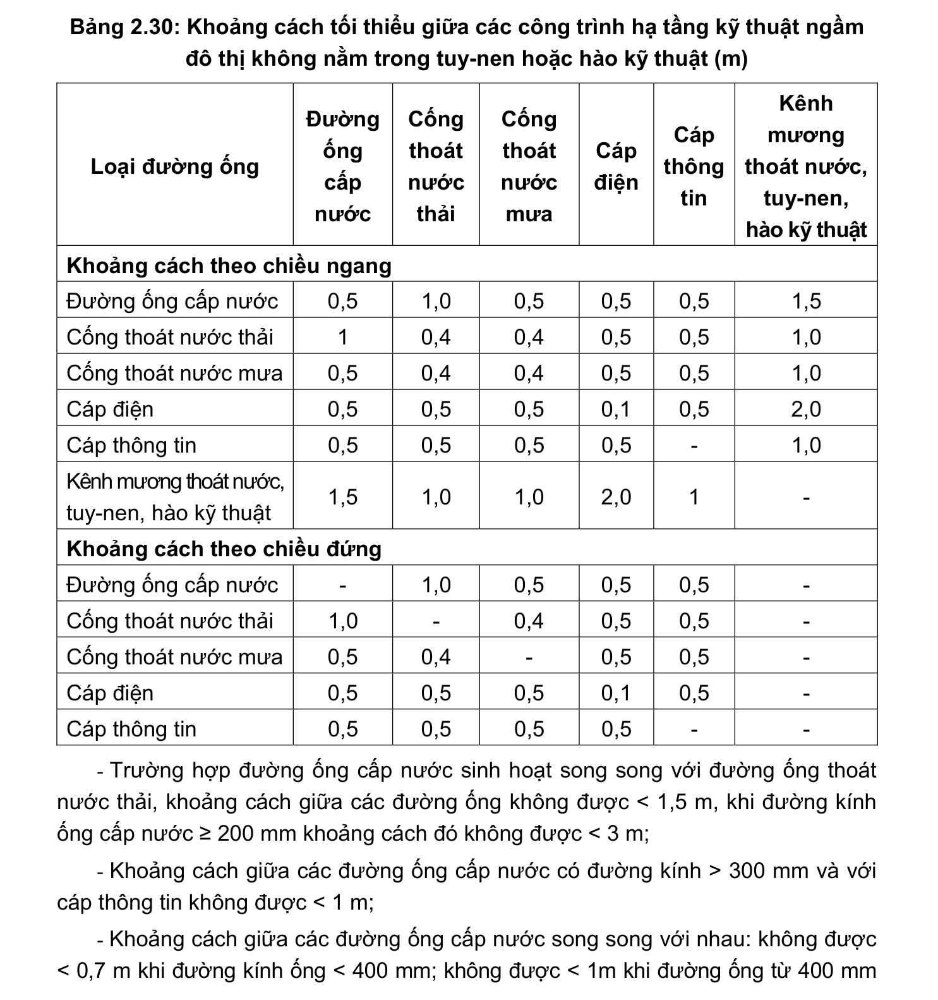

> **Trích dẫn:** mục 2.15 QCVN 01:2021/BXD

# 2.15 Yêu cầu về bố trí công trình hạ tầng kỹ thuật ngầm

Khoảng cách tối thiểu giữa các công trình hạ tầng kỹ thuật ngầm đô thị không nằm trong tuy-nen hoặc hào kỹ thuật được xác định theo các tiêu chuẩn kỹ thuật chuyên ngành được lựa chọn áp dụng. Các trường hợp khác áp dụng quy định trong Bảng 2.30;

**Bảng 2.30: Khoảng cách tối thiểu giữa các công trình hạ tầng kỹ thuật ngầm đô thị không nằm trong tuy-nen hoặc hào kỹ thuật (m)**

Loại đường ống Đường ống cấp nước Cống thoát nước thải Cống thoát nước mưa Cáp điện Cáp thông tin Kênh mương thoát nước, tuy-nen, hào kỹ thuật Khoảng cách theo chiều ngang Đường ống cấp nước 0,5 1,0 0,5 0,5 0,5 1,5 Cống thoát nước thải 0,4 0,4 0,5 0,5 1,0 Cống thoát nước mưa 0,5 0,4 0,4 0,5 0,5 1,0 Cáp điện 0,5 0,5 0,5 0,1 0,5 2,0 Cáp thông tin 0,5 0,5 0,5 0,5 - 1,0 Kênh mương thoát nước, tuy-nen, hào kỹ thuật 1,5 1,0 1,0 2,0 - Khoảng cách theo chiều đứng Đường ống cấp nước - 1,0 0,5 0,5 0,5 - Cống thoát nước thải 1,0 - 0,4 0,5 0,5 - Cống thoát nước mưa 0,5 0,4 - 0,5 0,5 - Cáp điện 0,5 0,5 0,5 0,1 0,5 - Cáp thông tin 0,5 0,5 0,5 0,5 - -

- Trường hợp đường ống cấp nước sinh hoạt song song với đường ống thoát nước thải, khoảng cách giữa các đường ống không được < 1,5 m, khi đường kính ống cấp nước ≥ 200 mm khoảng cách đó không được < 3 m;

- Khoảng cách giữa các đường ống cấp nước có đường kính > 300 mm và với cáp thông tin không được < 1 m;

- Khoảng cách giữa các đường ống cấp nước song song với nhau: không được < 0,7 m khi đường kính ống < 400 mm; không được < 1m khi đường ống từ 400 mm đến 1 000 mm; không được < 1,5 m khi đường kính ống > 1 000 mm. Khoảng cách giữa các đường ống có áp lực khác cũng áp dụng quy định đối với đường ống cấp nước;

- Khoảng cách tối thiểu giữa các đường dây, đường ống kỹ thuật nằm trong tuy- nen hoặc hào kỹ thuật được xác định theo các tiêu chuẩn kỹ thuật chuyên ngành được lựa chọn áp dụng;

- Khoảng cách, yêu cầu về kết nối không gian và hạ tầng kỹ thuật giữa các công trình ngầm phải được xác định trên cơ sở luận chứng kinh tế kỹ thuật;

- Ngoài ra các quy định về hệ thống tuy-nen và hào kỹ thuật tuân thủ QCVN 07- 3:2016/BXD.
