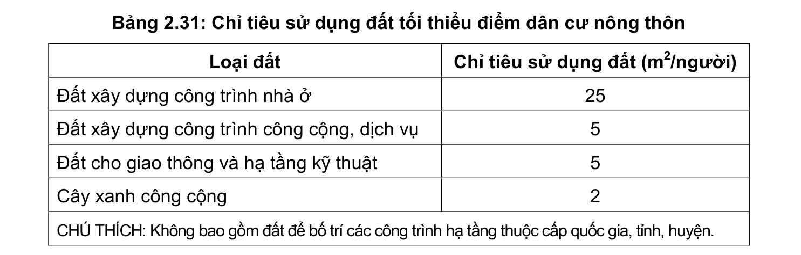

> **Trích dẫn:** mục 2.16.2 QCVN 01:2021/BXD

# 2.16.2 Quy định về chỉ tiêu sử dụng đất

Đất xây dựng cho các điểm dân cư nông thôn phải phù hợp với điều kiện cụ thể của từng địa phương nhưng không được nhỏ hơn quy định trong Bảng 2.31.

**Bảng 2.31: Chỉ tiêu sử dụng đất tối thiểu điểm dân cư nông thôn**

Loại đất Chỉ tiêu sử dụng đất (m2/người) Đất xây dựng công trình nhà ở Đất xây dựng công trình công cộng, dịch vụ Đất cho giao thông và hạ tầng kỹ thuật Cây xanh công cộng

CHÚ THÍCH: Không bao gồm đất để bố trí các công trình hạ tầng thuộc cấp quốc gia, tỉnh, huyện.
