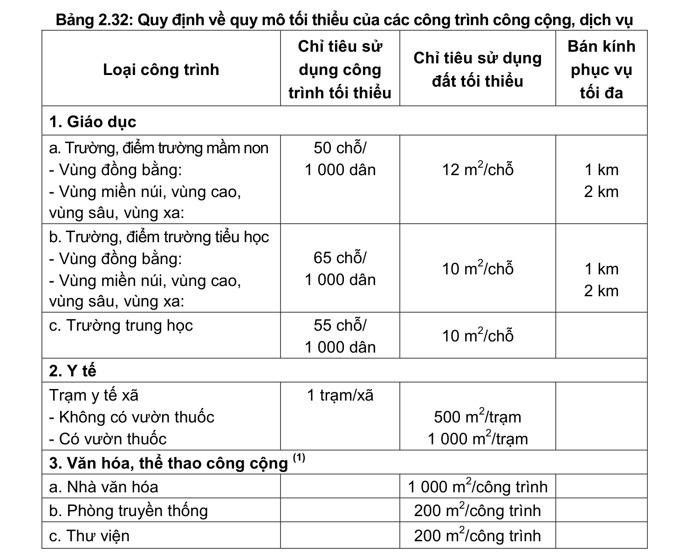
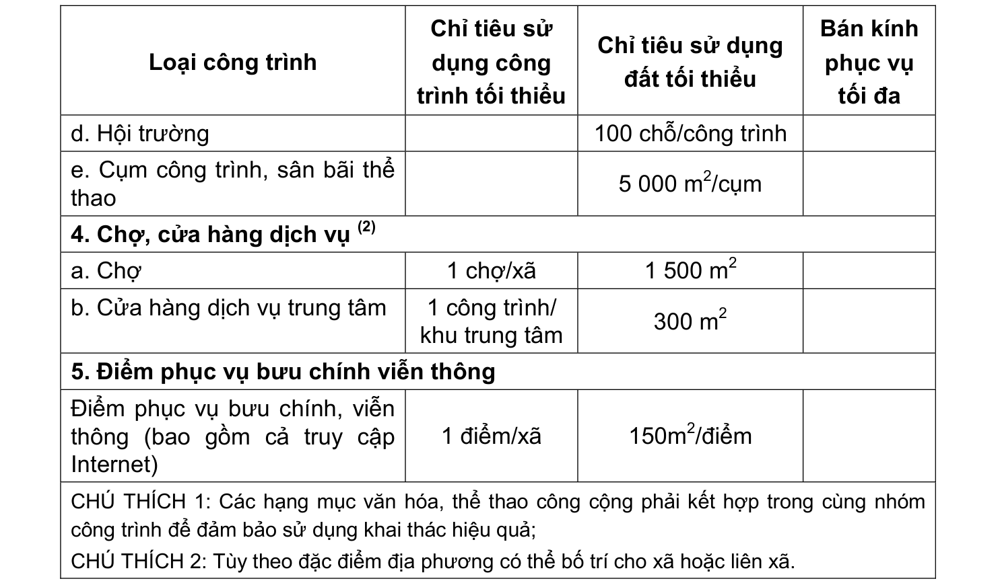

> **Trích dẫn:** mục 2.16.6.3 QCVN 01:2021/BXD

# 2.16.6.3 Các công trình công cộng, dịch vụ

**Bảng 2.32: Quy định về quy mô tối thiểu của các công trình công cộng, dịch vụ**

Loại công trình Chỉ tiêu sử dụng công trình tối thiểu Chỉ tiêu sử dụng đất tối thiểu Bán kính phục vụ tối đa

1. Giáo dục a. Trường, điểm trường mầm non

- Vùng đồng bằng:

- Vùng miền núi, vùng cao, vùng sâu, vùng xa: 50 chỗ/ 1 000 dân 12 m2/chỗ 1 km 2 km b. Trường, điểm trường tiểu học

- Vùng đồng bằng:

- Vùng miền núi, vùng cao, vùng sâu, vùng xa: 65 chỗ/ 1 000 dân 10 m2/chỗ 1 km 2 km c. Trường trung học 55 chỗ/ 1 000 dân 10 m2/chỗ

2. Y tế Trạm y tế xã

- Không có vườn thuốc

- Có vườn thuốc 1 trạm/xã 500 m2/trạm 1 000 m2/trạm

3. Văn hóa, thể thao công cộng (1) a. Nhà văn hóa 1 000 m2/công trình b. Phòng truyền thống 200 m2/công trình c. Thư viện 200 m2/công trình Loại công trình Chỉ tiêu sử dụng công trình tối thiểu Chỉ tiêu sử dụng đất tối thiểu Bán kính phục vụ tối đa d. Hội trường 100 chỗ/công trình e. Cụm công trình, sân bãi thể thao 5 000 m2/cụm

4. Chợ, cửa hàng dịch vụ (2) a. Chợ 1 chợ/xã 1 500 m2 b. Cửa hàng dịch vụ trung tâm 1 công trình/ khu trung tâm 300 m2

5. Điểm phục vụ bưu chính viễn thông Điểm phục vụ bưu chính, viễn thông (bao gồm cả truy cập Internet) 1 điểm/xã 150m2/điểm

CHÚ THÍCH 1: Các hạng mục văn hóa, thể thao công cộng phải kết hợp trong cùng nhóm công trình để đảm bảo sử dụng khai thác hiệu quả;

CHÚ THÍCH 2: Tùy theo đặc điểm địa phương có thể bố trí cho xã hoặc liên xã.
