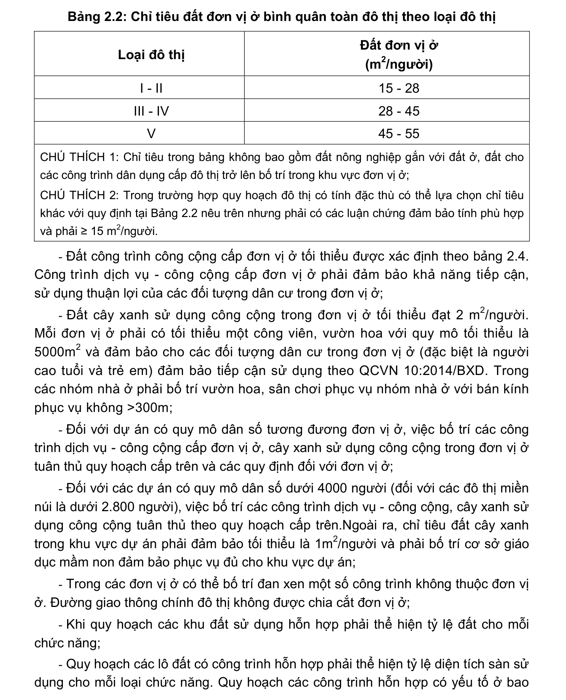

> **Trích dẫn:** mục 2.2 QCVN 01:2021/BXD

# 2.2 Yêu cầu về đơn vị ở

- Quy mô dân số tối đa của một đơn vị ở là 20000 người, quy mô dân số tối thiểu của một đơn vị ở là 4000 người (đối với các đô thị miền núi là 2800 người);

- Đất đơn vị ở bình quân toàn đô thị được quy định theo từng loại đô thị tại Bảng 2.2. Đối với khu vực quy hoạch là nội thành, nội thị tại các đô thị loại đặc biệt thì áp dụng chỉ tiêu đất đơn vị ở bình quân toàn đô thị như quy định đối với đô thị loại I. Các đô thị khác thuộc đô thị loại đặc biệt căn cứ vào định hướng quy hoạch để áp dụng chỉ tiêu đối với đô thị cùng loại;

**Bảng 2.2: Chỉ tiêu đất đơn vị ở bình quân toàn đô thị theo loại đô thị**

Loại đô thị Đất đơn vị ở (m2/người) I - II 15 - 28 III - IV 28 - 45 V 45 - 55

CHÚ THÍCH 1: Chỉ tiêu trong bảng không bao gồm đất nông nghiệp gắn với đất ở, đất cho các công trình dân dụng cấp đô thị trở lên bố trí trong khu vực đơn vị ở;

CHÚ THÍCH 2: Trong trường hợp quy hoạch đô thị có tính đặc thù có thể lựa chọn chỉ tiêu khác với quy định tại Bảng 2.2 nêu trên nhưng phải có các luận chứng đảm bảo tính phù hợp và phải ≥ 15 m2/người.

- Đất công trình công cộng cấp đơn vị ở tối thiểu được xác định theo bảng 2.4. Công trình dịch vụ - công cộng cấp đơn vị ở phải đảm bảo khả năng tiếp cận, sử dụng thuận lợi của các đối tượng dân cư trong đơn vị ở;

- Đất cây xanh sử dụng công cộng trong đơn vị ở tối thiểu đạt 2 m2/người. Mỗi đơn vị ở phải có tối thiểu một công viên, vườn hoa với quy mô tối thiểu là 5000m2 và đảm bảo cho các đối tượng dân cư trong đơn vị ở (đặc biệt là người cao tuổi và trẻ em) đảm bảo tiếp cận sử dụng theo QCVN 10:2014/BXD. Trong các nhóm nhà ở phải bố trí vườn hoa, sân chơi phục vụ nhóm nhà ở với bán kính phục vụ không >300m;

- Đối với dự án có quy mô dân số tương đương đơn vị ở, việc bố trí các công trình dịch vụ - công cộng cấp đơn vị ở, cây xanh sử dụng công cộng trong đơn vị ở tuân thủ quy hoạch cấp trên và các quy định đối với đơn vị ở;

- Đối với các dự án có quy mô dân số dưới 4000 người (đối với các đô thị miền núi là dưới 2.800 người), việc bố trí các công trình dịch vụ - công cộng, cây xanh sử dụng công cộng tuân thủ theo quy hoạch cấp trên.Ngoài ra, chỉ tiêu đất cây xanh trong khu vực dự án phải đảm bảo tối thiểu là 1m2/người và phải bố trí cơ sở giáo dục mầm non đảm bảo phục vụ đủ cho khu vực dự án;

- Trong các đơn vị ở có thể bố trí đan xen một số công trình không thuộc đơn vị ở. Đường giao thông chính đô thị không được chia cắt đơn vị ở;

- Khi quy hoạch các khu đất sử dụng hỗn hợp phải thể hiện tỷ lệ đất cho mỗi chức năng;

- Quy hoạch các lô đất có công trình hỗn hợp phải thể hiện tỷ lệ diện tích sàn sử dụng cho mỗi loại chức năng. Quy hoạch các công trình hỗn hợp có yếu tố ở bao gồm cả dịch vụ lưu trú (nếu có) phải xác định quy mô dân số để tính toán nhu cầu hạ tầng kỹ thuật, hạ tầng xã hội.
