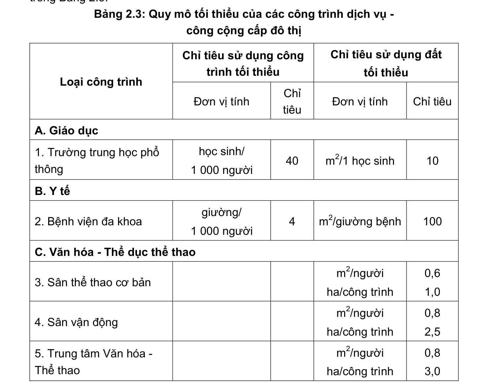
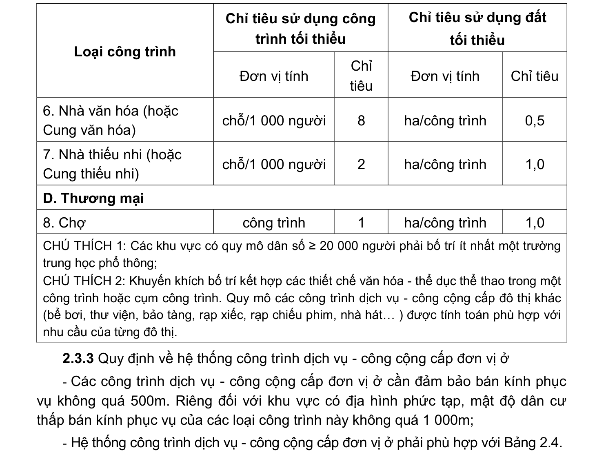

> **Trích dẫn:** mục 2.3.2 QCVN 01:2021/BXD

# 2.3.2 Quy định về hệ thống công trình dịch vụ - công cộng cấp đô thị

Hệ thống công trình dịch vụ - công cộng cấp đô thị phải phù hợp với quy định trong Bảng 2.3.

**Bảng 2.3: Quy mô tối thiểu của các công trình dịch vụ - công cộng cấp đô thị**

Chỉ tiêu sử dụng công trình tối thiểu Chỉ tiêu sử dụng đất tối thiểu Loại công trình Đơn vị tính Chỉ tiêu Đơn vị tính Chỉ tiêu A. Giáo dục

1. Trường trung học phổ thông học sinh/ 1 000 người m2/1 học sinh B. Y tế

2. Bệnh viện đa khoa giường/ 1 000 người m2/giường bệnh C. Văn hóa - Thể dục thể thao

3. Sân thể thao cơ bản m2/người ha/công trình 0,6 1,0

4. Sân vận động m2/người ha/công trình 0,8 2,5

5. Trung tâm Văn hóa - Thể thao m2/người ha/công trình 0,8 3,0 Chỉ tiêu sử dụng công trình tối thiểu Chỉ tiêu sử dụng đất tối thiểu Loại công trình Đơn vị tính Chỉ tiêu Đơn vị tính Chỉ tiêu

6. Nhà văn hóa (hoặc Cung văn hóa) chỗ/1 000 người ha/công trình 0,5

7. Nhà thiếu nhi (hoặc Cung thiếu nhi) chỗ/1 000 người ha/công trình 1,0 D. Thương mại

8. Chợ công trình ha/công trình 1,0

CHÚ THÍCH 1: Các khu vực có quy mô dân số ≥ 20 000 người phải bố trí ít nhất một trường trung học phổ thông;

CHÚ THÍCH 2: Khuyến khích bố trí kết hợp các thiết chế văn hóa - thể dục thể thao trong một công trình hoặc cụm công trình. Quy mô các công trình dịch vụ - công cộng cấp đô thị khác (bể bơi, thư viện, bảo tàng, rạp xiếc, rạp chiếu phim, nhà hát… ) được tính toán phù hợp với nhu cầu của từng đô thị.
