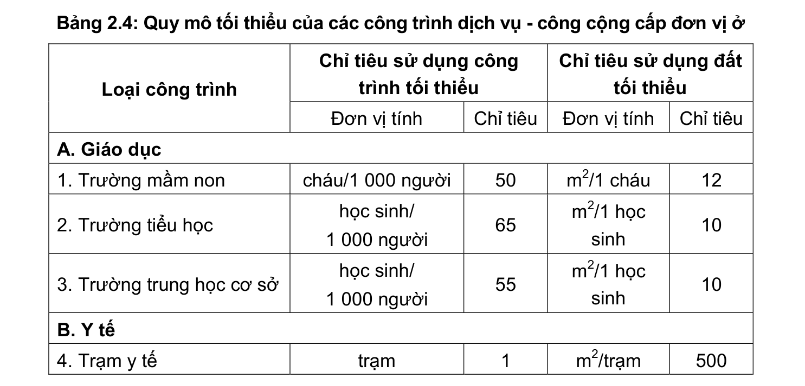
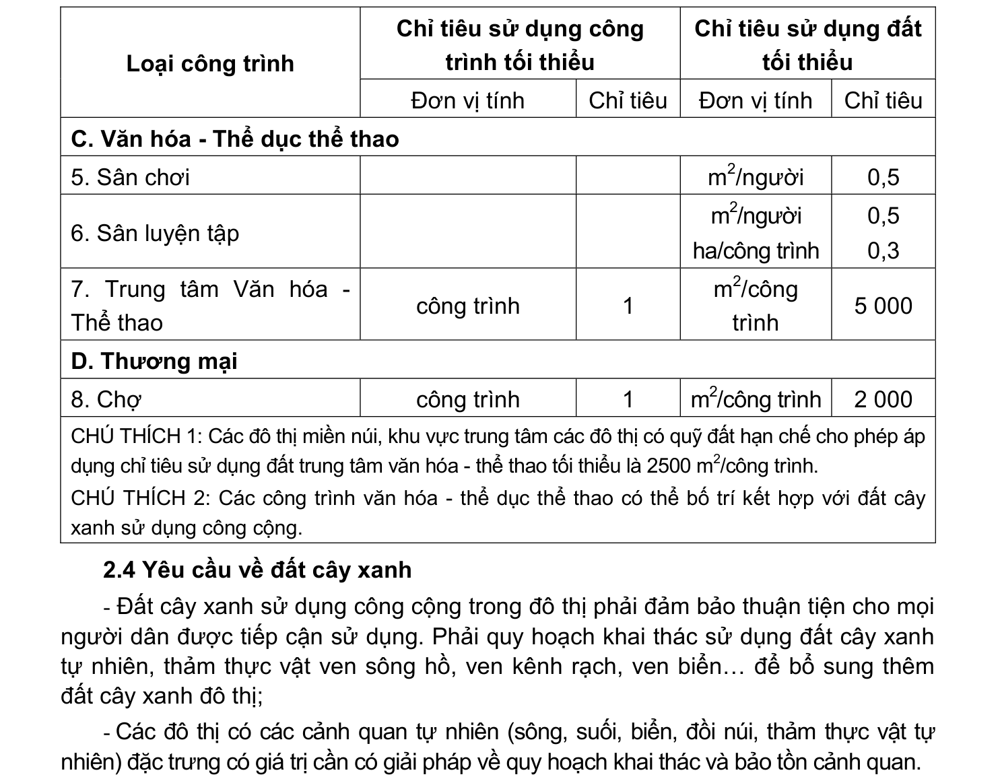

> **Trích dẫn:** mục 2.3.3 QCVN 01:2021/BXD

# 2.3.3 Quy định về hệ thống công trình dịch vụ - công cộng cấp đơn vị ở

- Các công trình dịch vụ - công cộng cấp đơn vị ở cần đảm bảo bán kính phục vụ không quá 500m. Riêng đối với khu vực có địa hình phức tạp, mật độ dân cư thấp bán kính phục vụ của các loại công trình này không quá 1 000m;

- Hệ thống công trình dịch vụ - công cộng cấp đơn vị ở phải phù hợp với Bảng 2.4.

**Bảng 2.4: Quy mô tối thiểu của các công trình dịch vụ - công cộng cấp đơn vị ở**

Chỉ tiêu sử dụng công trình tối thiểu Chỉ tiêu sử dụng đất tối thiểu Loại công trình Đơn vị tính Chỉ tiêu Đơn vị tính Chỉ tiêu A. Giáo dục

1. Trường mầm non cháu/1 000 người m2/1 cháu

2. Trường tiểu học học sinh/ 1 000 người m2/1 học sinh

3. Trường trung học cơ sở học sinh/ 1 000 người m2/1 học sinh B. Y tế

4. Trạm y tế trạm m2/trạm Chỉ tiêu sử dụng công trình tối thiểu Chỉ tiêu sử dụng đất tối thiểu Loại công trình Đơn vị tính Chỉ tiêu Đơn vị tính Chỉ tiêu C. Văn hóa - Thể dục thể thao

5. Sân chơi m2/người 0,5

6. Sân luyện tập m2/người ha/công trình 0,5 0,3

7. Trung tâm Văn hóa - Thể thao công trình m2/công trình 5 000 D. Thương mại

8. Chợ công trình m2/công trình 2 000

CHÚ THÍCH 1: Các đô thị miền núi, khu vực trung tâm các đô thị có quỹ đất hạn chế cho phép áp dụng chỉ tiêu sử dụng đất trung tâm văn hóa - thể thao tối thiểu là 2500 m2/công trình.

CHÚ THÍCH 2: Các công trình văn hóa - thể dục thể thao có thể bố trí kết hợp với đất cây xanh sử dụng công cộng.
