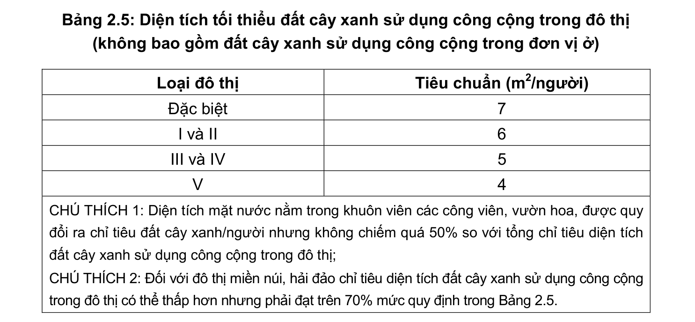

> **Trích dẫn:** mục 2.4 QCVN 01:2021/BXD

# 2.4 Yêu cầu về đất cây xanh

- Đất cây xanh sử dụng công cộng trong đô thị phải đảm bảo thuận tiện cho mọi người dân được tiếp cận sử dụng. Phải quy hoạch khai thác sử dụng đất cây xanh tự nhiên, thảm thực vật ven sông hồ, ven kênh rạch, ven biển… để bổ sung thêm đất cây xanh đô thị;

- Các đô thị có các cảnh quan tự nhiên (sông, suối, biển, đồi núi, thảm thực vật tự nhiên) đặc trưng có giá trị cần có giải pháp về quy hoạch khai thác và bảo tồn cảnh quan.

**Bảng 2.5: Diện tích tối thiểu đất cây xanh sử dụng công cộng trong đô thị**

(không bao gồm đất cây xanh sử dụng công cộng trong đơn vị ở) Loại đô thị Tiêu chuẩn (m2/người) Đặc biệt I và II III và IV V

CHÚ THÍCH 1: Diện tích mặt nước nằm trong khuôn viên các công viên, vườn hoa, được quy đổi ra chỉ tiêu đất cây xanh/người nhưng không chiếm quá 50% so với tổng chỉ tiêu diện tích đất cây xanh sử dụng công cộng trong đô thị;

CHÚ THÍCH 2: Đối với đô thị miền núi, hải đảo chỉ tiêu diện tích đất cây xanh sử dụng công cộng trong đô thị có thể thấp hơn nhưng phải đạt trên 70% mức quy định trong Bảng 2.5.
