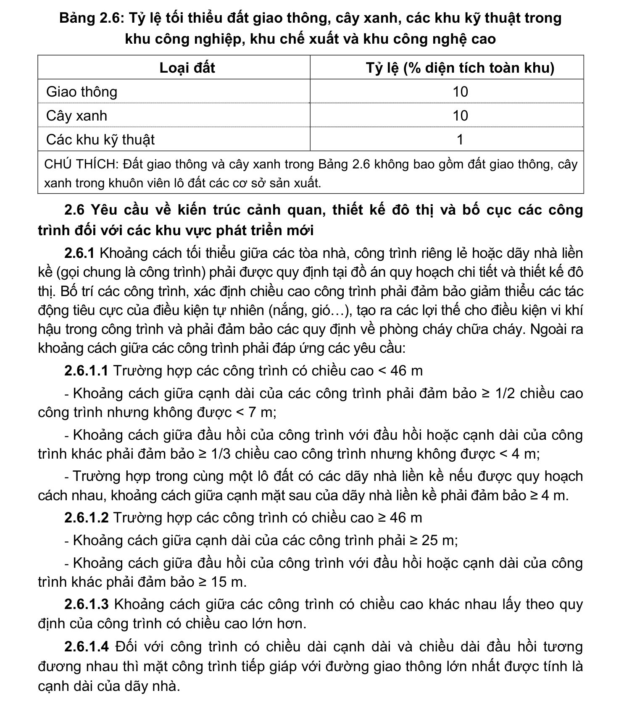

> **Trích dẫn:** mục 2.5.3 QCVN 01:2021/BXD

# 2.5.3 Sử dụng đất

- Đất xây dựng khu công nghiệp, khu chế xuất và khu công nghệ cao phải được quy hoạch phù hợp với tiềm năng phát triển công nghiệp, phát triển kinh tế - xã hội và các chiến lược phát triển có liên quan của từng địa phương;

- Tỷ lệ các loại đất trong khu công nghiệp, khu chế xuất và khu công nghệ cao phụ thuộc vào loại hình, tính chất các cơ sở sản xuất, mô-đun diện tích của các lô đất xây dựng cơ sở sản xuất, kho tàng, nhưng cần phù hợp với các quy định tại Bảng 2.6;

- Mật độ xây dựng thuần của lô đất xây dựng nhà máy, kho tàng tối đa là 70%. Đối với các lô đất xây dựng nhà máy có trên 05 sàn sử dụng để sản xuất, mật độ xây dựng thuần tối đa là 60%.

**Bảng 2.6: Tỷ lệ tối thiểu đất giao thông, cây xanh, các khu kỹ thuật trong khu công nghiệp, khu chế xuất và khu công nghệ cao**

Loại đất Tỷ lệ (% diện tích toàn khu) Giao thông Cây xanh Các khu kỹ thuật

CHÚ THÍCH: Đất giao thông và cây xanh trong Bảng 2.6 không bao gồm đất giao thông, cây xanh trong khuôn viên lô đất các cơ sở sản xuất.
