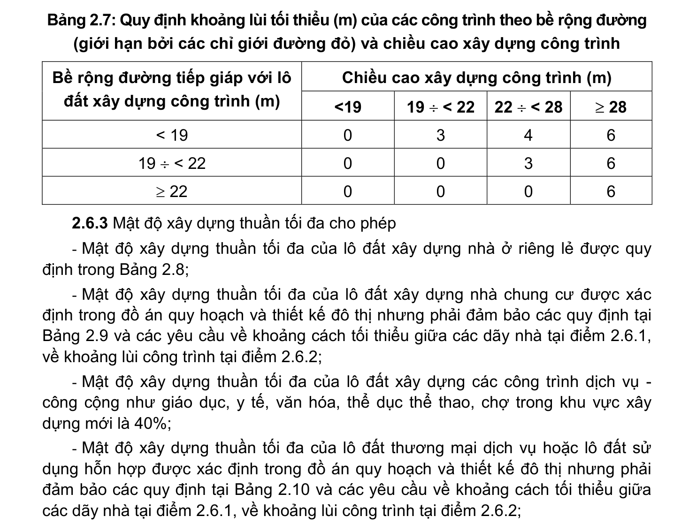

> **Trích dẫn:** mục 2.6.2 QCVN 01:2021/BXD

# 2.6.2 Khoảng lùi của công trình

- Khoảng lùi của các công trình tiếp giáp với đường giao thông (đối với đường giao thông cấp khu vực trở lên) được quy định tại đồ án quy hoạch chi tiết và thiết kế đô thị, nhưng phải thỏa mãn quy định trong Bảng 2.7;

- Đối với tổ hợp công trình bao gồm phần đế công trình và tháp cao phía trên thì các quy định về khoảng lùi công trình được áp dụng riêng đối với phần đế công trình và đối với phần tháp cao phía trên theo chiều cao tương ứng của mỗi phần.

**Bảng 2.7: Quy định khoảng lùi tối thiểu (m) của các công trình theo bề rộng đường**

(giới hạn bởi các chỉ giới đường đỏ) và chiều cao xây dựng công trình Chiều cao xây dựng công trình (m) Bề rộng đường tiếp giáp với lô đất xây dựng công trình (m) <19 19 ÷ < 22 22 ÷ < 28 ≥ 28 < 19 19 ÷ < 22 ≥ 22
