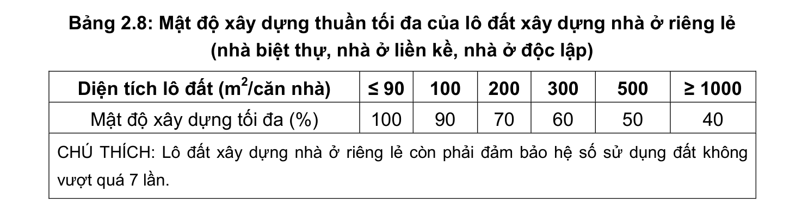
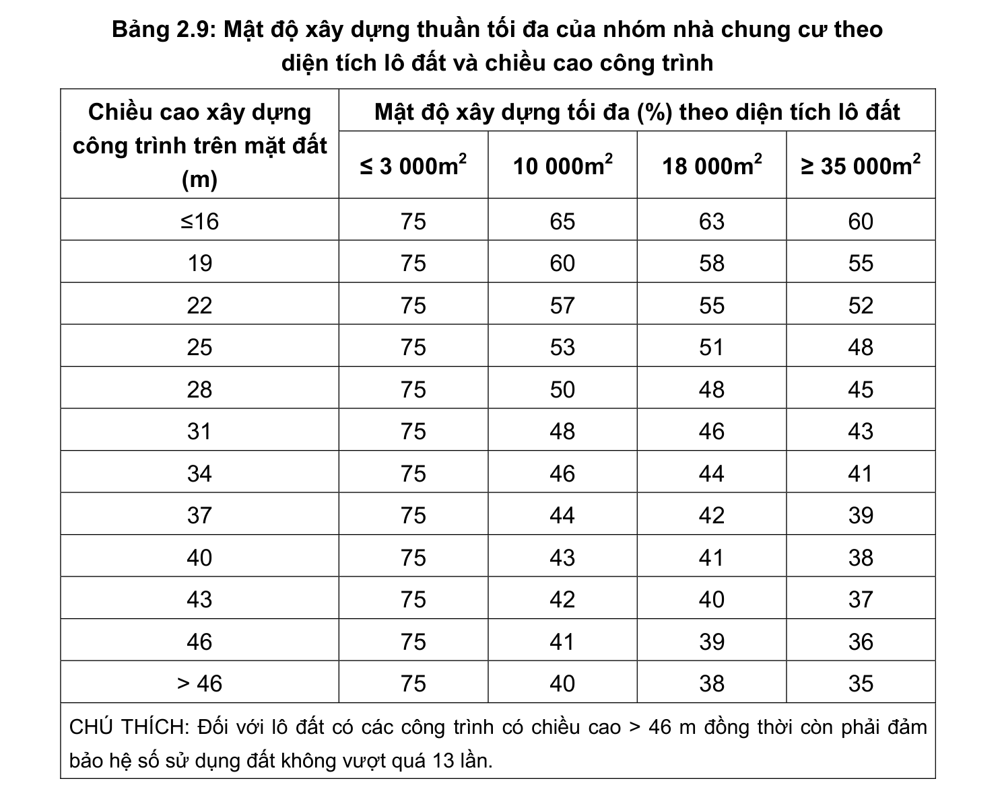
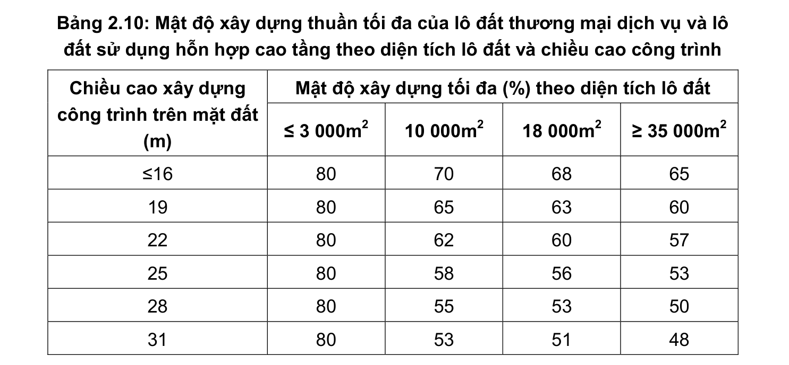
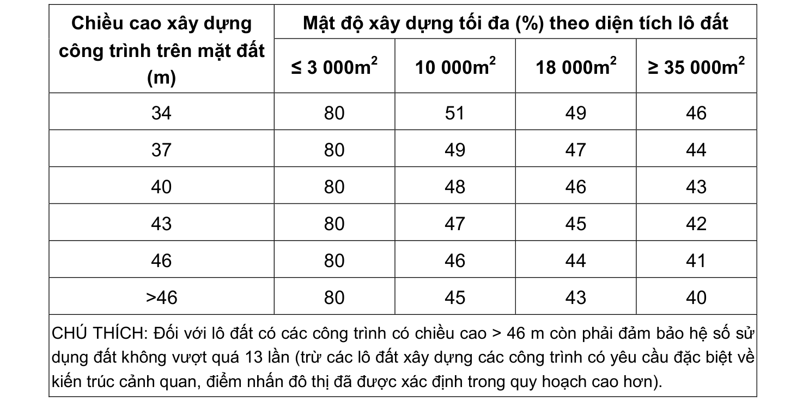

> **Trích dẫn:** mục 2.6.3 QCVN 01:2021/BXD

# 2.6.3 Mật độ xây dựng thuần tối đa cho phép

- Mật độ xây dựng thuần tối đa của lô đất xây dựng nhà ở riêng lẻ được quy định trong Bảng 2.8;

- Mật độ xây dựng thuần tối đa của lô đất xây dựng nhà chung cư được xác định trong đồ án quy hoạch và thiết kế đô thị nhưng phải đảm bảo các quy định tại Bảng 2.9 và các yêu cầu về khoảng cách tối thiểu giữa các dãy nhà tại điểm 2.6.1, về khoảng lùi công trình tại điểm 2.6.2;

- Mật độ xây dựng thuần tối đa của lô đất xây dựng các công trình dịch vụ - công cộng như giáo dục, y tế, văn hóa, thể dục thể thao, chợ trong khu vực xây dựng mới là 40%;

- Mật độ xây dựng thuần tối đa của lô đất thương mại dịch vụ hoặc lô đất sử dụng hỗn hợp được xác định trong đồ án quy hoạch và thiết kế đô thị nhưng phải đảm bảo các quy định tại Bảng 2.10 và các yêu cầu về khoảng cách tối thiểu giữa các dãy nhà tại điểm 2.6.1, về khoảng lùi công trình tại điểm 2.6.2;

**Bảng 2.8: Mật độ xây dựng thuần tối đa của lô đất xây dựng nhà ở riêng lẻ**

(nhà biệt thự, nhà ở liền kề, nhà ở độc lập) Diện tích lô đất (m2/căn nhà) ≤ 90 ≥ 1000 Mật độ xây dựng tối đa (%)

CHÚ THÍCH: Lô đất xây dựng nhà ở riêng lẻ còn phải đảm bảo hệ số sử dụng đất không vượt quá 7 lần.

**Bảng 2.9: Mật độ xây dựng thuần tối đa của nhóm nhà chung cư theo diện tích lô đất và chiều cao công trình**

Mật độ xây dựng tối đa (%) theo diện tích lô đất Chiều cao xây dựng công trình trên mặt đất (m) ≤ 3 000m2 10 000m2 18 000m2 ≥ 35 000m2 ≤16 > 46

CHÚ THÍCH: Đối với lô đất có các công trình có chiều cao > 46 m đồng thời còn phải đảm bảo hệ số sử dụng đất không vượt quá 13 lần.

**Bảng 2.10: Mật độ xây dựng thuần tối đa của lô đất thương mại dịch vụ và lô đất sử dụng hỗn hợp cao tầng theo diện tích lô đất và chiều cao công trình**

Mật độ xây dựng tối đa (%) theo diện tích lô đất Chiều cao xây dựng công trình trên mặt đất (m) ≤ 3 000m2 10 000m2 18 000m2 ≥ 35 000m2 ≤16 Mật độ xây dựng tối đa (%) theo diện tích lô đất Chiều cao xây dựng công trình trên mặt đất (m) ≤ 3 000m2 10 000m2 18 000m2 ≥ 35 000m2 >46

CHÚ THÍCH: Đối với lô đất có các công trình có chiều cao > 46 m còn phải đảm bảo hệ số sử dụng đất không vượt quá 13 lần (trừ các lô đất xây dựng các công trình có yêu cầu đặc biệt về kiến trúc cảnh quan, điểm nhấn đô thị đã được xác định trong quy hoạch cao hơn).

- Đối với các lô đất không nằm trong các Bảng 2.8; Bảng 2.9; Bảng 2.10 được phép nội suy giữa 2 giá trị gần nhất;

- Trong trường hợp công trình là tổ hợp với nhiều loại chiều cao khác nhau, quy định về mật độ xây dựng tối đa cho phép áp dụng theo chiều cao trung bình;

- Đối với tổ hợp công trình bao gồm phần đế công trình và tháp cao phía trên, các quy định mật độ xây dựng được áp dụng riêng đối với phần đế công trình và đối với phần tháp cao phía trên theo chiều cao xây dựng tương ứng nhưng phải đảm bảo hệ số sử dụng đất chung của phần đế và phần tháp không vượt quá 13 lần.
