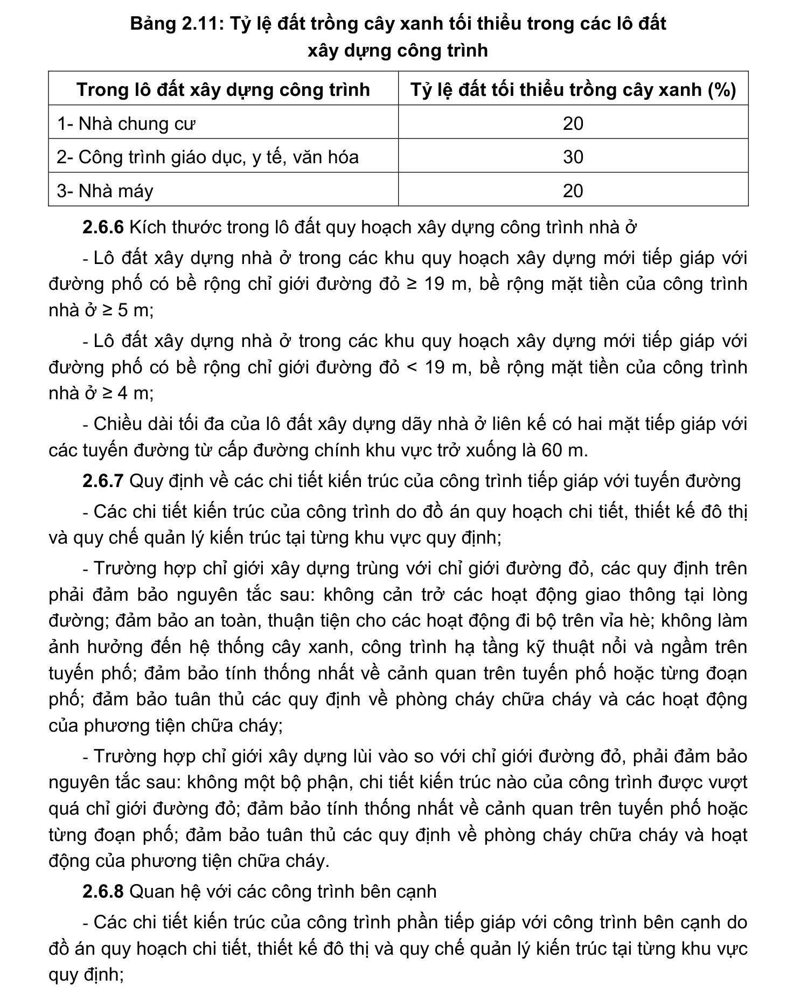

> **Trích dẫn:** mục 2.6.5 QCVN 01:2021/BXD

# 2.6.5 Tỷ lệ đất trồng cây xanh trong các lô đất xây dựng công trình, phải…

Tỷ lệ đất trồng cây xanh trong các lô đất xây dựng công trình, phải đảm bảo quy định về tỷ lệ tối thiểu đất trồng cây xanh nêu trong Bảng 2.11.

**Bảng 2.11: Tỷ lệ đất trồng cây xanh tối thiểu trong các lô đất xây dựng công trình**

Trong lô đất xây dựng công trình Tỷ lệ đất tối thiểu trồng cây xanh (%) 1- Nhà chung cư 2- Công trình giáo dục, y tế, văn hóa 3- Nhà máy
