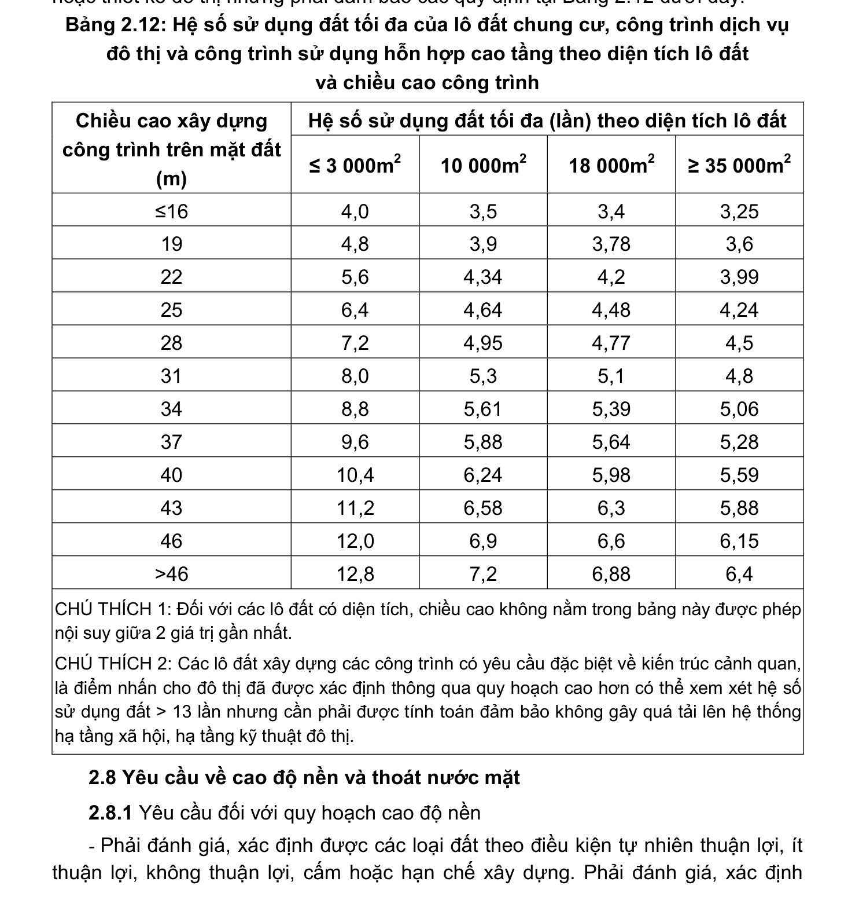

> **Trích dẫn:** mục 2.7.7 QCVN 01:2021/BXD

# 2.7.7 Quy định về mật độ xây dựng thuần

- Mật độ xây dựng thuần tuân thủ các quy định tại điểm 2.6.3. Riêng các lô đất xây dựng nhà ở riêng lẻ có chiều cao ≤ 25 m có diện tích lô đất ≤ 100 m2 được phép xây dựng đến mật độ tối đa là 100% nhưng vẫn phải đảm bảo các quy định về khoảng lùi, khoảng cách giữa các công trình tại điểm 2.7.5 và điểm 2.7.6;

- Trong trường hợp do đặc thù hiện trạng của khu vực quy hoạch không còn quỹ đất để đảm bảo chỉ tiêu sử dụng đất của các công trình dịch vụ - công cộng, cho phép tăng mật độ xây dựng thuần tối đa của các công trình dịch vụ - công cộng nhưng không vượt quá 60%;

- Đối với các khu vực do nhu cầu cần kiểm soát về chất tải dân số và nhu cầu hạ tầng cho phép sử dụng chỉ tiêu hệ số sử dụng đất thay cho nhóm chỉ tiêu mật độ, tầng cao xây dựng. Hệ số sử dụng đất tối đa được xác định trong đồ án quy hoạch hoặc thiết kế đô thị nhưng phải đảm bảo các quy định tại Bảng 2.12 dưới đây.

**Bảng 2.12: Hệ số sử dụng đất tối đa của lô đất chung cư, công trình dịch vụ đô thị và công trình sử dụng hỗn hợp cao tầng theo diện tích lô đất và chiều cao công trình**

Hệ số sử dụng đất tối đa (lần) theo diện tích lô đất Chiều cao xây dựng công trình trên mặt đất (m) ≤ 3 000m2 10 000m2 18 000m2 ≥ 35 000m2 ≤16 4,0 3,5 3,4 3,25 4,8 3,9 3,78 3,6 5,6 4,34 4,2 3,99 6,4 4,64 4,48 4,24 7,2 4,95 4,77 4,5 8,0 5,3 5,1 4,8 8,8 5,61 5,39 5,06 9,6 5,88 5,64 5,28 10,4 6,24 5,98 5,59 11,2 6,58 6,3 5,88 12,0 6,9 6,6 6,15 >46 12,8 7,2 6,88 6,4

CHÚ THÍCH 1: Đối với các lô đất có diện tích, chiều cao không nằm trong bảng này được phép nội suy giữa 2 giá trị gần nhất.

CHÚ THÍCH 2: Các lô đất xây dựng các công trình có yêu cầu đặc biệt về kiến trúc cảnh quan, là điểm nhấn cho đô thị đã được xác định thông qua quy hoạch cao hơn có thể xem xét hệ số sử dụng đất > 13 lần nhưng cần phải được tính toán đảm bảo không gây quá tải lên hệ thống hạ tầng xã hội, hạ tầng kỹ thuật đô thị.
