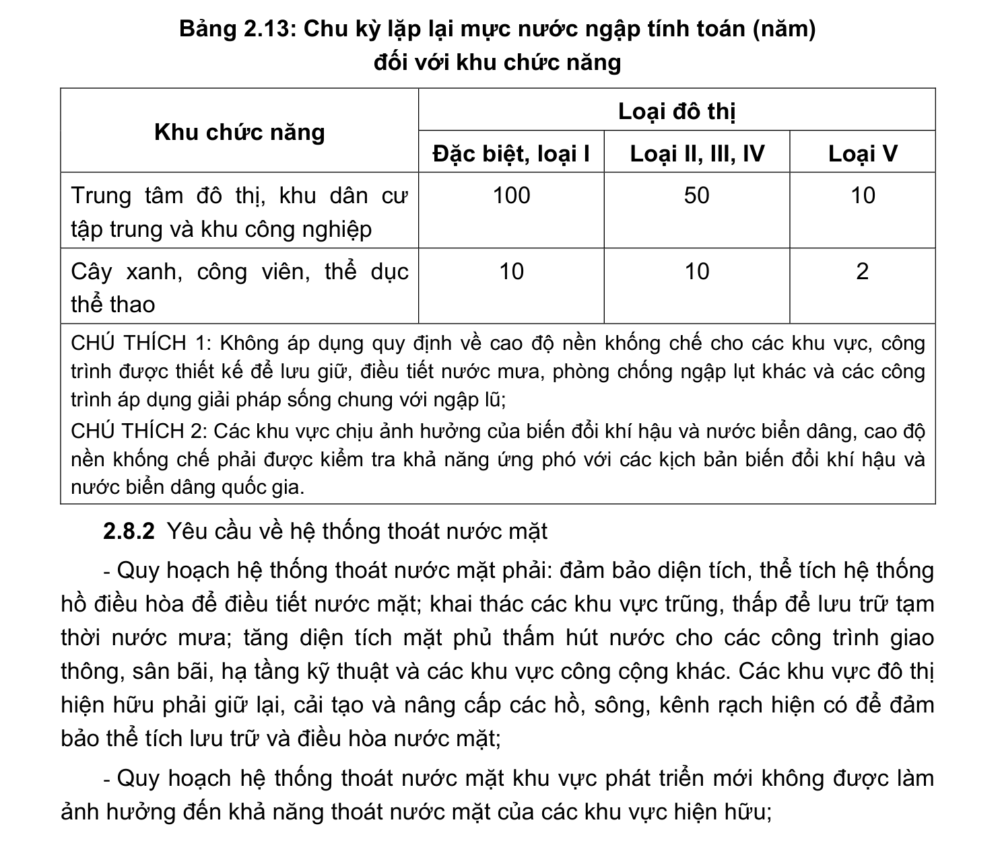

> **Trích dẫn:** mục 2.8.1 QCVN 01:2021/BXD

# 2.8.1 Yêu cầu đối với quy hoạch cao độ nền

- Phải đánh giá, xác định được các loại đất theo điều kiện tự nhiên thuận lợi, ít thuận lợi, không thuận lợi, cấm hoặc hạn chế xây dựng. Phải đánh giá, xác định được các nguy cơ rủi ro do thiên tai, biến đổi khí hậu và nước biển dâng trong đó có xét đến các khu vực lân cận;

- Phải phù hợp với quy hoạch chuyên ngành thủy lợi. Phải tận dụng địa hình và điều kiện tự nhiên, hạn chế khối lượng đào, đắp. Phải có giải pháp để cao độ nền khu quy hoạch mới không ảnh hưởng đến khả năng tiêu thoát nước của các khu vực hiện hữu;

- Quy hoạch cao độ nền phải được thiết kế với chu kỳ lặp lại mực nước ngập tính toán được xác định theo loại đô thị và phân khu chức năng đô thị theo Bảng 2.13;

- Cao độ nền khống chế tối thiểu khu vực xây dựng công trình phải cao hơn mực nước ngập tính toán 0,3 m đối với đất dân dụng và 0,5 m đối với đất công nghiệp.

**Bảng 2.13: Chu kỳ lặp lại mực nước ngập tính toán (năm) đối với khu chức năng**

Loại đô thị Khu chức năng Đặc biệt, loại I Loại II, III, IV Loại V Trung tâm đô thị, khu dân cư tập trung và khu công nghiệp Cây xanh, công viên, thể dục thể thao

CHÚ THÍCH 1: Không áp dụng quy định về cao độ nền khống chế cho các khu vực, công trình được thiết kế để lưu giữ, điều tiết nước mưa, phòng chống ngập lụt khác và các công trình áp dụng giải pháp sống chung với ngập lũ;

CHÚ THÍCH 2: Các khu vực chịu ảnh hưởng của biến đổi khí hậu và nước biển dâng, cao độ nền khống chế phải được kiểm tra khả năng ứng phó với các kịch bản biến đổi khí hậu và nước biển dâng quốc gia.
