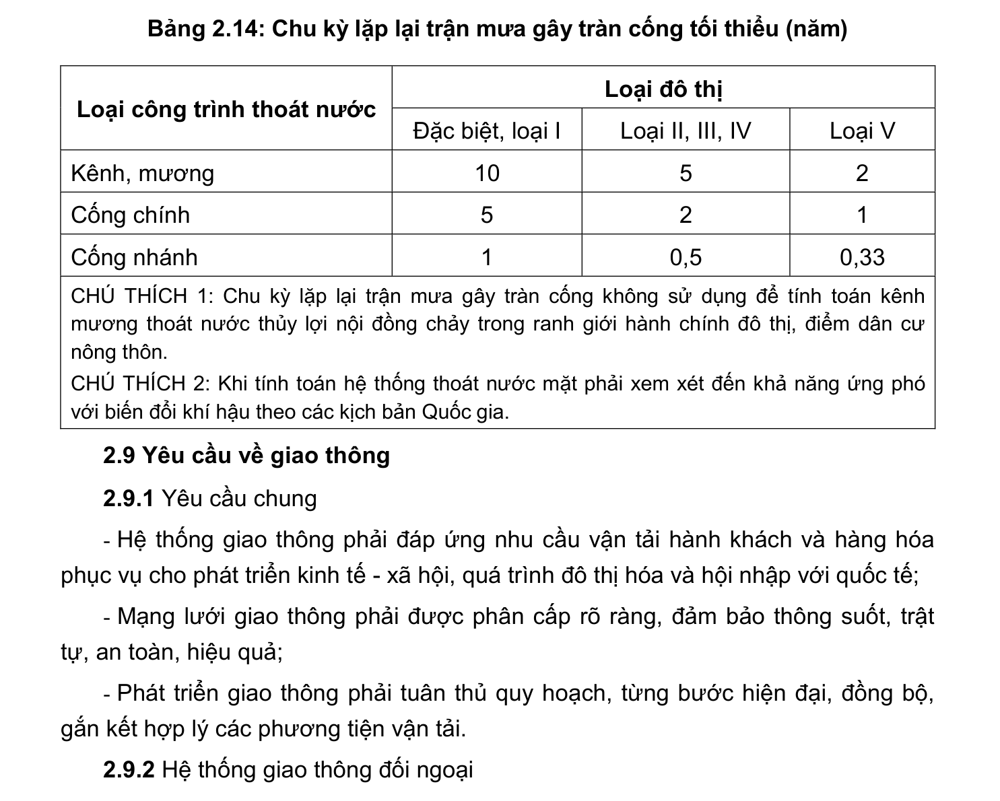

> **Trích dẫn:** mục 2.8.2 QCVN 01:2021/BXD

# 2.8.2 Yêu cầu về hệ thống thoát nước mặt

- Quy hoạch hệ thống thoát nước mặt phải: đảm bảo diện tích, thể tích hệ thống hồ điều hòa để điều tiết nước mặt; khai thác các khu vực trũng, thấp để lưu trữ tạm thời nước mưa; tăng diện tích mặt phủ thấm hút nước cho các công trình giao thông, sân bãi, hạ tầng kỹ thuật và các khu vực công cộng khác. Các khu vực đô thị hiện hữu phải giữ lại, cải tạo và nâng cấp các hồ, sông, kênh rạch hiện có để đảm bảo thể tích lưu trữ và điều hòa nước mặt;

- Quy hoạch hệ thống thoát nước mặt khu vực phát triển mới không được làm ảnh hưởng đến khả năng thoát nước mặt của các khu vực hiện hữu;

- Quy hoạch hệ thống thoát nước mặt phải tính đến việc giảm thiểu thiệt hại do tác động của thiên tai (lũ, lụt, bão, triều cường, trượt, sạt lở đất...), ứng phó với biến đổi khí hậu và nước biển dâng;

- Các khu vực xây dựng mới hoàn toàn phải xây dựng hệ thống thoát nước riêng. Các khu vực đã có mạng lưới thoát nước chung phải cải tạo thành hệ thống thoát nước nửa riêng hoặc hệ thống thoát nước riêng;

- Hệ thống thoát nước mặt phải được tính toán theo chu kỳ lặp lại trận mưa gây tràn cống. Chu kỳ lặp lại trận mưa gây tràn cống tối thiểu được quy định tại Bảng 2.14;

- Yêu cầu về thu gom nước mưa: 100% đường nội thị và đường đi qua khu dân cư ngoại thị phải có hệ thống thoát nước mưa;

- Ngoài ra các công trình trên mạng lưới thoát nước phải tuân thủ QCVN 07- 2:2016/BXD.

**Bảng 2.14: Chu kỳ lặp lại trận mưa gây tràn cống tối thiểu (năm)**

Loại đô thị Loại công trình thoát nước Đặc biệt, loại I Loại II, III, IV Loại V Kênh, mương Cống chính Cống nhánh 0,5 0,33

CHÚ THÍCH 1: Chu kỳ lặp lại trận mưa gây tràn cống không sử dụng để tính toán kênh mương thoát nước thủy lợi nội đồng chảy trong ranh giới hành chính đô thị, điểm dân cư nông thôn.

CHÚ THÍCH 2: Khi tính toán hệ thống thoát nước mặt phải xem xét đến khả năng ứng phó với biến đổi khí hậu theo các kịch bản Quốc gia.
