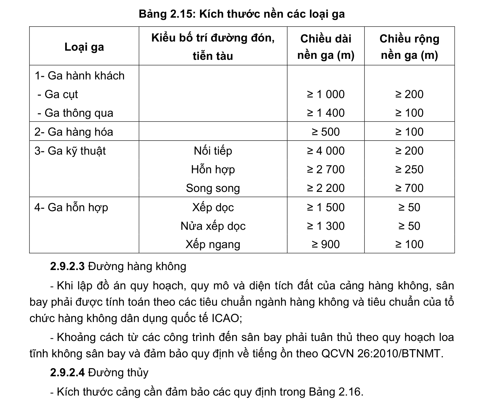

> **Trích dẫn:** mục 2.9.2.2 QCVN 01:2021/BXD

# 2.9.2.2 Đường sắt

- Khoảng cách an toàn của các công trình đường sắt đối với các công trình khác phải tuân thủ các quy định hiện hành của ngành giao thông;

- Khoảng cách từ tim đường ray gần nhất đến nhà ở đô thị phải ≥ 20 m;

- Kích thước nền ga đảm bảo các yêu cầu trong Bảng 2.15.

**Bảng 2.15: Kích thước nền các loại ga**

Loại ga Kiểu bố trí đường đón, tiễn tàu Chiều dài nền ga (m) Chiều rộng nền ga (m) 1- Ga hành khách

- Ga cụt ≥ 1 000 ≥ 200

- Ga thông qua ≥ 1 400 ≥ 100 2- Ga hàng hóa ≥ 500 ≥ 100 3- Ga kỹ thuật Nối tiếp ≥ 4 000 ≥ 200 Hỗn hợp ≥ 2 700 ≥ 250 Song song ≥ 2 200 ≥ 700 4- Ga hỗn hợp Xếp dọc ≥ 1 500 ≥ 50 Nửa xếp dọc ≥ 1 300 ≥ 50 Xếp ngang ≥ 900 ≥ 100
