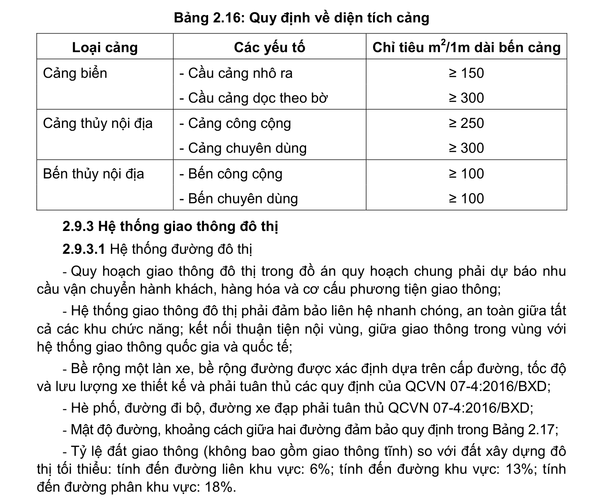

> **Trích dẫn:** mục 2.9.2.4 QCVN 01:2021/BXD

# 2.9.2.4 Đường thủy

- Kích thước cảng cần đảm bảo các quy định trong Bảng 2.16.

**Bảng 2.16: Quy định về diện tích cảng**

Loại cảng Các yếu tố Chỉ tiêu m2/1m dài bến cảng Cảng biển

- Cầu cảng nhô ra ≥ 150

- Cầu cảng dọc theo bờ ≥ 300 Cảng thủy nội địa

- Cảng công cộng ≥ 250

- Cảng chuyên dùng ≥ 300 Bến thủy nội địa

- Bến công cộng ≥ 100

- Bến chuyên dùng ≥ 100
