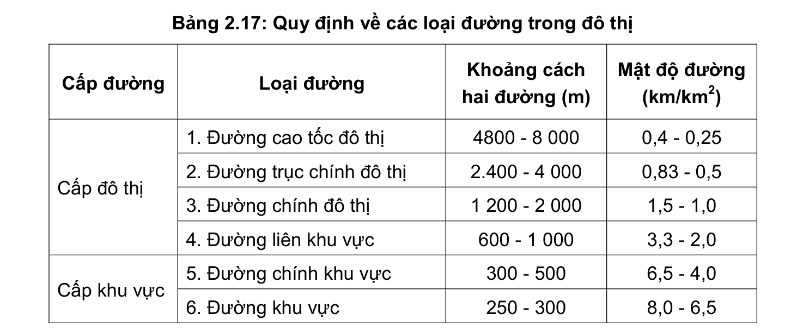
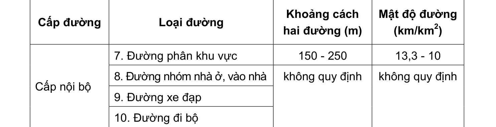

> **Trích dẫn:** mục 2.9.3.1 QCVN 01:2021/BXD

# 2.9.3.1 Hệ thống đường đô thị

- Quy hoạch giao thông đô thị trong đồ án quy hoạch chung phải dự báo nhu cầu vận chuyển hành khách, hàng hóa và cơ cấu phương tiện giao thông;

- Hệ thống giao thông đô thị phải đảm bảo liên hệ nhanh chóng, an toàn giữa tất cả các khu chức năng; kết nối thuận tiện nội vùng, giữa giao thông trong vùng với hệ thống giao thông quốc gia và quốc tế;

- Bề rộng một làn xe, bề rộng đường được xác định dựa trên cấp đường, tốc độ và lưu lượng xe thiết kế và phải tuân thủ các quy định của QCVN 07-4:2016/BXD;

- Hè phố, đường đi bộ, đường xe đạp phải tuân thủ QCVN 07-4:2016/BXD;

- Mật độ đường, khoảng cách giữa hai đường đảm bảo quy định trong Bảng 2.17;

- Tỷ lệ đất giao thông (không bao gồm giao thông tĩnh) so với đất xây dựng đô thị tối thiểu: tính đến đường liên khu vực: 6%; tính đến đường khu vực: 13%; tính đến đường phân khu vực: 18%.

**Bảng 2.17: Quy định về các loại đường trong đô thị**

Cấp đường Loại đường Khoảng cách hai đường (m) Mật độ đường (km/km2)

1. Đường cao tốc đô thị 4800 - 8 000 0,4 - 0,25

2. Đường trục chính đô thị

2.400 - 4 000

0,83 - 0,5

3. Đường chính đô thị 1 200 - 2 000 1,5 - 1,0 Cấp đô thị

4. Đường liên khu vực 600 - 1 000 3,3 - 2,0

5. Đường chính khu vực 300 - 500 6,5 - 4,0 Cấp khu vực

6. Đường khu vực 250 - 300 8,0 - 6,5 Cấp đường Loại đường Khoảng cách hai đường (m) Mật độ đường (km/km2)

7. Đường phân khu vực 150 - 250 13,3 - 10

8. Đường nhóm nhà ở, vào nhà

9. Đường xe đạp Cấp nội bộ

10. Đường đi bộ không quy định không quy định
