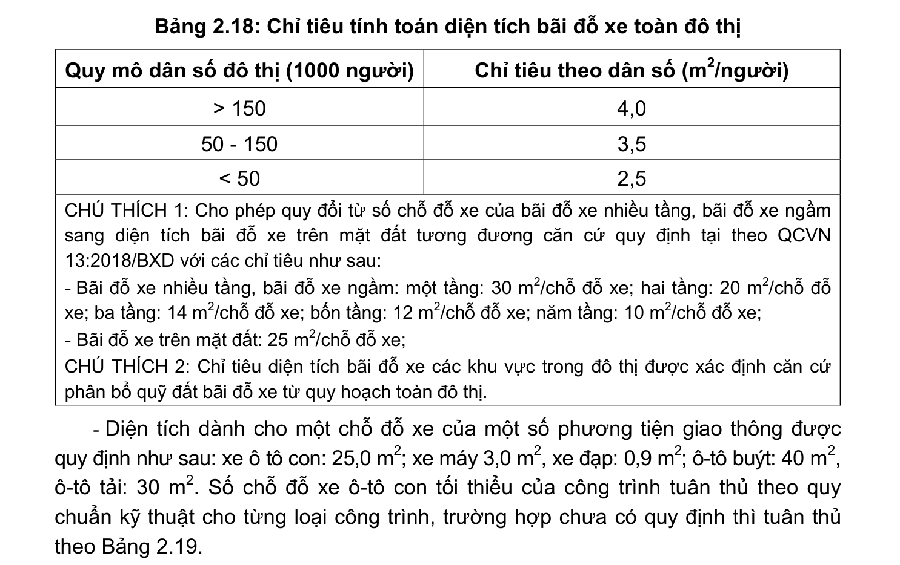
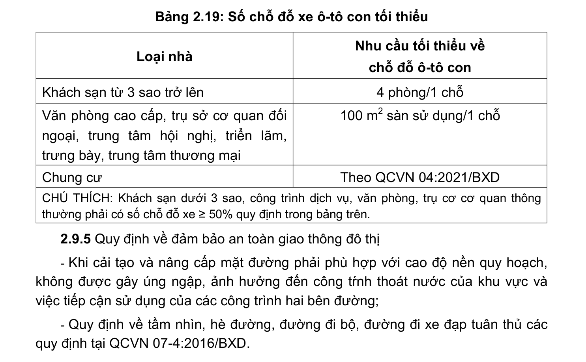

> **Trích dẫn:** mục 2.9.4 QCVN 01:2021/BXD

# 2.9.4 Công trình giao thông khác trong đô thị

- Trong các khu đô thị, đơn vị ở và nhóm nhà ở phải bố trí chỗ để xe, bãi đỗ xe. Trong khu công nghiệp, kho tàng phải bố trí bãi đỗ xe, xưởng sửa chữa;

- Bãi đỗ xe chở hàng hóa phải bố trí gần chợ, ga hàng hóa, các trung tâm thương mại và các công trình khác có yêu cầu vận chuyển lớn;

- Các khu vực có nhu cầu vận chuyển lớn, trung tâm thương mại, dịch vụ, thể dục thể thao, vui chơi giải trí phải bố trí phải bố trí bãi đỗ xe, điểm đỗ xe công cộng thuận tiện cho hành khách và phương tiện, kết nối liên thông với mạng lưới đường phố, đảm bảo khoảng cách đi bộ tối đa là 500 m;

- Bãi đỗ ô-tô buýt tại các điểm đầu và cuối tuyến, cần xác định quy mô theo nhu cầu cụ thể;

- Đê-pô tàu điện bố trí tại các điểm đầu, cuối và điểm kết nối tuyến, có thể bố trí kết hợp đê-pô tàu điện với cơ sở sửa chữa;

- Các công trình công cộng, dịch vụ, các khu chung cư, các cơ quan phải đảm bảo đủ số lượng chỗ đỗ xe đối với từng loại phương tiện theo nhu cầu sử dụng;

- Khu vực đô thị hiện hữu cho phép quy hoạch các bãi đỗ xe ngầm, bãi đỗ xe nhiều tầng nhưng phải bảo đảm kết nối tương thích và đồng bộ, an toàn với các công trình khác;

- Chỉ tiêu diện tích tính toán đất bãi đỗ xe toàn đô thị theo Bảng 2.18;

**Bảng 2.18: Chỉ tiêu tính toán diện tích bãi đỗ xe toàn đô thị**

Quy mô dân số đô thị (1000 người) Chỉ tiêu theo dân số (m2/người) > 150 4,0 50 - 150 3,5 < 50 2,5

CHÚ THÍCH 1: Cho phép quy đổi từ số chỗ đỗ xe của bãi đỗ xe nhiều tầng, bãi đỗ xe ngầm sang diện tích bãi đỗ xe trên mặt đất tương đương căn cứ quy định tại theo QCVN 13:2018/BXD với các chỉ tiêu như sau:

- Bãi đỗ xe nhiều tầng, bãi đỗ xe ngầm: một tầng: 30 m2/chỗ đỗ xe; hai tầng: 20 m2/chỗ đỗ xe; ba tầng: 14 m2/chỗ đỗ xe; bốn tầng: 12 m2/chỗ đỗ xe; năm tầng: 10 m2/chỗ đỗ xe;

- Bãi đỗ xe trên mặt đất: 25 m2/chỗ đỗ xe;

CHÚ THÍCH 2: Chỉ tiêu diện tích bãi đỗ xe các khu vực trong đô thị được xác định căn cứ phân bổ quỹ đất bãi đỗ xe từ quy hoạch toàn đô thị.

- Diện tích dành cho một chỗ đỗ xe của một số phương tiện giao thông được quy định như sau: xe ô tô con: 25,0 m2; xe máy 3,0 m2, xe đạp: 0,9 m2; ô-tô buýt: 40 m2, ô-tô tải: 30 m2. Số chỗ đỗ xe ô-tô con tối thiểu của công trình tuân thủ theo quy chuẩn kỹ thuật cho từng loại công trình, trường hợp chưa có quy định thì tuân thủ theo Bảng 2.19.

**Bảng 2.19: Số chỗ đỗ xe ô-tô con tối thiểu**

Loại nhà Nhu cầu tối thiểu về chỗ đỗ ô-tô con Khách sạn từ 3 sao trở lên 4 phòng/1 chỗ Văn phòng cao cấp, trụ sở cơ quan đối ngoại, trung tâm hội nghị, triển lãm, trưng bày, trung tâm thương mại 100 m2 sàn sử dụng/1 chỗ Chung cư Theo QCVN 04:2021/BXD

CHÚ THÍCH: Khách sạn dưới 3 sao, công trình dịch vụ, văn phòng, trụ cơ cơ quan thông thường phải có số chỗ đỗ xe ≥ 50% quy định trong bảng trên.
