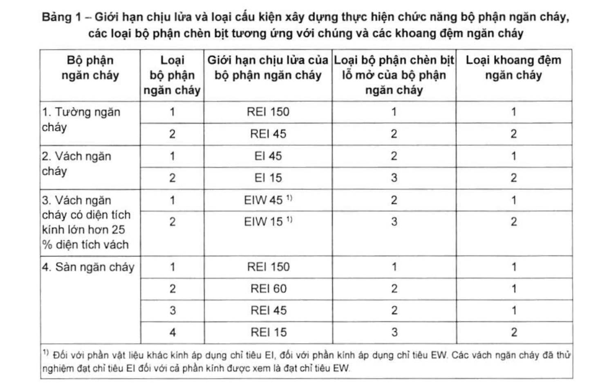
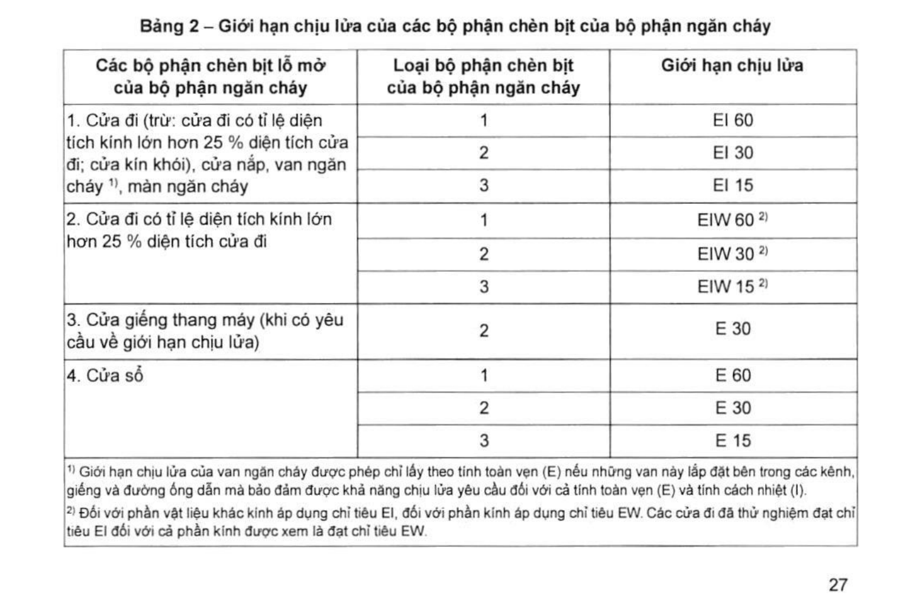

> **Trích dẫn:** mục 2.3.3.5 QCVN 06:2022/BXD

# 2.3.3.5 Giới hạn chịu lửa đối với các loại bộ phận chèn bịt lỗ mở tương ứng…

Giới hạn chịu lửa đối với các loại bộ phận chèn bịt lỗ mở tương ứng của bộ phận ngăn cháy được quy định tại Bảng 2.

**Bảng 1 – Giới hạn chịu lửa và loại cấu kiện xây dựng thực hiện chức năng bộ phận ngăn cháy, các loại bộ phận chèn bịt tương ứng với chúng và các khoang đệm ngăn cháy**

| Bộ phận ngăn cháy | Loại bộ phận ngăn cháy | Giới hạn chịu lửa của bộ phận ngăn cháy | Loại bộ phận chèn bịt lỗ mở của bộ phận ngăn cháy | Loại khoang đệm ngăn cháy |
|---|---|---|---|---|
| 1. Tường ngăn cháy | 1 | REI 150 | 1 | 1 |
| | 2 | REI 45 | 2 | 2 |
| 2. Vách ngăn cháy | 1 | EI 45 | 2 | 1 |
| | 2 | EI 15 | 3 | 2 |
| 3. Vách ngăn cháy có diện tích kính lớn hơn 25 % diện tích vách | 1 | EIW 45 ^1)^ | 2 | 1 |
| | 2 | EIW 15 ^1)^ | 3 | 2 |
| 4. Sàn ngăn cháy | 1 | REI 150 | 1 | 1 |
| | 2 | REI 60 | 2 | 1 |
| | 3 | REI 45 | 2 | 1 |
| | 4 | REI 15 | 3 | 2 |

> ^1)^ Đối với phần vật liệu khác kính áp dụng chỉ tiêu EI, đối với phần kính áp dụng chỉ tiêu EW. Các vách ngăn cháy đã thử nghiệm đạt chỉ tiêu EI đối với cả phần kính được xem là đạt chỉ tiêu EW.

**Bảng 2 – Giới hạn chịu lửa của các bộ phận chèn bịt của bộ phận ngăn cháy**

| Các bộ phận chèn bịt lỗ mở của bộ phận ngăn cháy | Loại bộ phận chèn bịt của bộ phận ngăn cháy | Giới hạn chịu lửa |
|---|---|---|
| 1. Cửa đi (trừ: cửa đi có tỉ lệ diện tích kính lớn hơn 25 % diện tích cửa đi; cửa kín khói), cửa nắp, van ngăn cháy ^1)^, màn ngăn cháy | 1 | EI 60 |
| | 2 | EI 30 |
| | 3 | EI 15 |
| 2. Cửa đi có tỉ lệ diện tích kính lớn hơn 25 % diện tích cửa đi | 1 | EIW 60 ^2)^ |
| | 2 | EIW 30 ^2)^ |
| | 3 | EIW 15 ^2)^ |
| 3. Cửa giếng thang máy (khi có yêu cầu về giới hạn chịu lửa) | 2 | E 30 |
| 4. Cửa sổ | 1 | E 60 |
| | 2 | E 30 |
| | 3 | E 15 |

> ^1)^ Giới hạn chịu lửa của van ngăn cháy được phép chỉ lấy theo tính toàn vẹn (E) nếu những van này lắp đặt bên trong các kênh, giếng và đường ống dẫn mà bảo đảm được khả năng chịu lửa yêu cầu đối với cả tính toàn vẹn (E) và tính cách nhiệt (I).
>
> ^2)^ Đối với phần vật liệu khác kính áp dụng chỉ tiêu EI, đối với phần kính áp dụng chỉ tiêu EW. Các cửa đi đã thử nghiệm đạt chỉ tiêu EI đối với cả phần kính được xem là đạt chỉ tiêu EW.
