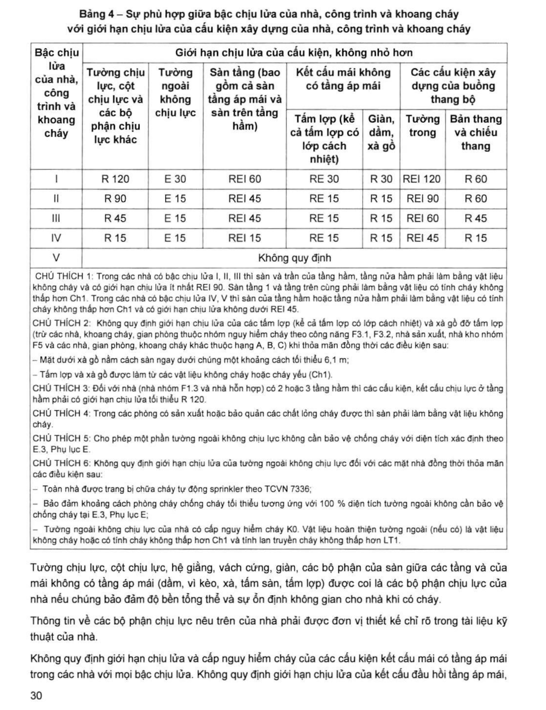

> **Trích dẫn:** mục 2.5.3.3 QCVN 06:2022/BXD

# 2.5.3.3 Giới hạn chịu lửa cần thiết của kết cấu xây dựng phải được lựa chọn…

Giới hạn chịu lửa cần thiết của kết cấu xây dựng phải được lựa chọn phù hợp với bậc chịu lửa đã chọn của nhà, công trình và khoang cháy. Trừ những trường hợp được quy định riêng trong quy chuẩn này, sự phù hợp giữa bậc chịu lửa của nhà, công trình và khoang cháy với giới hạn chịu lửa của kết cấu xây dựng của chúng được quy định tại Bảng 4.

**Bảng 4 – Sự phù hợp giữa bậc chịu lửa của nhà, công trình và khoang cháy với giới hạn chịu lửa của cấu kiện xây dựng của nhà, công trình và khoang cháy**

*Giới hạn chịu lửa của cấu kiện, không nhỏ hơn:*

| Bậc chịu lửa của nhà, công trình và khoang cháy | Tường chịu lực, cột chịu lực và các bộ phận chịu lực khác | Tường ngoài không chịu lực | Sàn tầng (bao gồm cả sàn tầng áp mái và sàn trên tầng hầm) | Kết cấu mái không có tầng áp mái — Tấm lợp (kể cả tấm lợp có lớp cách nhiệt) | Kết cấu mái không có tầng áp mái — Giàn, dầm, xà gồ | Buồng thang bộ — Tường trong | Buồng thang bộ — Bản thang và chiếu thang |
|---|---|---|---|---|---|---|---|
| **I** | R 120 | E 30 | REI 60 | RE 30 | R 30 | REI 120 | R 60 |
| **II** | R 90 | E 15 | REI 45 | RE 15 | R 15 | REI 90 | R 60 |
| **III** | R 45 | E 15 | REI 45 | RE 15 | R 15 | REI 60 | R 45 |
| **IV** | R 15 | E 15 | REI 15 | RE 15 | R 15 | REI 45 | R 15 |
| **V** | Không quy định | Không quy định | Không quy định | Không quy định | Không quy định | Không quy định | Không quy định |

> CHÚ THÍCH 1: Trong các nhà có bậc chịu lửa I, II, III thì sàn và trần của tầng hầm, tầng nửa hầm phải làm bằng vật liệu không cháy và có giới hạn chịu lửa ít nhất REI 90. Sàn tầng 1 và tầng trên cùng phải làm bằng vật liệu có tính cháy không thấp hơn Ch1. Trong các nhà có bậc chịu lửa IV, V thì sàn của tầng hầm hoặc tầng nửa hầm phải làm bằng vật liệu có tính cháy không thấp hơn Ch1 và có giới hạn chịu lửa không dưới REI 45.
>
> CHÚ THÍCH 2: Không quy định giới hạn chịu lửa của các tấm lợp (kể cả tấm lợp có lớp cách nhiệt) và xà gồ đỡ tấm lợp (trừ các nhà, khoang cháy, gian phòng thuộc nhóm nguy hiểm cháy theo công năng F3.1, F3.2, nhà sản xuất, nhà kho nhóm F5 và các nhà, gian phòng, khoang cháy khác thuộc hạng A, B, C) khi thỏa mãn đồng thời các điều kiện sau:
>
> – Mặt dưới xà gồ nằm cách sàn ngay dưới chúng một khoảng cách tối thiểu 6,1 m;
>
> – Tấm lợp và xà gồ được làm từ các vật liệu không cháy hoặc cháy yếu (Ch1).
>
> CHÚ THÍCH 3: Đối với nhà (nhà nhóm F1.3 và nhà hỗn hợp) có 2 hoặc 3 tầng hầm thì các cấu kiện, kết cấu chịu lực ở tầng hầm phải có giới hạn chịu lửa tối thiểu R 120.
>
> CHÚ THÍCH 4: Trong các phòng có sản xuất hoặc bảo quản các chất lỏng cháy được thì sàn phải làm bằng vật liệu không cháy.
>
> CHÚ THÍCH 5: Cho phép một phần tường ngoài không chịu lực không cần bảo vệ chống cháy với diện tích xác định theo E.3, Phụ lục E.
>
> CHÚ THÍCH 6: Không quy định giới hạn chịu lửa của tường ngoài không chịu lực đối với các mặt nhà đồng thời thỏa mãn các điều kiện sau:
>
> – Toàn nhà được trang bị chữa cháy tự động sprinkler theo TCVN 7336;
>
> – Bảo đảm khoảng cách phòng cháy chống cháy tối thiểu tương ứng với 100 % diện tích tường ngoài không cần bảo vệ chống cháy tại E.3, Phụ lục E;
>
> – Tường ngoài không chịu lực của nhà có cấp nguy hiểm cháy K0. Vật liệu hoàn thiện tường ngoài (nếu có) là vật liệu không cháy hoặc có tính cháy không thấp hơn Ch1 và tính lan truyền cháy không thấp hơn LT1.

Tường chịu lực, cột chịu lực, hệ giằng, vách cứng, giàn, các bộ phận của sàn giữa các tầng và của mái không có tầng áp mái (dầm, vì kèo, xà, tấm sàn, tấm lợp) được coi là các bộ phận chịu lực của nhà nếu chúng bảo đảm độ bền tổng thể và sự ổn định không gian cho nhà khi có cháy.

Thông tin về các bộ phận chịu lực nêu trên của nhà phải được đơn vị thiết kế chỉ rõ trong tài liệu kỹ thuật của nhà.

Không quy định giới hạn chịu lửa và cấp nguy hiểm cháy của các cấu kiện kết cấu mái có tầng áp mái trong các nhà với mọi bậc chịu lửa. Không quy định giới hạn chịu lửa của kết cấu đầu hồi tầng áp mái, trong trường hợp này thì đầu hồi tầng áp mái phải có cấp nguy hiểm cháy tương đương với cấp nguy hiểm cháy của tường bao che nhà. Các cấu kiện, kết cấu thuộc các bộ phận của mái có tầng áp mái phải được đơn vị thiết kế chỉ dẫn trong tài liệu kỹ thuật của nhà.

Không quy định giới hạn chịu lửa đối với bộ phận chèn bịt lỗ mở (cửa, cửa sổ, cửa nắp), cửa trời trên mái, cửa lấy sáng trên mái, và các tấm lợp mái lấy sáng, ngoại trừ các bộ phận chèn bịt lỗ mở trên các bộ phận ngăn cháy và các trường hợp được nói riêng.

Khi giới hạn chịu lửa tối thiểu của các cấu kiện được yêu cầu là R 15 (RE 15, REI 15) thì cho phép sử dụng các kết cấu thép không bọc bảo vệ nếu giới hạn chịu lửa của chúng theo kết quả thử nghiệm hoặc theo tính toán từ R 8 trở lên, hoặc hệ số tiết diện A~m~/V nhỏ hơn hoặc bằng 250 m^-1^.

> CHÚ THÍCH: Hệ số tiết diện A~m~/V xác định theo ISO 834-10 hoặc các tiêu chuẩn tương đương.

Trong các buồng thang bộ không nhiễm khói loại N1 được phép sử dụng các bản thang và các chiếu thang với giới hạn chịu lửa R 15 và có cấp nguy hiểm cháy K0.

Các khoang cháy được ngăn chia bởi các tường ngăn cháy loại 1 và (hoặc) sàn ngăn cháy loại 1. Cho phép ngăn chia khoang cháy theo phương đứng bằng tầng kỹ thuật được ngăn cách với các tầng liền kề bằng các sàn ngăn cháy loại 2, nếu các tường ngăn cháy loại 1 không lệch khỏi trục chính. Cho phép phân chia khoang cháy trong các nhà có bậc chịu lửa IV và V bằng các tường ngăn cháy loại 2.
