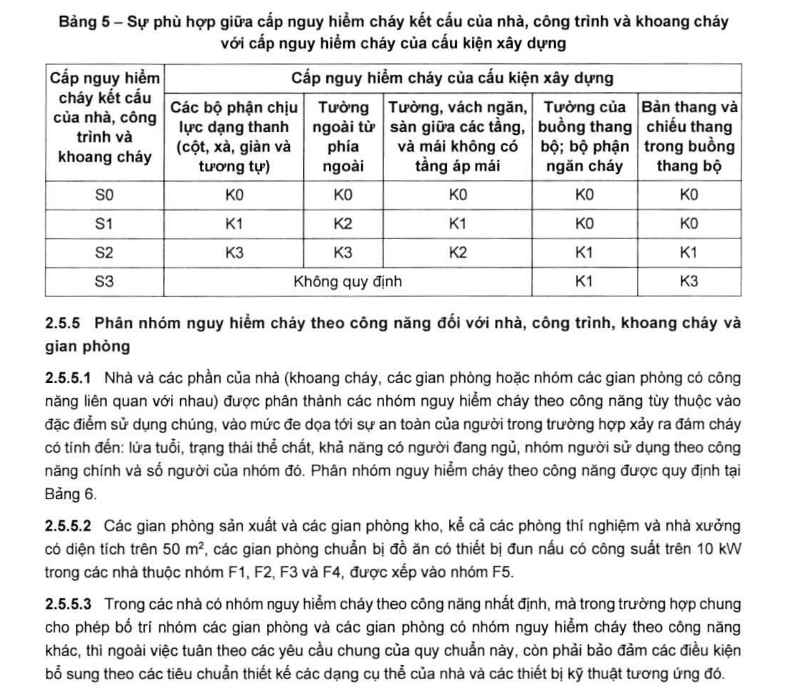

> **Trích dẫn:** mục 2.5.4.4 QCVN 06:2022/BXD

# 2.5.4.4 Không quy định về cấp nguy hiểm cháy đối các với bộ phận chèn bịt lỗ…

Không quy định về cấp nguy hiểm cháy đối các với bộ phận chèn bịt lỗ thông trên kết cấu bao che của nhà (cửa, cửa sổ, cửa nắp), cửa trời trên mái, cửa lấy sáng trên mái, trừ các bộ phận chèn bịt lỗ mở trong bộ phận ngăn cháy.

> CHÚ THÍCH: Khi áp dụng vào thực tế xây dựng các kết cấu hoặc hệ kết cấu mà không thể xác định được giới hạn chịu lửa hoặc cấp nguy hiểm cháy của chúng trên cơ sở các thử nghiệm chịu lửa tiêu chuẩn hoặc theo tính toán thì cần tiến hành thử nghiệm chịu lửa trên các bộ phận của kết cấu hoặc hệ kết cấu đó theo tài liệu chuẩn được lựa chọn áp dụng.

**Bảng 5 – Sự phù hợp giữa cấp nguy hiểm cháy kết cấu của nhà, công trình và khoang cháy với cấp nguy hiểm cháy của cấu kiện xây dựng**

| Cấp nguy hiểm cháy kết cấu của nhà, công trình và khoang cháy | Các bộ phận chịu lực dạng thanh (cột, xà, giàn và tương tự) | Tường ngoài từ phía ngoài | Tường, vách ngăn, sàn giữa các tầng, và mái không có tầng áp mái | Tường của buồng thang bộ; bộ phận ngăn cháy | Bản thang và chiếu thang trong buồng thang bộ |
|---|---|---|---|---|---|
| **S0** | K0 | K0 | K0 | K0 | K0 |
| **S1** | K1 | K2 | K1 | K0 | K0 |
| **S2** | K3 | K3 | K2 | K1 | K1 |
| **S3** | Không quy định | Không quy định | Không quy định | K1 | K3 |
