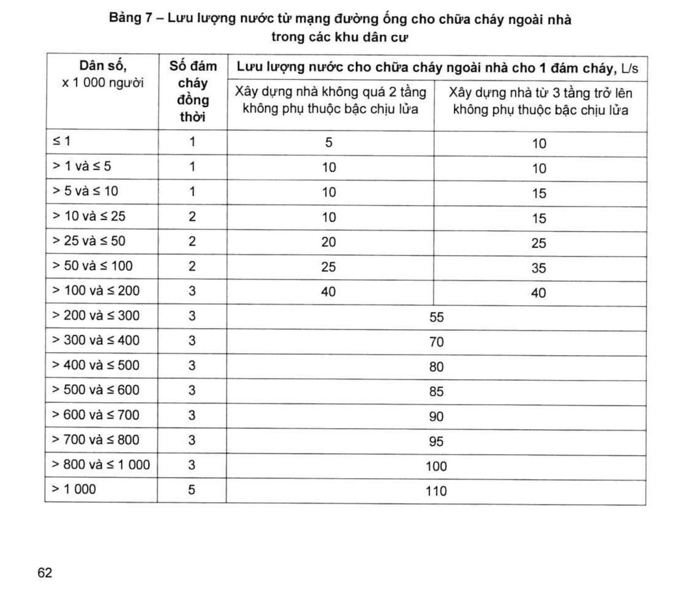
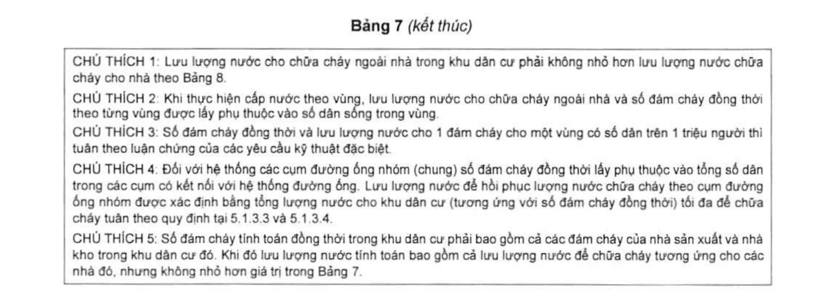
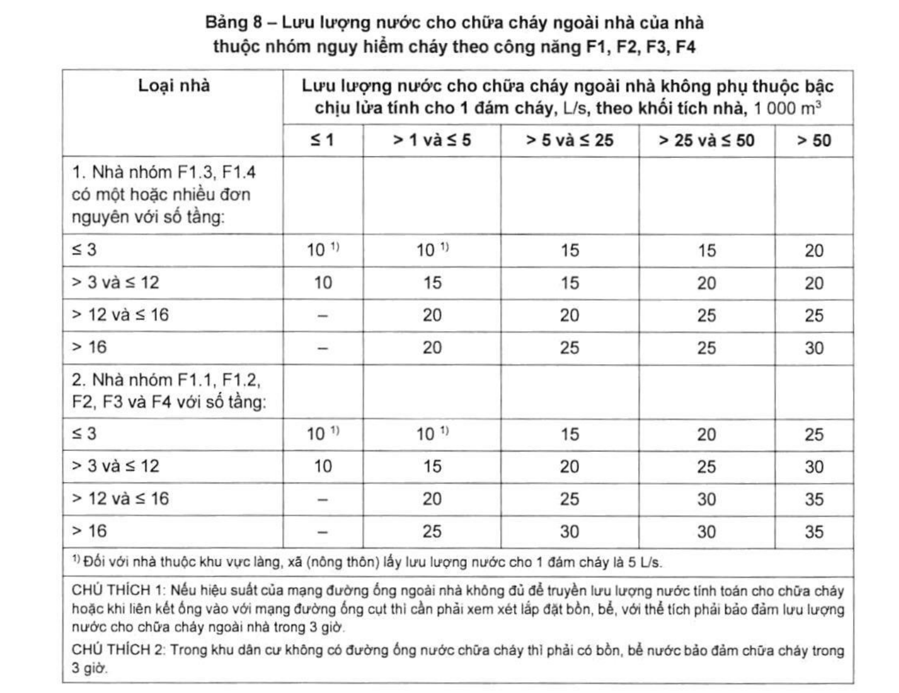
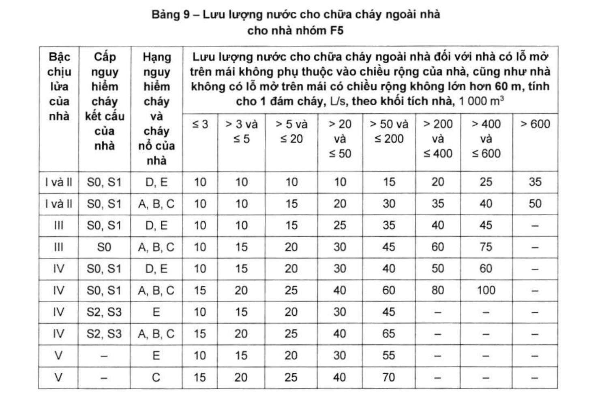
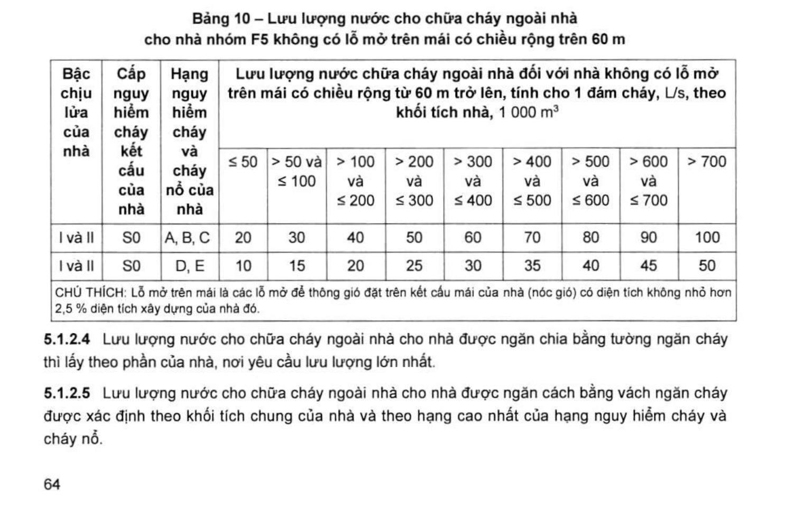

> **Trích dẫn:** mục 5.1.2.3 QCVN 06:2022/BXD

# 5.1.2.3 Lưu lượng nước cho chữa cháy ngoài nhà cho nhà có nhóm nguy hiểm cháy…

Lưu lượng nước cho chữa cháy ngoài nhà cho nhà có nhóm nguy hiểm cháy theo công năng F5, tính cho 1 đám cháy, lấy theo nhà có yêu cầu giá trị lớn nhất như Bảng 9 và Bảng 10.

> CHÚ THÍCH 1: Khi tính toán lưu lượng nước chữa cháy cho 2 đám cháy thì lấy giá trị bằng cho 2 nhà có yêu cầu lưu lượng lớn nhất.
>
> CHÚ THÍCH 2: Lưu lượng nước cho chữa cháy ngoài nhà cho các nhà phụ trợ nằm độc lập lấy theo Bảng 8 giống như cho nhà có nhóm nguy hiểm cháy theo công năng F2, F3, F4, còn nếu nằm trong các nhà sản xuất thì tính theo khối tích chung của nhà sản xuất và lấy theo Bảng 9.
>
> CHÚ THÍCH 3: Lưu lượng nước cho chữa cháy ngoài nhà cho nhà phục vụ nông nghiệp và phát triển nông thôn có bậc chịu lửa I, II với khối tích không lớn hơn 5 000 m³ hạng nguy hiểm cháy và cháy nổ D, E lấy bằng 5 L/s.
>
> CHÚ THÍCH 4: Lưu lượng nước cho chữa cháy ngoài nhà cho trạm truyền thanh, truyền hình không phụ thuộc khối tích của trạm và số lượng người sống trong khu vực đặt các trạm này, phải lấy không nhỏ hơn 15 L/s, ngay cả khi Bảng 9 và Bảng 10 quy định lưu lượng thấp hơn giá trị này.

> CHÚ THÍCH 5: Lưu lượng nước cho chữa cháy ngoài nhà cho nhà có khối tích lớn hơn trong Bảng 9 và Bảng 10 phải tuân theo các yêu cầu đặc biệt.
>
> CHÚ THÍCH 6: Đối với nhà có bậc chịu lửa II làm bằng kết cấu gỗ thì lưu lượng nước cho chữa cháy ngoài nhà lấy lớn hơn 5 L/s so với Bảng 9 và Bảng 10.
>
> CHÚ THÍCH 7: Lưu lượng nước cho chữa cháy ngoài nhà cho nhà và khu vực kho lạnh bảo quản thực phẩm thì lấy giống nhà có hạng nguy hiểm cháy C.
>
> CHÚ THÍCH 8: Lưu lượng nước cho chữa cháy ngoài nhà cho cơ sở lưu trữ công-ten-nơ có hàng hóa phụ thuộc vào số lượng công-ten-nơ, được lấy như sau:
>
> – Từ 30 đến 50 công-ten-nơ: lấy 15 L/s;
> – Từ 51 đến 100 công-ten-nơ: lấy 20 L/s;
> – Từ 101 đến 300 công-ten-nơ: lấy 25 L/s;
> – Từ 301 đến 1 000 công-ten-nơ: lấy 40 L/s;
> – Từ 1 001 đến 1 500 công-ten-nơ: lấy 60 L/s;
> – Từ 1 501 đến 2 000 công-ten-nơ: lấy 80 L/s;
> – Nhiều hơn 2 000 công-ten-nơ: lấy 100 L/s;

**Bảng 7 – Lưu lượng nước từ mạng đường ống cho chữa cháy ngoài nhà trong các khu dân cư**

| Dân số, × 1 000 người | Số đám cháy đồng thời | Lưu lượng cho 1 đám cháy, L/s — Xây dựng nhà không quá 2 tầng không phụ thuộc bậc chịu lửa | Lưu lượng cho 1 đám cháy, L/s — Xây dựng nhà từ 3 tầng trở lên không phụ thuộc bậc chịu lửa |
|---|---|---|---|
| ≤ 1 | 1 | 5 | 10 |
| > 1 và ≤ 5 | 1 | 10 | 10 |
| > 5 và ≤ 10 | 1 | 10 | 15 |
| > 10 và ≤ 25 | 2 | 10 | 15 |
| > 25 và ≤ 50 | 2 | 20 | 25 |
| > 50 và ≤ 100 | 2 | 25 | 35 |
| > 100 và ≤ 200 | 3 | 40 | 40 |
| > 200 và ≤ 300 | 3 | 55 | 55 |
| > 300 và ≤ 400 | 3 | 70 | 70 |
| > 400 và ≤ 500 | 3 | 80 | 80 |
| > 500 và ≤ 600 | 3 | 85 | 85 |
| > 600 và ≤ 700 | 3 | 90 | 90 |
| > 700 và ≤ 800 | 3 | 95 | 95 |
| > 800 và ≤ 1 000 | 3 | 100 | 100 |
| > 1 000 | 5 | 110 | 110 |

*(Từ mức dân số > 200 nghìn người trở lên, bảng gốc gộp chung một giá trị cho cả hai cột số tầng.)*

> **CHÚ THÍCH của Bảng 7:**
>
> CHÚ THÍCH 1: Lưu lượng nước cho chữa cháy ngoài nhà trong khu dân cư phải không nhỏ hơn lưu lượng nước chữa cháy cho nhà theo Bảng 8.
>
> CHÚ THÍCH 2: Khi thực hiện cấp nước theo vùng, lưu lượng nước cho chữa cháy ngoài nhà và số đám cháy đồng thời theo từng vùng được lấy phụ thuộc vào số dân sống trong vùng.
>
> CHÚ THÍCH 3: Số đám cháy đồng thời và lưu lượng nước cho 1 đám cháy cho một vùng có số dân trên 1 triệu người thì tuân theo luận chứng của các yêu cầu kỹ thuật đặc biệt.
>
> CHÚ THÍCH 4: Đối với hệ thống các cụm đường ống nhóm (chung) số đám cháy đồng thời lấy phụ thuộc vào tổng số dân trong các cụm có kết nối với hệ thống đường ống. Lưu lượng nước để hồi phục lượng nước chữa cháy theo cụm đường ống nhóm được xác định bằng tổng lượng nước cho khu dân cư (tương ứng với số đám cháy đồng thời) tối đa để chữa cháy tuân theo quy định tại 5.1.3.3 và 5.1.3.4.
>
> CHÚ THÍCH 5: Số đám cháy tính toán đồng thời trong khu dân cư phải bao gồm cả các đám cháy của nhà sản xuất và nhà kho trong khu dân cư đó. Khi đó lưu lượng nước tính toán bao gồm cả lưu lượng nước để chữa cháy tương ứng cho các nhà đó, nhưng không nhỏ hơn giá trị trong Bảng 7.

**Bảng 8 – Lưu lượng nước cho chữa cháy ngoài nhà của nhà thuộc nhóm nguy hiểm cháy theo công năng F1, F2, F3, F4**

*Lưu lượng nước cho chữa cháy ngoài nhà không phụ thuộc bậc chịu lửa tính cho 1 đám cháy, L/s, theo khối tích nhà, 1 000 m³:*

| Loại nhà | ≤ 1 | > 1 và ≤ 5 | > 5 và ≤ 25 | > 25 và ≤ 50 | > 50 |
|---|---|---|---|---|---|
| **1. Nhà nhóm F1.3, F1.4 có một hoặc nhiều đơn nguyên với số tầng:** | | | | | |
| ≤ 3 | 10 ^1)^ | 10 ^1)^ | 15 | 15 | 20 |
| > 3 và ≤ 12 | 10 | 15 | 15 | 20 | 20 |
| > 12 và ≤ 16 | – | 20 | 20 | 25 | 25 |
| > 16 | – | 20 | 25 | 25 | 30 |
| **2. Nhà nhóm F1.1, F1.2, F2, F3 và F4 với số tầng:** | | | | | |
| ≤ 3 | 10 ^1)^ | 10 ^1)^ | 15 | 20 | 25 |
| > 3 và ≤ 12 | 10 | 15 | 20 | 25 | 30 |
| > 12 và ≤ 16 | – | 20 | 25 | 30 | 35 |
| > 16 | – | 25 | 30 | 30 | 35 |

> ^1)^ Đối với nhà thuộc khu vực làng, xã (nông thôn) lấy lưu lượng nước cho 1 đám cháy là 5 L/s.
>
> CHÚ THÍCH 1: Nếu hiệu suất của mạng đường ống ngoài nhà không đủ để truyền lưu lượng nước tính toán cho chữa cháy hoặc khi liên kết ống vào với mạng đường ống cụt thì cần phải xem xét lắp đặt bồn, bể, với thể tích phải bảo đảm lưu lượng nước cho chữa cháy ngoài nhà trong 3 giờ.
>
> CHÚ THÍCH 2: Trong khu dân cư không có đường ống nước chữa cháy thì phải có bồn, bể nước bảo đảm chữa cháy trong 3 giờ.

**Bảng 9 – Lưu lượng nước cho chữa cháy ngoài nhà cho nhà nhóm F5**

*Lưu lượng nước cho chữa cháy ngoài nhà đối với nhà có lỗ mở trên mái không phụ thuộc vào chiều rộng của nhà, cũng như nhà không có lỗ mở trên mái có chiều rộng không lớn hơn 60 m, tính cho 1 đám cháy, L/s, theo khối tích nhà, 1 000 m³:*

| Bậc chịu lửa | Cấp nguy hiểm cháy kết cấu | Hạng nguy hiểm cháy và cháy nổ | ≤ 3 | > 3 và ≤ 5 | > 5 và ≤ 20 | > 20 và ≤ 50 | > 50 và ≤ 200 | > 200 và ≤ 400 | > 400 và ≤ 600 | > 600 |
|---|---|---|---|---|---|---|---|---|---|---|
| I và II | S0, S1 | D, E | 10 | 10 | 10 | 10 | 15 | 20 | 25 | 35 |
| I và II | S0, S1 | A, B, C | 10 | 10 | 15 | 20 | 30 | 35 | 40 | 50 |
| III | S0, S1 | D, E | 10 | 10 | 15 | 25 | 35 | 40 | 45 | – |
| III | S0 | A, B, C | 10 | 15 | 20 | 30 | 45 | 60 | 75 | – |
| IV | S0, S1 | D, E | 10 | 15 | 20 | 30 | 40 | 50 | 60 | – |
| IV | S0, S1 | A, B, C | 15 | 20 | 25 | 40 | 60 | 80 | 100 | – |
| IV | S2, S3 | E | 10 | 15 | 20 | 30 | 45 | – | – | – |
| IV | S2, S3 | A, B, C | 15 | 20 | 25 | 40 | 65 | – | – | – |
| V | – | E | 10 | 15 | 20 | 30 | 55 | – | – | – |
| V | – | C | 15 | 20 | 25 | 40 | 70 | – | – | – |

**Bảng 10 – Lưu lượng nước cho chữa cháy ngoài nhà cho nhà nhóm F5 không có lỗ mở trên mái có chiều rộng trên 60 m**

*Lưu lượng nước chữa cháy ngoài nhà đối với nhà không có lỗ mở trên mái có chiều rộng từ 60 m trở lên, tính cho 1 đám cháy, L/s, theo khối tích nhà, 1 000 m³:*

| Bậc chịu lửa | Cấp nguy hiểm cháy kết cấu | Hạng nguy hiểm cháy và cháy nổ | ≤ 50 | > 50 và ≤ 100 | > 100 và ≤ 200 | > 200 và ≤ 300 | > 300 và ≤ 400 | > 400 và ≤ 500 | > 500 và ≤ 600 | > 600 và ≤ 700 | > 700 |
|---|---|---|---|---|---|---|---|---|---|---|---|
| I và II | S0 | A, B, C | 20 | 30 | 40 | 50 | 60 | 70 | 80 | 90 | 100 |
| I và II | S0 | D, E | 10 | 15 | 20 | 25 | 30 | 35 | 40 | 45 | 50 |

> CHÚ THÍCH: Lỗ mở trên mái là các lỗ mở để thông gió đặt trên kết cấu mái của nhà (nóc gió) có diện tích không nhỏ hơn 2,5 % diện tích xây dựng của nhà đó.
