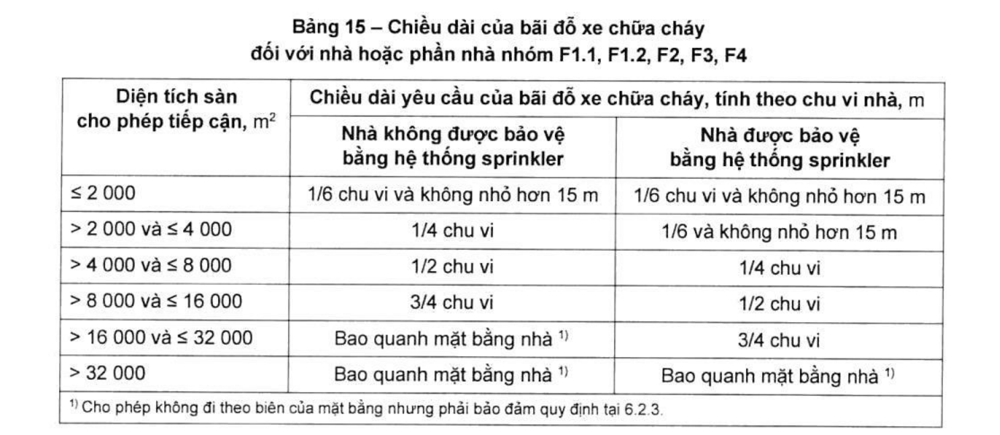

> **Trích dẫn:** mục 6.2.2.3 QCVN 06:2022/BXD

# 6.2.2.3 Nhà hoặc phần nhà nhóm F1.1, F1.2, F2, F3 và F4 có chiều cao PCCC lớn…

Nhà hoặc phần nhà nhóm F1.1, F1.2, F2, F3 và F4 có chiều cao PCCC lớn hơn 15 m thì tại mỗi vị trí có lối vào từ trên cao phải bố trí một bãi đỗ xe chữa cháy để tiếp cận trực tiếp đến các tấm cửa của lối vào từ trên cao. Chiều dài của bãi đỗ xe chữa cháy phải được lấy theo Bảng 15 căn cứ vào diện tích sàn cho phép tiếp cận của tầng có giá trị diện tích sàn cho phép tiếp cận lớn nhất. Đối với trường hợp nhà có sàn thông tầng, giá trị đó được tính như sau:

a) Đối với nhà có các sàn thông tầng, bao gồm cả các tầng hầm thông với các tầng trên mặt đất thì diện tích sàn cho phép tiếp cận lấy bằng diện tích cộng dồn các giá trị diện tích sàn cho phép tiếp cận của tất cả các sàn thông tầng;

b) Đối với các nhà có từ hai nhóm sàn thông tầng trở lên thì diện tích sàn cho phép tiếp cận phải lấy bằng giá trị cộng dồn của nhóm sàn thông tầng có diện tích lớn nhất;

c) Đối với nhà nhóm F5, phải có một bãi đỗ xe chữa cháy cho các phương tiện chữa cháy. Chiều dài của bãi đỗ xe chữa cháy phải được lấy theo Bảng 16, dựa vào tổng quy mô khối tích của nhà (không bao gồm tầng hầm).

Khi điều kiện sản xuất không yêu cầu có đường vào thì đường cho xe chữa cháy được phép bố trí phần đường rộng 3,5 m cho xe chạy, nền đường được gia cố bằng các vật liệu bảo đảm chịu được tải trọng của xe chữa cháy và bảo đảm thoát nước mặt.

Khoảng cách từ mép đường cho xe chữa cháy đến tường của nhà phải không lớn hơn **5 m** đối với các nhà có chiều cao PCCC nhỏ hơn 12 m, không lớn hơn **8 m** đối với các nhà có chiều cao PCCC từ 12 m đến 28 m và không lớn hơn **10 m** đối với các nhà có chiều cao PCCC trên 28 m.

Trong những trường hợp cần thiết, khoảng cách từ mép gần nhà của đường xe chạy đến tường ngoài của nhà và công trình được tăng đến 60 m với điều kiện nhà và công trình này có các đường cụt đi vào, kèm theo bãi quay xe chữa cháy và bố trí các trụ nước chữa cháy. Trong trường hợp đó, khoảng cách từ nhà và công trình đến bãi quay xe chữa cháy phải không nhỏ hơn 5 m và không lớn hơn 15 m và khoảng cách giữa các đường cụt không được vượt quá 100 m.

> CHÚ THÍCH 1: Chiều rộng của nhà và công trình lấy theo khoảng cách giữa các trục định vị.
>
> CHÚ THÍCH 2: Đối với các hồ nước được sử dụng để chữa cháy, cần bố trí lối vào với khoảng sân có kích thước mỗi cạnh không nhỏ hơn 12 m.

**Bảng 15 – Chiều dài của bãi đỗ xe chữa cháy đối với nhà hoặc phần nhà nhóm F1.1, F1.2, F2, F3, F4**

*Chiều dài yêu cầu của bãi đỗ xe chữa cháy, tính theo chu vi nhà, m:*

| Diện tích sàn cho phép tiếp cận, m² | Nhà không được bảo vệ bằng hệ thống sprinkler | Nhà được bảo vệ bằng hệ thống sprinkler |
|---|---|---|
| ≤ 2 000 | 1/6 chu vi và không nhỏ hơn 15 m | 1/6 chu vi và không nhỏ hơn 15 m |
| > 2 000 và ≤ 4 000 | 1/4 chu vi | 1/6 và không nhỏ hơn 15 m |
| > 4 000 và ≤ 8 000 | 1/2 chu vi | 1/4 chu vi |
| > 8 000 và ≤ 16 000 | 3/4 chu vi | 1/2 chu vi |
| > 16 000 và ≤ 32 000 | Bao quanh mặt bằng nhà ^1)^ | 3/4 chu vi |
| > 32 000 | Bao quanh mặt bằng nhà ^1)^ | Bao quanh mặt bằng nhà ^1)^ |

> ^1)^ Cho phép không đi theo biên của mặt bằng nhưng phải bảo đảm quy định tại 6.2.3.

**Bảng 16 – Chiều dài của bãi đỗ xe chữa cháy đối với nhà nhóm F5**

*Chiều dài yêu cầu của bãi đỗ xe chữa cháy, tính theo chu vi nhà, m:*

| Quy mô khối tích, m³ | Nhà không được bảo vệ bằng hệ thống sprinkler | Nhà được bảo vệ bằng hệ thống sprinkler |
|---|---|---|
| ≤ 28 400 | 1/6 chu vi và không nhỏ hơn 15 m | 1/6 chu vi và không nhỏ hơn 15 m |
| > 28 400 và ≤ 56 800 | 1/4 chu vi | 1/6 chu vi và không nhỏ hơn 15 m |
| > 56 800 và ≤ 85 200 | 1/2 chu vi | 1/4 chu vi |
| > 85 200 và ≤ 113 600 | 3/4 chu vi | 1/4 chu vi |
| > 113 600 và ≤ 170 400 | Bao quanh mặt bằng nhà ^1)^ | 1/2 chu vi |
| > 170 400 và ≤ 227 200 | Bao quanh mặt bằng nhà ^1)^ | 3/4 chu vi |
| > 227 200 | Bao quanh mặt bằng nhà ^1)^ | Bao quanh mặt bằng nhà ^1)^ |

> ^1)^ Cho phép không đi theo biên của mặt bằng nhưng phải bảo đảm quy định tại 6.2.3.
